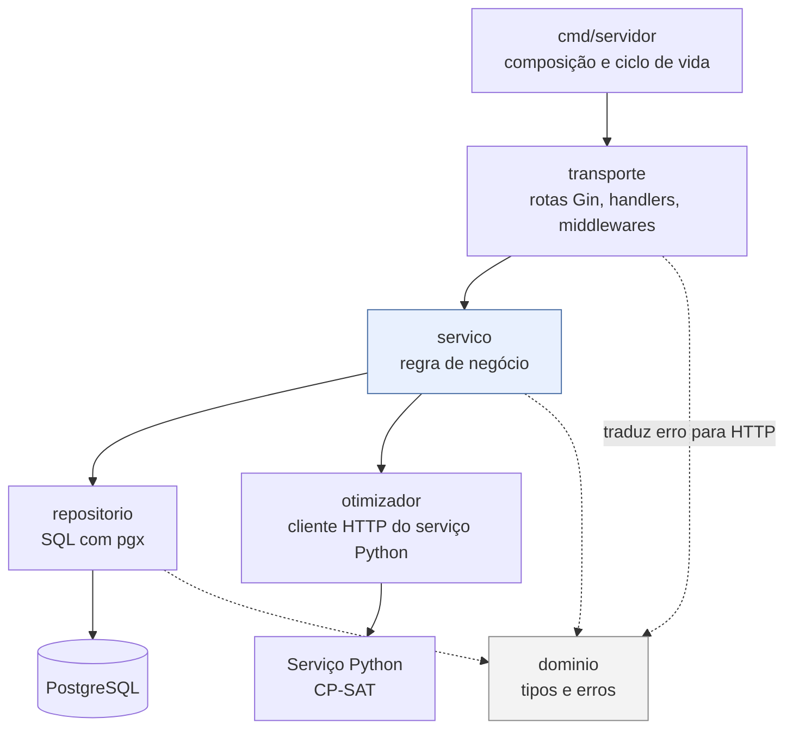
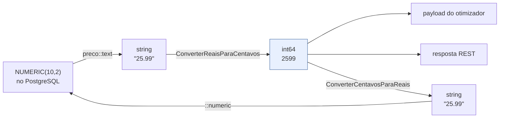

# Arquitetura interna da API

## Camadas e regra de dependência



A dependência aponta **sempre para baixo**. `dominio` não importa ninguém; `repositorio`
e `otimizador` não conhecem HTTP; `servico` não conhece Gin; `transporte` não escreve SQL.

## O que cada camada pode e não pode fazer

| Camada | Pode | Não pode |
|---|---|---|
| `cmd/servidor` | ler config, abrir pool, aplicar migrations, montar serviços, encerrar com prazo | conter regra de negócio |
| `transporte` | decodificar JSON, chamar um serviço, escrever a resposta, traduzir erro em HTTP | consultar o banco, decidir regra |
| `servico` | validar entrada, orquestrar, aplicar regra de domínio | conhecer `gin.Context`, escrever SQL |
| `repositorio` | montar e executar SQL, converter tipos do banco | decidir regra, conhecer HTTP |
| `otimizador` | falar HTTP com o serviço Python | conhecer banco ou usuário |
| `dominio` | definir tipos e erros sentinela | importar qualquer outro pacote do projeto |

## Tratamento de erros

Erros nascem no `dominio` como **sentinelas** e são embrulhados com contexto por cada
camada que os repassa:

```go
return fmt.Errorf("buscar lista: %w", traduzirErro(err, ""))
```

O `%w` preserva a cadeia, de modo que `errors.Is(err, dominio.ErrNaoEncontrado)` continua
funcionando lá em cima. A tradução para HTTP acontece em **um único lugar** —
`transporte/erros.go` — e é coberta por teste:

| Erro de domínio | HTTP | Código |
|---|---|---|
| `*ErroValidacao` | 400 | `VALIDACAO` |
| `ErrNaoAutenticado` | 401 | `NAO_AUTENTICADO` |
| `ErrNaoAutorizado` | 403 | `NAO_AUTORIZADO` |
| `ErrNaoEncontrado` | 404 | `NAO_ENCONTRADO` |
| `ErrConflito` | 409 | `CONFLITO` |
| `ErrOtimizadorIndisponivel` | 503 | `OTIMIZADOR_INDISPONIVEL` |
| qualquer outro | 500 | `ERRO_INTERNO` |

Erro inesperado vira 500 com **mensagem genérica**: o texto original vai para o log via
`c.Error(err)`, nunca para a resposta. Há um teste que verifica que endereço de banco e
mensagem do driver não vazam.

## Dinheiro nunca passa por `float64`

Esta é a decisão técnica mais importante da API. O CP-SAT é um solver inteiro e o contrato
trafega centavos; um `float64` no meio do caminho reintroduziria erro de arredondamento.



Toda leitura monetária usa cast explícito para texto no SQL. A conversão opera sobre os
dígitos, com arredondamento explícito da terceira casa afastando-se do zero, e há teste de
ida e volta garantindo que a conversão é exata.

## Onde a regra de negócio realmente mora

| Regra | Arquivo |
|---|---|
| Posse da lista (403, não 404) | `servico/lista.go`, em `garantirPosse` |
| Perfil → peso, com peso livre sobrepondo | `servico/recomendacao.go`, em `resolverPeso` |
| Origem padrão e sinalização de distância aproximada | `servico/recomendacao.go`, em `resolverOrigem` |
| Teto da PoC (20 itens × 8 mercados) | `servico/recomendacao.go`, em `Gerar` |
| Marca livre: escolher um candidato por mercado | `servico/recomendacao.go`, em `melhorCandidato` |
| Unidades aceitas | `dominio/modelos.go`, em `ValidarUnidade` |
| `precos` é append-only | ausência de rota e de método de UPDATE |

## Determinismo do payload

`converterMercadosOrdenados` ordena os candidatos por `mercado_id` antes de enviá-los. A
iteração de mapa em Go é deliberadamente aleatória, e sem essa ordenação a mesma lista
geraria payloads diferentes a cada chamada — o que quebraria a reprodutibilidade exigida
pela Fase 4, mesmo com o solver determinístico do outro lado.
