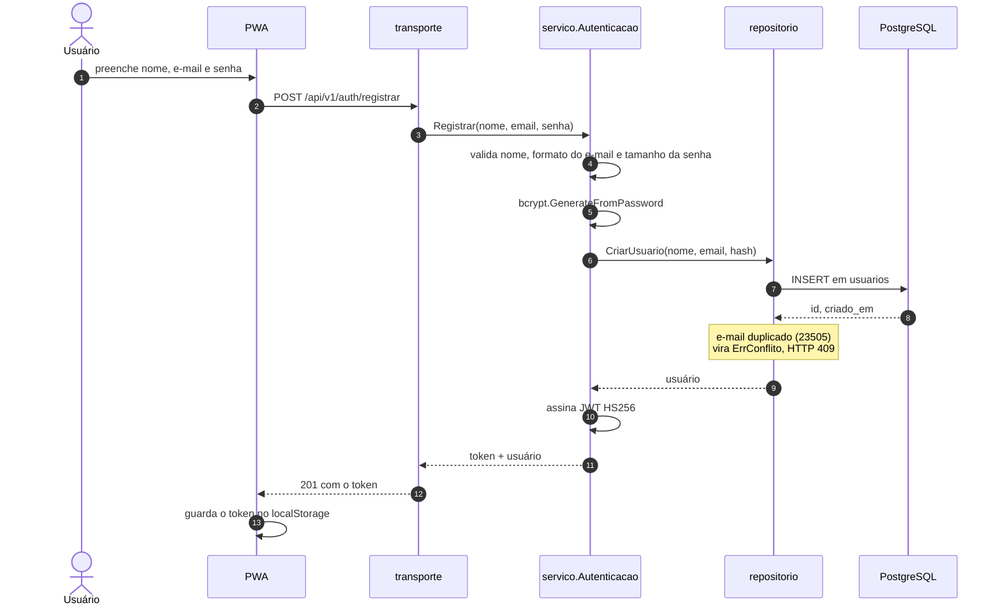
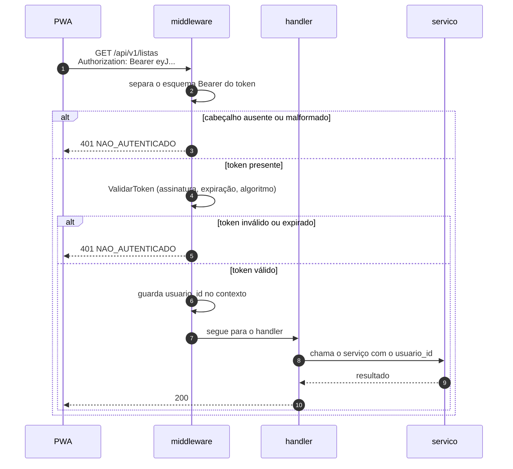

# Autenticação

Cadastro, login e proteção das rotas. Implementado em
[`internal/servico/autenticacao.go`](../internal/servico/autenticacao.go) e
[`internal/transporte/middleware.go`](../internal/transporte/middleware.go).

## Fluxo de cadastro e login



O cadastro já devolve uma sessão aberta: o cliente não precisa fazer login logo em seguida.

## Requisição autenticada



## Decisões de segurança

| Decisão | Motivo |
|---|---|
| **bcrypt** com custo padrão | algoritmo lento por projeto, resistente a força bruta; nunca guardar senha em texto claro nem em hash rápido |
| **Mensagem genérica no login** | responder "e-mail não encontrado" revelaria quais e-mails estão cadastrados; e-mail inexistente e senha errada devolvem o mesmo 401 |
| **`jwt.WithValidMethods`** | sem essa restrição, um token forjado com `alg: none` ou com algoritmo assimétrico poderia ser aceito |
| **`usuario_id` no `subject`** | claim padrão do JWT; evita inventar estrutura própria |
| **403 e não 404 para lista alheia** | definido no contrato REST; a existência do recurso não é segredo neste domínio |
| **Senha mínima de 8 caracteres** | RNF do projeto; validado no serviço, antes de chegar ao banco |

## Escopo por usuário

Toda operação sobre lista passa por `garantirPosse`, em `servico/lista.go`:

```go
lista, err := l.repositorio.BuscarLista(ctx, listaID)
if lista.UsuarioID != usuarioID {
    return dominio.Lista{}, dominio.ErrNaoAutorizado
}
```

A conferência é feita **no serviço**, não no SQL de cada consulta. Concentrá-la em um único
ponto evita que uma consulta nova esqueça o filtro por usuário — o tipo de esquecimento que
não aparece em teste feliz.

## Configuração

| Variável | Padrão | Descrição |
|---|---|---|
| `JWT_SEGREDO` | **sem padrão** | chave HS256; a ausência é erro fatal na inicialização |
| `JWT_HORAS_VALIDADE` | `24` | validade do token |

`JWT_SEGREDO` não tem valor padrão de propósito: subir a API com um segredo conhecido
seria pior do que não subir. O valor de `.env.exemplo` serve apenas para desenvolvimento
local e está marcado como tal.

## Limites assumidos na PoC

Registrados aqui porque valem menção na defesa, e **não** são falhas de implementação e sim
escopo deliberado (seção 7 do `CLAUDE.md`):

- Sem refresh token: expirou, faz login de novo.
- Sem revogação de token antes do vencimento.
- Sem recuperação de senha por e-mail.
- Sem limitação de tentativas de login.
- Rotas de catálogo autenticadas, mas sem distinção de papel: qualquer usuário logado pode
  cadastrar mercado ou preço. A separação entre consumidor e administrador de dados existe
  nos requisitos, não no código.
