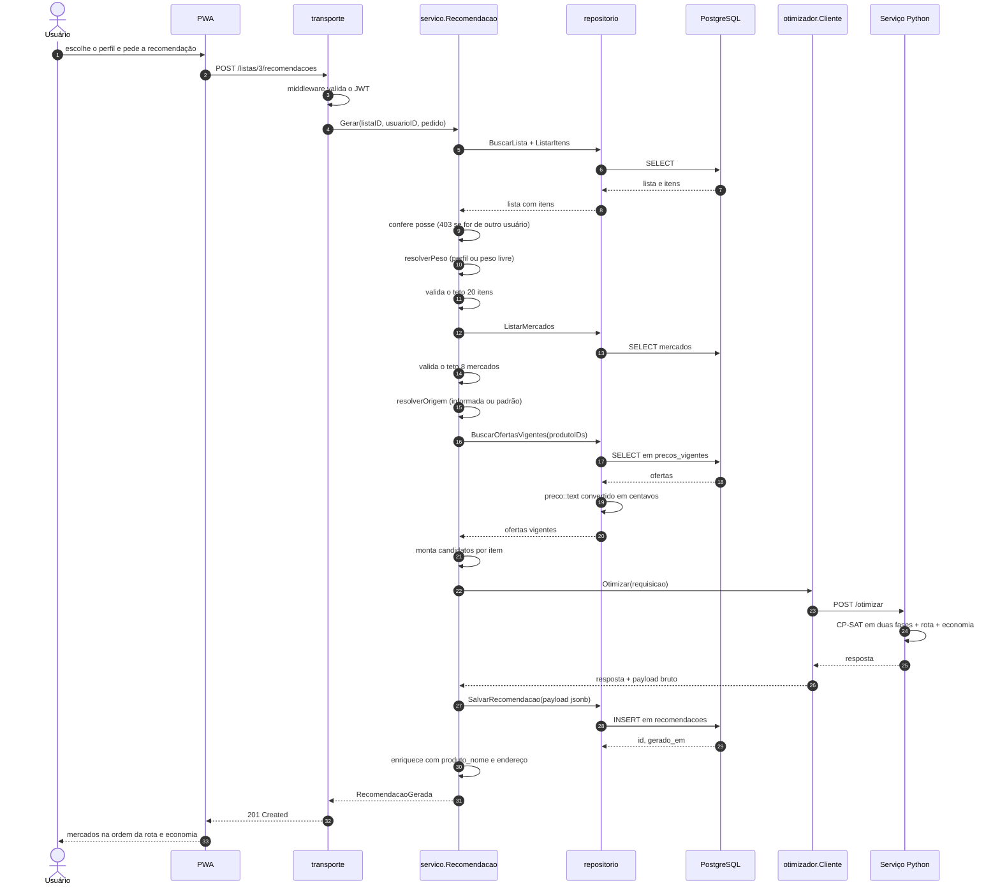
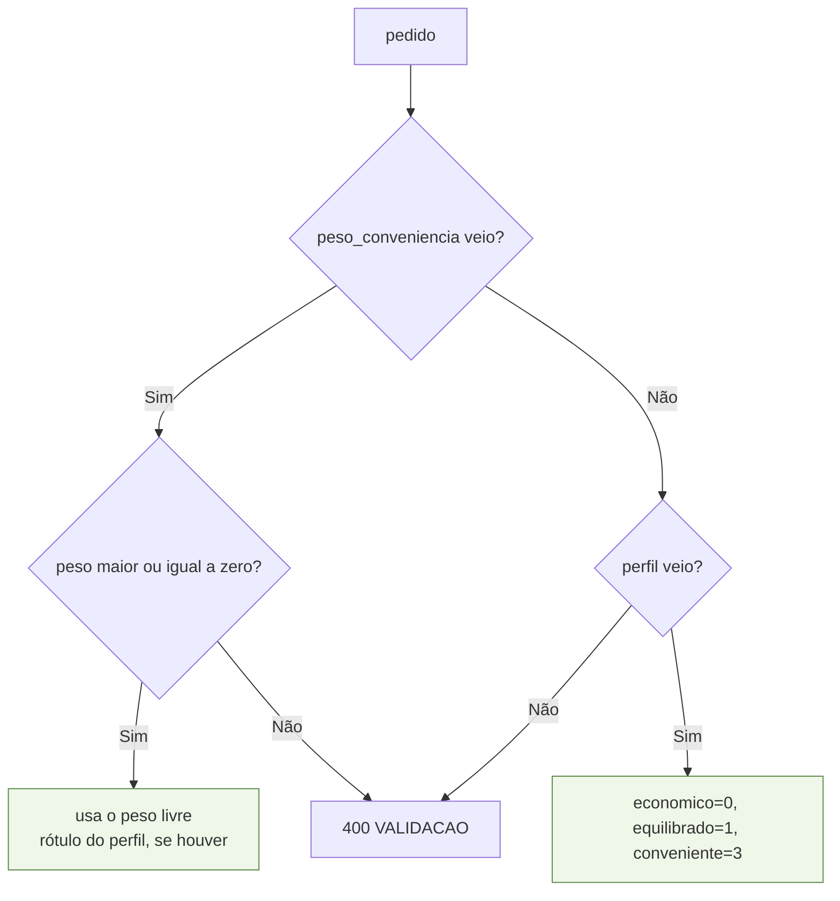
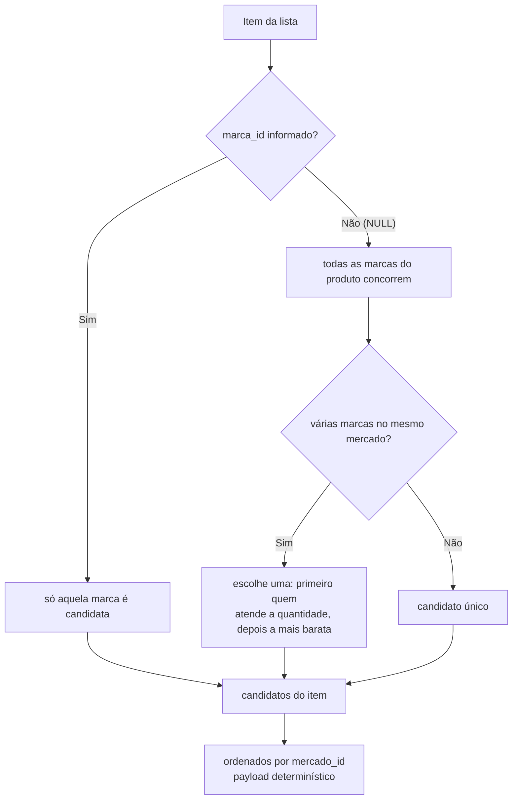

# Fluxo da recomendação

O caminho completo de `POST /api/v1/listas/:id/recomendacoes`, que é a razão de existir do
sistema. Implementado em [`internal/servico/recomendacao.go`](../internal/servico/recomendacao.go).

## Sequência completa



## Os dez passos, em detalhe

### 1–3. Posse e limites
A lista é carregada com os itens e a posse é conferida. Lista de outro usuário responde
**403**, não 404 — decisão do contrato REST.

Em seguida vêm os tetos da PoC: mais de **20 itens** ou mais de **8 mercados** cadastrados
resultam em `400 VALIDACAO` com mensagem descritiva. A instância nunca é processada
parcialmente.

### 4. Peso da conveniência



O peso numérico livre **sobrepõe** o perfil. É o que permite varrer a fronteira de Pareto
nos experimentos da Fase 4 sem alterar código nem inventar perfis novos.

### 5. Origem
Usa a coordenada enviada pelo cliente ou, na ausência dela, `ORIGEM_PADRAO_LATITUDE` e
`ORIGEM_PADRAO_LONGITUDE` — o centro de Juazeiro do Norte. Nesse caso a resposta traz
`origem_aproximada: true`, para o PWA poder avisar que a distância é estimada.

### 6. Candidatos — a consulta que sustenta o modelo

A leitura vem da **view `precos_vigentes`**, nunca da tabela `precos`. A view devolve o
snapshot mais recente de cada par (marca, mercado); ler a tabela crua faria uma coleta
antiga concorrer com a atual dentro do modelo.

```sql
SELECT ma.produto_id, pv.marca_id, ma.nome, pv.mercado_id,
       pv.preco::text, pv.quantidade_disponivel::float8, pv.unidade
  FROM precos_vigentes pv
  JOIN marcas ma ON ma.id = pv.marca_id
 WHERE ma.produto_id = ANY($1::bigint[])
```

Uma única consulta para todos os produtos da lista — não uma por item.

### 7. Marca fixa versus marca livre



O contrato de otimização admite **um único candidato por par (item, mercado)**. Com marca
livre, várias marcas do mesmo produto disputam o mesmo mercado, e `melhorCandidato` decide:
quem atende a quantidade pedida sempre vence quem não atende; entre equivalentes, vence a
mais barata.

Candidatos com estoque insuficiente **são enviados assim mesmo**. Descartá-los aqui
impediria o otimizador de distinguir `SEM_CANDIDATO` (não existe preço) de
`SEM_CANDIDATO_COM_ESTOQUE` (existe preço, falta estoque) — e essa distinção é o que o
usuário precisa ver para saber se o problema é de catálogo ou de disponibilidade.

### 8. Chamada ao otimizador
Com timeout de `OTIMIZADOR_TIMEOUT_SEGUNDOS` e `context.Context` propagado. Timeout,
conexão recusada ou 5xx viram `ErrOtimizadorIndisponivel` → **503**.

A API **nunca** devolve uma recomendação parcial ou estimada por conta própria quando o
otimizador falha. Isso preserva a rastreabilidade entre o que o usuário viu e o que o
modelo matemático decidiu.

### 9. Persistência para auditoria
O `payload_resultado` guarda a resposta **bruta** do otimizador, em `jsonb`. Com ele e a
semente fixa do solver, qualquer execução futura do mesmo código reproduz o resultado — é
o que torna a trilha da Fase 4 verificável, e não apenas registrada.

### 10. Enriquecimento
O otimizador não conhece nome de produto nem endereço de mercado — ele recebe apenas
identificadores, preços e coordenadas. A API reanexa `produto_nome` e `endereco` a partir
dos dados que já tem em memória, sem consulta extra.

## Reabrir uma recomendação

`GET /recomendacoes/:id` reconstrói a resposta a partir do `payload_resultado` gravado.
**Nunca recalcula.** Recomendações são imutáveis: só assim é possível comparar a mesma
lista sob perfis diferentes, ou ao longo de coletas de preço diferentes, sem que o passado
mude sob os pés do experimento.
