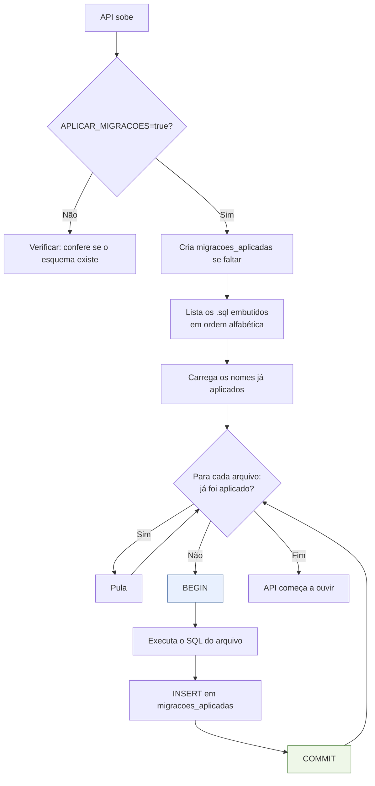
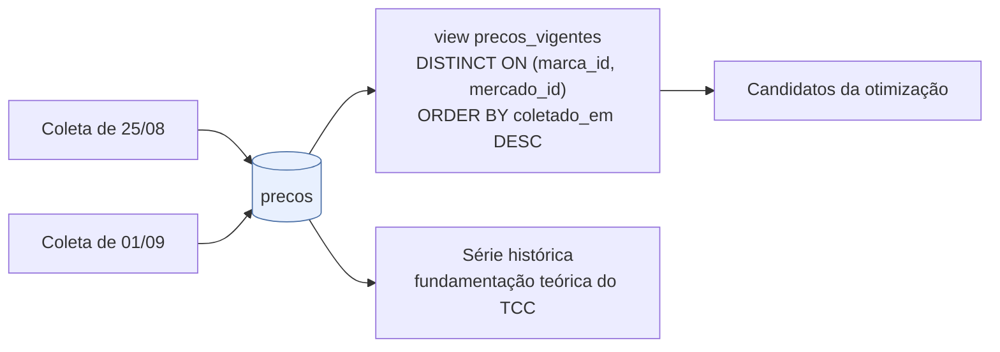

# Migrations

O esquema do banco é aplicado pela própria API na inicialização, sem ferramenta externa.
Implementado em [`internal/banco/migracoes.go`](../internal/banco/migracoes.go).

## Como funciona



Cada arquivo roda **dentro de uma transação própria**: ou ele inteiro é aplicado e
registrado, ou nada dele fica. Por isso os arquivos `.sql` **não devem conter `BEGIN` nem
`COMMIT`** — o runner já cuida disso.

## Os arquivos são embutidos no binário

```go
//go:embed *.sql
var Arquivos embed.FS
```

A diretiva `//go:embed` só enxerga o diretório do próprio arquivo Go, por isso existe um
`migracoes/embed.go` dentro de `migracoes/` em vez de a diretiva ficar em
`internal/banco/`. O efeito prático é que o binário compilado carrega o esquema consigo: o
container não precisa montar volume de SQL, e a versão do esquema nunca se descola da
versão do código.

## Controle de aplicação

```sql
CREATE TABLE migracoes_aplicadas (
    nome        TEXT PRIMARY KEY,
    aplicada_em TIMESTAMPTZ NOT NULL DEFAULT now()
);
```

O nome do arquivo é a chave. Um arquivo já registrado nunca é reexecutado, o que torna a
subida da API idempotente — reiniciar o container não recria nem duplica nada.

## Arquivos atuais

| Arquivo | Conteúdo |
|---|---|
| `001_esquema_inicial.sql` | tabelas, CHECKs, índices, comentários e a view `precos_vigentes` |
| `002_dados_semente.sql` | dados **fictícios** de Juazeiro do Norte para a PoC rodar ponta a ponta |
| `003_raio_da_recomendacao.sql` | `recomendacoes.parametro_raio_km`, para o histórico saber qual recorte de mercados produziu cada resultado |
| `004_catalogo_dieese.sql` | **gerada** por `dados/gerar_catalogo_dieese.py`: remove o catálogo fictício de 002 e carrega a base da cesta básica do DIEESE (28 supermercados fictícios em Juazeiro do Norte, um por cidade do CSV, 13 produtos, 2 marcas fictícias cada) |

## Como adicionar uma migration

1. Crie `migracoes/005_descricao_curta.sql`. O prefixo numérico define a ordem.
2. Escreva SQL idempotente (`IF NOT EXISTS`, `ON CONFLICT DO NOTHING`) — é barato e evita
   surpresa em ambiente que já tenha parte do esquema.
3. **Não** inclua `BEGIN`/`COMMIT`.
4. Suba a API. O runner detecta o arquivo novo e o aplica.

Migrations já aplicadas em um banco compartilhado **não devem ser editadas**: o runner não
as reexecuta, e a edição criaria divergência silenciosa entre ambientes. Corrija sempre com
um arquivo novo.

## Por que `precos` nunca sofre UPDATE

A tabela `precos` é **append-only** por decisão de modelagem (seção 4 do `CLAUDE.md`), e
isso se reflete na API: não existe `PUT /precos/:id` nem método de atualização no
repositório.



Cada coleta é um `INSERT`. Corrigir um preço errado também é um `INSERT`, com
`coletado_em` posterior. A view `precos_vigentes` sempre entrega o snapshot mais recente,
enquanto a tabela preserva a série inteira — que é o que permite analisar variação de preço
ao longo do tempo no capítulo de resultados.

> A semente fictícia não foi substituída por esse mecanismo: a migration 004 a removeu e
> carregou a base do DIEESE (ver `docs/dados-e-coleta.md`).

Era também o mecanismo previsto para substituir a semente fictícia: ao inserir a coleta real de
Juazeiro do Norte com data posterior, ela passa a prevalecer automaticamente, sem `DELETE`.
