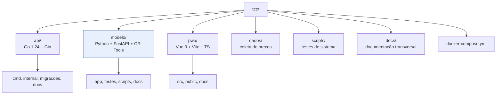

# Documentação

Sistema de Apoio à Decisão para compras de supermercado em **Juazeiro do Norte/CE** —
Trabalho de Conclusão de Curso.

Recebe uma lista de compras e recomenda **em quais supermercados comprar cada item**,
equilibrando custo financeiro e conveniência logística.

## Por onde começar

| Se você quer… | Leia |
|---|---|
| entender o problema e o escopo | [`visao-geral.md`](visao-geral.md) |
| rodar o sistema | [`como-rodar.md`](como-rodar.md) |
| entender **o modelo matemático** | [`../modelo/docs/formulacao-matematica.md`](../modelo/docs/formulacao-matematica.md) |
| entender como as peças se encaixam | [`arquitetura.md`](arquitetura.md) |
| saber se a recomendação está correta | [`plano-de-testes.md`](plano-de-testes.md) e [`relatorio-validacao.md`](relatorio-validacao.md) |

## Documentação transversal

| Documento | Conteúdo |
|---|---|
| [`visao-geral.md`](visao-geral.md) | problema, escopo, o que está fora, mapa Fases 1–4 → código |
| [`requisitos.md`](requisitos.md) | requisitos funcionais e não funcionais, histórias, casos de borda |
| [`arquitetura.md`](arquitetura.md) | os quatro componentes, responsabilidades e decisões |
| [`modelo-de-dados.md`](modelo-de-dados.md) | tabelas, dicionário de dados, `precos` append-only |
| [`contrato-otimizacao.md`](contrato-otimizacao.md) | contrato HTTP entre a API Go e o serviço Python |
| [`contrato-api-rest.md`](contrato-api-rest.md) | contrato REST entre a API Go e o PWA |
| [`dados-e-coleta.md`](dados-e-coleta.md) | protocolo de coleta de preços e a base de semente |
| [`plano-de-sprints.md`](plano-de-sprints.md) | cronograma, DoD e registro de riscos |
| [`plano-de-testes.md`](plano-de-testes.md) | estratégia de verificação e o que já foi executado |
| [`relatorio-validacao.md`](relatorio-validacao.md) | tabela de convergência CP-SAT × enumeração exaustiva (gerada por comando) |
| [`como-rodar.md`](como-rodar.md) | execução em Docker e local, verificação e problemas comuns |

## Documentação por serviço

| Serviço | Documentação |
|---|---|
| **Otimizador** (`modelo/`) | [`README`](../modelo/docs/README.md) · [formulação matemática](../modelo/docs/formulacao-matematica.md) · [guia do CP-SAT](../modelo/docs/guia-cpsat.md) · [validação e testes](../modelo/docs/validacao-e-testes.md) |
| **API** (`api/`) | [`README`](../api/docs/README.md) · [arquitetura interna](../api/docs/arquitetura-interna.md) · [fluxo da recomendação](../api/docs/fluxo-recomendacao.md) · [autenticação](../api/docs/autenticacao.md) · [migrations](../api/docs/migracoes.md) · [endpoints](../api/docs/endpoints.md) |
| **PWA** (`pwa/`) | [`README`](../pwa/docs/README.md) · [telas e navegação](../pwa/docs/telas-e-navegacao.md) · [estado e API](../pwa/docs/estado-e-api.md) · [PWA e offline](../pwa/docs/pwa-e-offline.md) |
| **Dados** (`dados/`) | [`README`](../dados/README.md) · [dados e coleta](dados-e-coleta.md) |
| **Testes de sistema** (`scripts/`) | [`testes_de_sistema.sh`](../scripts/testes_de_sistema.sh) · [plano de testes](plano-de-testes.md) |

## Mapa do repositório

## Convenções do projeto

- Código, comentários e documentação em **português brasileiro**.
- Dinheiro sempre em **centavos inteiros** entre serviços; formatação só na apresentação.
- `precos` é **append-only**: cada coleta é um INSERT, e a leitura passa pela view
  `precos_vigentes`.
- Diagramas em **Mermaid**, versionáveis em diff e renderizados pelo GitHub e pelo VS Code.
- Mudanças na função objetivo obrigam a atualizar a seção 5 do `CLAUDE.md`, a
  [formulação matemática](../modelo/docs/formulacao-matematica.md) e o capítulo de
  metodologia do TCC.

## Aviso sobre os dados

A base carregada por `api/migracoes/002_dados_semente.sql` é **fictícia** e existe apenas
para o sistema rodar ponta a ponta antes de a coleta de campo terminar. Nenhum preço foi
observado em loja e nenhum estabelecimento real é representado.

**Nenhum resultado do capítulo de resultados do TCC pode se basear nesses valores.** O
procedimento de substituição está em [`dados-e-coleta.md`](dados-e-coleta.md).
