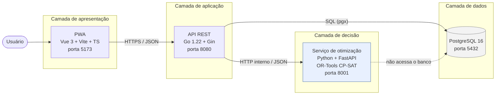
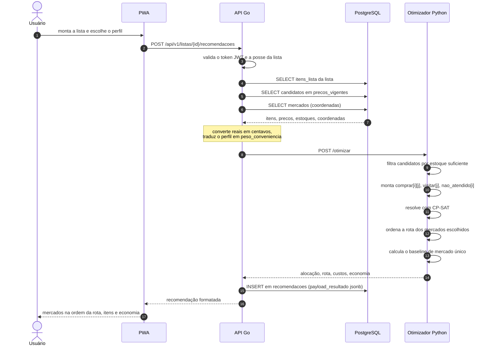
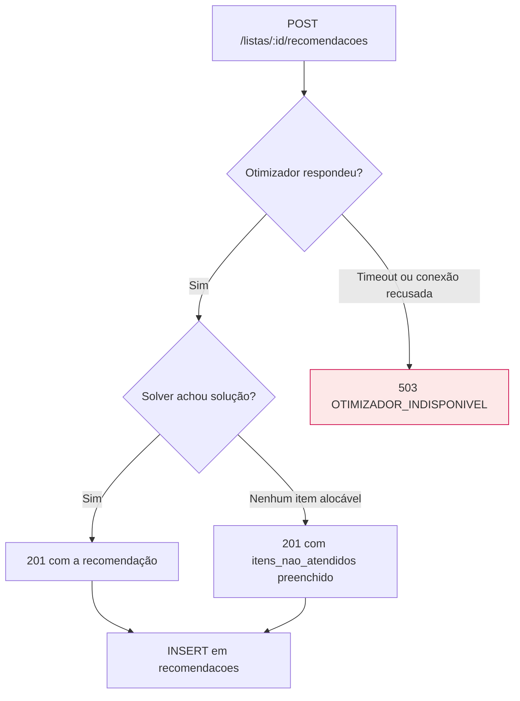

# Arquitetura

## Visão geral

O sistema é dividido em quatro componentes, cada um com uma responsabilidade única. A
divisão não é enfeite: ela isola o núcleo de otimização — a contribuição acadêmica do
trabalho — de tudo que é acessório (autenticação, CRUD, interface).

A seta tracejada é intencional: o serviço Python **nunca** fala com o banco.

## Responsabilidades

| Componente | Responsabilidades | Não faz |
|---|---|---|
| **PWA** (`pwa/`) | formulário de lista, escolha de perfil, exibição da recomendação e da rota, instalação/offline do app shell | nenhuma regra de negócio ou cálculo de custo |
| **API Go** (`api/`) | autenticação, CRUD, montagem do payload de otimização, persistência da recomendação, formatação da resposta | não resolve o modelo matemático |
| **Serviço Python** (`modelo/`) | formulação e resolução do modelo CP-SAT, cálculo de distância, ordenação da rota, cálculo da economia | não tem estado, não conhece usuário, não acessa o banco |
| **PostgreSQL** | fonte única de verdade, histórico de preços, trilha de auditoria das recomendações | — |

## Por que o serviço de otimização é stateless

1. **Testabilidade.** O modelo é uma função pura de um JSON para outro. Cada teste de
   `modelo/testes/` monta uma instância pequena com ótimo conhecido à mão e verifica o
   resultado, sem banco, sem fixture e sem mock.
2. **Validação da Fase 4.** O `modelo/scripts/validacao_exaustiva.py` chama exatamente o
   mesmo código que a API chama em produção e o compara com enumeração exaustiva. Se o
   solver dependesse do banco, essa comparação exigiria montar um ambiente inteiro.
3. **Separação da contribuição acadêmica.** O capítulo de metodologia descreve o conteúdo
   de `modelo/app/otimizacao/`. Nada de infraestrutura se mistura ali.
4. **Substituibilidade.** Trocar a formulação, o solver ou os pesos não toca em uma linha
   de Go — o contrato em [`contrato-otimizacao.md`](contrato-otimizacao.md) é a fronteira.

## Fluxo completo de uma recomendação

## Decisões de arquitetura e seus motivos

| Decisão | Motivo | Consequência aceita |
|---|---|---|
| Dois serviços de backend em vez de um monólito | OR-Tools só existe de forma madura em Python/C++; a API se beneficia da concorrência e da tipagem do Go | um salto de rede extra por recomendação (irrelevante frente ao tempo de solve) |
| Só a API Go acessa o Postgres | evita duas fontes de acesso concorrente e mantém o otimizador puro | a API precisa montar um payload completo a cada chamada |
| Dinheiro em centavos inteiros no fio | CP-SAT é um solver **inteiro**; float em dinheiro produz erro de arredondamento acumulado | conversão explícita nas bordas, documentada no contrato |
| `precos` append-only | preserva a série histórica exigida pela fundamentação teórica do TCC | leitura passa pela view `precos_vigentes` |
| Distância por haversine, sem PostGIS | a PoC tem um raio pequeno e poucos mercados; haversine tem erro desprezível nessa escala | não considera malha viária real |
| Rota ordenada **após** o solve | manter a ordenação dentro do MILP transformaria o modelo em um TSP com seleção, fora do escopo da PoC | a distância usada no objetivo é uma linearização (ida e volta origem↔mercado) |
| Persistir `payload_resultado` como `jsonb` | trilha de auditoria para os testes de acurácia da Fase 4 sem criar tabelas de detalhe | duplicação controlada de dados |

## Portas, variáveis e execução

| Serviço | Porta | Variáveis principais |
|---|---|---|
| PWA | 5173 | `VITE_API_URL` |
| API Go | 8080 | `API_PORTA`, `BANCO_URL`, `OTIMIZADOR_URL`, `JWT_SEGREDO`, `ORIGEM_PADRAO_*` |
| Otimizador | 8001 | `MODELO_PORTA`, `MODELO_LIMITE_TEMPO_SEGUNDOS` |
| PostgreSQL | 5432 | `POSTGRES_USUARIO`, `POSTGRES_SENHA`, `POSTGRES_BANCO` |

Todas as variáveis têm exemplo em [`.env.exemplo`](../.env.exemplo). O passo a passo de
execução está em [`como-rodar.md`](como-rodar.md).

## Tratamento de falhas entre serviços

A API **nunca** devolve uma recomendação parcial ou estimada por conta própria quando o
otimizador falha: ou a resposta vem do solver, ou o cliente recebe `503`. Isso preserva a
rastreabilidade entre o que o usuário viu e o que o modelo matemático decidiu — requisito
para os experimentos da Fase 4.
