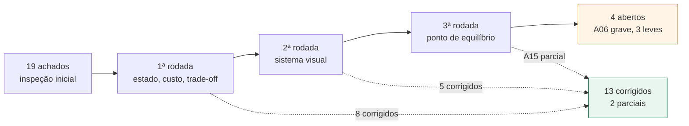
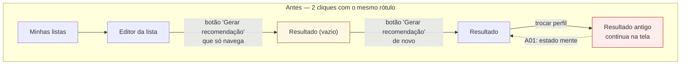
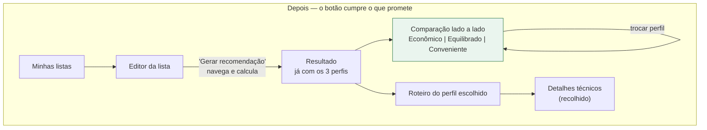

# Avaliação heurística da interface (PWA)

Avaliação de usabilidade do frontend pelas **10 heurísticas de Nielsen** (Nielsen, 1994),
com severidade na escala de 0 a 4 do próprio autor. A inspeção foi feita sobre o código de
`pwa/src/`, não sobre suposições: cada achado aponta arquivo e linha.

## Método

Inspeção por heurísticas — um avaliador percorre a interface confrontando cada tela com um
conjunto pequeno de princípios reconhecidos. É a técnica adequada aqui porque não exige
recrutar usuários e encontra a maior parte dos problemas estruturais antes do teste com
gente de verdade.

**Escala de severidade** (Nielsen):

| Grau | Significado | Tratamento |
|---|---|---|
| 4 | Catastrófico — impede ou corrompe a tarefa | corrigir antes da defesa |
| 3 | Grave — atrapalha muito, alta frequência | corrigir antes da defesa |
| 2 | Leve — atrapalha, mas contornável | corrigir se houver prazo |
| 1 | Cosmético — não atrapalha a tarefa | opcional |

## Resumo dos achados

19 problemas. Dois deles são **defeitos confirmados no código**, não questões de gosto.
A coluna *Situação* registra a reinspeção feita após a primeira rodada de correções.

| # | Heurística | Achado | Sev. | Situação |
|---|---|---|---|---|
| A01 | H1 Visibilidade do status | Resultado de uma lista/perfil permanece na tela ao abrir outra | **4** | corrigido |
| A02 | H2 Correspondência com o mundo real | "Custo total" soma dinheiro real com custo logístico imputado | **4** | corrigido |
| A03 | H6 Reconhecimento | Busca e seleção de produto são dois controles desconexos | 3 | corrigido |
| A04 | H4 Consistência | "Gerar recomendação" tem dois significados diferentes | 3 | corrigido |
| A05 | H6 Reconhecimento | O trade-off entre perfis não é comparável na tela | 3 | corrigido |
| A06 | H3 Controle e liberdade | Não há como editar um item nem renomear uma lista | 3 | aberto |
| A07 | H5 Prevenção de erros | O teto de 20 itens só se revela no erro 400 | 3 | corrigido |
| A08 | H5 Prevenção de erros | Unidade não é validada contra o produto | 2 | aberto |
| A09 | H1 Visibilidade do status | "Leva alguns segundos" — a resposta leva 40 ms | 2 | corrigido |
| A10 | H2 Correspondência | "Solução ótima comprovada" em posição de destaque | 2 | corrigido |
| A11 | H3 Controle e liberdade | Remover item não confirma nem desfaz; excluir lista confirma | 2 | aberto |
| A12 | H9 Recuperação de erros | Item não atendido é informado sem oferecer saída | 2 | parcial |
| A13 | H8 Estética e minimalismo | Tela de resultado sem hierarquia visual | 2 | corrigido |
| A14 | H4 Consistência | Ações da lista são links de texto indistinguíveis entre si | 2 | corrigido |
| A15 | H10 Ajuda | Nenhuma explicação de *por que* aquele mercado foi escolhido | 2 | parcial |
| A16 | H7 Flexibilidade | Sem atalho para repetir ou duplicar uma lista | 2 | aberto |
| A17 | H1 Visibilidade | Adicionar item não anuncia confirmação | 1 | corrigido |
| A18 | H2 Correspondência | Latitude/longitude com 6 casas para o usuário final | 1 | corrigido |
| A19 | H8 Estética | Filtro dentro do `v-for` do template recalcula a cada render | 1 | corrigido |

**Resultado das três rodadas:** 13 corrigidos e 2 parciais de 19. Saíram os dois
catastróficos e quatro dos cinco graves. Restam 4 abertos — três de severidade 2 e o A06,
o único grave que sobra.




---

## H1 — Visibilidade do status do sistema

### A01 · A tela mostra o resultado de outra lista (severidade 4)

`recomendacao.atual` é estado **global** de uma store Pinia
([recomendacao.ts:27](../pwa/src/stores/recomendacao.ts#L27)) e nunca é limpo na troca de
rota. [TelaResultado.vue:24-26](../pwa/src/telas/TelaResultado.vue#L24-L26) só carrega a
lista, não zera a recomendação.

Três caminhos reproduzem o defeito:

1. Gerar recomendação da lista A → voltar → abrir a lista B: o título diz "Lista B" e os
   mercados, os itens e o custo na tela ainda são os de A.
2. Trocar o perfil de "Equilibrado" para "Econômico" sem clicar em gerar: o rádio marca
   Econômico e a tela continua exibindo o resultado do Equilibrado.
3. Abrir um item do histórico ([TelaHistorico.vue:26](../pwa/src/telas/TelaHistorico.vue#L26)
   grava em `atual`) e navegar para a recomendação: o resultado arquivado aparece como se
   fosse recém-gerado.

É o pior tipo de violação da H1 — a interface não está apenas silenciosa sobre o que
aconteceu, está afirmando algo falso. Num sistema cuja função é apoiar uma decisão de
compra, apresentar o roteiro errado invalida a decisão.

**Correção:** limpar `atual` no `onMounted` quando o `lista_id` do resultado não bate com o
da rota, e invalidar o resultado no `watch` do perfil, trocando-o por um convite explícito
("Você mudou para Econômico. Gere novamente para ver o efeito.").

### A09 · A promessa de espera é falsa (severidade 2)

[TelaResultado.vue:66-71](../pwa/src/telas/TelaResultado.vue#L66-L71) exibe "Calculando a
melhor combinação…" e "Isso leva alguns segundos". A medição registrada em
[plano-de-testes.md](plano-de-testes.md) mostra **33 a 56 ms** no ciclo completo. Anunciar
segundos para uma resposta instantânea faz o sistema parecer mais lento do que é e, pela
H1, o feedback deve corresponder ao tempo real: abaixo de 100 ms a resposta é percebida
como imediata e nem precisa de indicador de progresso.

### A17 · Adicionar item não confirma (severidade 1)

[TelaEditorDeLista.vue:57-62](../pwa/src/telas/TelaEditorDeLista.vue#L57-L62) limpa o
formulário e recarrega a lista. Em tela de celular a lista pode estar fora da área visível,
e não há região `aria-live` anunciando a inclusão. Um `role="status"` com "Arroz adicionado"
resolve para todo mundo, com ou sem leitor de tela.

---

## H2 — Correspondência entre o sistema e o mundo real

### A02 · "Custo total" mistura duas moedas diferentes (severidade 4)

[TelaResultado.vue:80-103](../pwa/src/telas/TelaResultado.vue#L80-L103) apresenta, em
destaque tipográfico:

```
Custo total estimado
R$ 334,42
    Itens R$ 308,65   Deslocamento R$ 25,77
```

Os R$ 25,77 **não são dinheiro que o usuário vai gastar**. São o custo logístico imputado
pelo modelo (`custo_por_visita + custo_por_km · 2 · d`), um parâmetro de escalarização que
existe para tornar comparáveis duas grandezas incomensuráveis. Somá-lo ao preço da cesta e
chamar o resultado de "custo total estimado" leva o usuário a acreditar que vai pagar
R$ 334,42 no caixa quando vai pagar R$ 308,65.

O mesmo vazamento acontece no bloco de economia: "comprar tudo em X sairia por R$ Y" usa um
Y que também carrega a parcela logística
([economia.py](../modelo/app/otimizacao/economia.py), `_custo_do_baseline`). A régua está
correta do ponto de vista do modelo — os dois lados são medidos igual — mas o rótulo mente
para o usuário.

**Correção** — separar as duas naturezas, em vez de somá-las sob um rótulo só:

```
Você paga nos mercados          R$ 308,65
Custo estimado de deslocamento  R$  25,77   ⓘ combustível e tempo
─────────────────────────────────────────
Custo considerado na decisão    R$ 334,42
```

O terceiro número continua sendo o objetivo do modelo, e continua aparecendo — mas agora
como *critério de decisão*, que é o que ele é, e não como valor de compra.

### A10 · Vocabulário do solver na tela do usuário (severidade 2)

[TelaResultado.vue:83](../pwa/src/telas/TelaResultado.vue#L83) mostra
`explicarStatus(resultado.status)` — "Solução ótima comprovada" — como etiqueta ao lado do
custo, no ponto de maior atenção da tela. Para quem vai fazer compras isso é ruído: ele não
sabe o que seria uma solução não comprovada, e a etiqueta ocupa o lugar de uma informação
que importa ("2 mercados, 7,7 km").

A informação **não deve ser removida** — ela é relevante para a banca e para o capítulo de
resultados. Deve descer para um detalhe secundário, junto com o tempo de resolução, num
bloco recolhido tipo "Detalhes técnicos desta recomendação".

### A18 · Coordenadas cruas (severidade 1)

[TelaMercados.vue:34-37](../pwa/src/telas/TelaMercados.vue#L34-L37) imprime latitude e
longitude com seis casas decimais. É dado de depuração. O que o usuário reconhece é
distância ("a 2,3 km de você") ou um link para o mapa.

---

## H3 — Controle e liberdade do usuário

### A06 · Funcionalidade construída e não exposta (severidade 3)

`atualizarItem` existe na API, no cliente HTTP e na store
([listas.ts:121-130](../pwa/src/stores/listas.ts#L121-L130)) — e **nenhuma tela a chama**.
`renomearLista` ([listas.ts:85](../pwa/src/stores/listas.ts#L85)) idem. Na prática:

- errou a quantidade de arroz → precisa remover o item e recriá-lo do zero;
- errou o nome da lista → precisa excluir a lista inteira e refazê-la.

A H3 fala em "saída de emergência claramente sinalizada". Aqui não há nem a saída comum. E
o custo de corrigir é baixo, porque a camada de dados já está pronta.

### A11 · Duas destruições, dois comportamentos (severidade 2)

Excluir lista pergunta
([TelaMinhasListas.vue:33](../pwa/src/telas/TelaMinhasListas.vue#L33)). Remover item não
pergunta nada e não oferece desfazer
([TelaEditorDeLista.vue:65-67](../pwa/src/telas/TelaEditorDeLista.vue#L65-L67)). O usuário
não consegue formar um modelo mental de quando o sistema vai protegê-lo.

O padrão moderno preferível é o oposto do `window.confirm`: **ação imediata + desfazer**.
Confirmação prévia treina o usuário a clicar "sim" no automático; o desfazer protege de
verdade e não cobra pedágio de quem acertou.

---

## H4 — Consistência e padrões

### A04 · Um rótulo, dois significados (severidade 3)

| Onde | Elemento | O que faz |
|---|---|---|
| [TelaEditorDeLista.vue:153](../pwa/src/telas/TelaEditorDeLista.vue#L153) | `RouterLink` estilizado de botão primário | **navega** para outra tela |
| [TelaResultado.vue:60](../pwa/src/telas/TelaResultado.vue#L60) | `<button>` | **executa** o cálculo |
| [TelaMinhasListas.vue:96](../pwa/src/telas/TelaMinhasListas.vue#L96) | link de texto | **navega** |

Os três dizem "Gerar recomendação". O usuário clica no botão grande e azul do editor
esperando o resultado, e cai numa tela onde precisa clicar em "Gerar recomendação" de novo.
Essa repetição é forte candidata a ser a origem direta da confusão relatada.

**Correção:** o botão do editor passa a gerar de fato — navega e dispara o cálculo na
chegada. A tela de resultado mantém o botão só para *regerar* com outro perfil, e aí seu
rótulo muda para "Recalcular com este perfil".

### A14 · Ações sem hierarquia (severidade 2)

[TelaMinhasListas.vue:92-102](../pwa/src/telas/TelaMinhasListas.vue#L92-L102) coloca
"Editar itens", "Gerar recomendação" e "Histórico" como três links de texto idênticos, lado
a lado, enquanto "Excluir" — a ação mais rara e mais perigosa — recebe um botão. A
importância visual está invertida em relação à frequência de uso.

---

## H5 — Prevenção de erros

### A07 · O limite só aparece quando é violado (severidade 3)

A API rejeita listas com mais de 20 itens (cenário B06 dos testes de sistema). A interface
não menciona o teto em lugar nenhum: o usuário monta a lista, adiciona o 21º item e recebe
uma mensagem de erro. Pela H5, é melhor tornar o erro impossível do que explicá-lo bem
depois. Um contador "14 de 20 itens" no cabeçalho da lista, virando aviso a partir do 18º e
desabilitando o botão no 20º, elimina a classe inteira de erro.

### A08 · Unidade livre para qualquer produto (severidade 2)

[TelaEditorDeLista.vue:103-114](../pwa/src/telas/TelaEditorDeLista.vue#L103-L114) oferece
`un / kg / g / L / ml` para todo produto, sem relação com o que está cadastrado em `precos`.
Nada impede "3 L de arroz" ou "0,001 un de feijão" (`min="0.001"`). Nenhum dos dois casa
com uma oferta real, e o item cai silenciosamente em `itens_nao_atendidos` — o usuário
recebe um "nenhum mercado tem esse item" que na verdade quer dizer "você pediu numa unidade
que não existe". A unidade deveria vir do catálogo, não do usuário.

---

## H6 — Reconhecer em vez de lembrar

### A03 · O combobox partido em dois (severidade 3)

[TelaEditorDeLista.vue:78-91](../pwa/src/telas/TelaEditorDeLista.vue#L78-L91) tem dois
campos empilhados para uma única decisão:

```
Buscar produto   [ arroz            ]   ← filtra a lista
Produto          [ Selecione ▾      ]   ← e aqui você procura de novo
```

O usuário digita "arroz", nada visivelmente acontece (o filtro age sobre um `<select>`
fechado), e ele ainda precisa abrir o seletor e caçar o item. Em celular, um `<select>` com
18 opções abre uma roleta nativa que ocupa metade da tela. São dois passos e dois modelos
mentais para uma tarefa que é uma só: *escolher um produto*.

**Correção:** um campo único de autocompletar — digita, vê a lista filtrada aparecer
embaixo, toca no item. Um controle, um passo, resultado visível a cada tecla. O `debounce`
de 300 ms já implementado ([linha 33](../pwa/src/telas/TelaEditorDeLista.vue#L33)) continua
valendo.

Vale ainda enriquecer cada sugestão com o dado que sustenta a decisão: *"Arroz — 5 mercados,
a partir de R$ 4,29"*. Sem isso o usuário monta a lista às cegas e só descobre no resultado
que metade dela não tinha oferta.

### A05 · O trade-off, que é a tese do trabalho, é invisível (severidade 3)

O sistema existe para mostrar que economizar custa deslocamento. Hoje, para perceber isso, o
usuário precisa: gerar com Econômico, **memorizar R$ 391,09 / 6 mercados / 21,9 km**, trocar
o rádio, gerar de novo e comparar de cabeça — sem nenhum apoio da tela, já que o resultado
anterior desapareceu (e, pelo achado A01, às vezes não desapareceu, o que é pior).

Isso inverte a H6 na dimensão mais cara do projeto. A comparação entre perfis é o produto,
e a interface a trata como navegação entre estados mutuamente exclusivos.

**Correção:** gerar os três perfis de uma vez — são 40 ms cada — e apresentá-los lado a
lado, com o escolhido em destaque e os outros como alternativas legíveis:

| | Econômico | **Equilibrado** | Conveniente |
|---|---|---|---|
| Você paga | R$ 300,39 | **R$ 308,65** | R$ 308,65 |
| Mercados | 6 | **2** | 2 |
| Distância | 21,9 km | **7,7 km** | 7,7 km |
| | *R$ 8,26 mais barato, 14,2 km a mais* | | |

Esta única tela responde à pergunta do TCC melhor do que qualquer outra parte da interface —
e, de brinde, torna visível na tela um achado que hoje só existe no relatório: nesta base,
*Equilibrado* e *Conveniente* convergem.

---

## H7 — Flexibilidade e eficiência de uso

### A16 · Sem atalho para o caso mais frequente (severidade 2)

Compra de supermercado é tarefa repetitiva: a cesta do mês que vem é quase a do mês passado.
Não existe "duplicar lista" nem "repetir a última compra" — o usuário remonta 18 itens do
zero a cada ciclo. Um acelerador aqui vale mais que qualquer outro, e o backend já tem tudo
o que é preciso.

O peso numérico livre aceito pela API não está exposto na interface. Para o usuário final
está certo; para os experimentos da Fase 4, um campo em "modo avançado" pouparia recorrer ao
`curl`.

---

## H8 — Estética e design minimalista

### A13 · Tudo com o mesmo peso (severidade 2)

A tela de resultado empilha sete blocos — seletor de perfil, botão, resumo com quatro
indicadores, economia, roteiro com uma tabela por mercado, não atendidos, link de histórico
— todos no mesmo `.cartao`, com a mesma borda e a mesma sombra
([base.css:71-78](../pwa/src/estilos/base.css#L71-L78)). Não há sinal visual de que "vá a 2
mercados e gaste R$ 308" importa mais que "Solução ótima comprovada".

Pela H8, cada unidade extra de informação compete com as unidades relevantes. A pirâmide
correta: **resposta** (onde ir, quanto custa) → **justificativa** (economia, comparação de
perfis) → **detalhe** (itens por mercado) → **técnico** (status do solver, tempo).

### A19 · Filtro no template (severidade 1)

[TelaResultado.vue:145-149](../pwa/src/telas/TelaResultado.vue#L145-L149) roda
`compras_por_mercado.filter(...)` dentro do `v-for` das paradas — O(n²) reavaliado a cada
render. Com 8 mercados é irrelevante em desempenho, mas o certo é um `computed` que indexe
as compras por `mercado_id` uma vez. Também simplifica o template.

---

## H9 — Reconhecer, diagnosticar e recuperar-se de erros

Esta é a heurística mais bem atendida do sistema. `explicarMotivo` e `explicarStatus`
([formato.ts:58-86](../pwa/src/utilitarios/formato.ts#L58-L86)) traduzem códigos técnicos
para linguagem comum, `EstadoDaTela` garante que nenhuma tela fique em branco, e o
`ErroApi` distingue falta de rede de erro do servidor.

### A12 · Diagnóstico sem recuperação (severidade 2)

Falta a terceira parte da heurística: **recuperar-se**.
[TelaResultado.vue:188-196](../pwa/src/telas/TelaResultado.vue#L188-L196) informa "Nenhum
mercado tem esse item com estoque suficiente" e para por aí — no fim da tela, depois do
roteiro, sem nenhuma ação. O usuário fica sabendo do problema no pior momento possível (já
com o roteiro pronto) e sem saída oferecida.

Cada item não atendido deveria trazer sua correção ao lado: *reduzir a quantidade*,
*aceitar outra marca*, *remover da lista*. E o aviso deveria subir para o topo do resultado,
porque muda a decisão de compra inteira.

---

## H10 — Ajuda e documentação

### A15 · Um SAD que não explica a decisão (severidade 2)

A interface entrega a recomendação, nunca o raciocínio. Não há resposta para as perguntas
que o usuário vai fazer:

- *Por que o arroz vem do Mercado A e não do B, se lá é mais barato?*
- *O que eu perderia se cortasse o segundo mercado?*
- *De quando são esses preços?*

A última é a mais séria: `precos` é append-only e guarda `coletado_em`
([modelo-de-dados.md](modelo-de-dados.md)), mas a tela de resultado **não mostra a data da
coleta em lugar nenhum**. O usuário não tem como julgar se o preço é de ontem ou de três
meses atrás — e é ele, não o sistema, quem assume o risco no caixa.

Isto não é preciosismo de usabilidade. Um Sistema de Apoio à Decisão, por definição, *apoia*
uma decisão que continua sendo humana; sem explicação, ele apenas emite um veredito e pede
obediência. Explicabilidade é requisito conceitual, e um parágrafo sobre isso no capítulo de
resultados vale mais que uma tela nova.

---

## O fluxo antes e depois





## Primeira rodada de correções

### A01 · O estado passou a ter dono

`recomendacao.atual` deixou de existir. A store agora guarda `resultadosPorPerfil` com a
lista dona declarada, e três mecanismos fecham os três caminhos que reproduziam o defeito:

| Mecanismo | Fecha o caminho |
|---|---|
| `focarLista(id)` descarta tudo quando a lista muda | abrir outra lista |
| `invalidarResultados()`, chamado pela store `listas` a cada item incluído, alterado ou removido | editar a cesta e ver o roteiro antigo |
| `recomendacaoAberta` separado de `resultadosPorPerfil` | consultar o histórico e contaminar a tela de recomendação |

O segundo mecanismo cobre um caminho que a inspeção original não tinha listado e que a
correção teria **criado**: com os resultados em cache, adicionar um item e voltar ao
roteiro mostraria a recomendação da cesta anterior.

### A04 · O botão cumpre o que promete

Chegar na tela de resultado *é* o pedido de recomendação: o cálculo dispara no `onMounted`.
O botão que sobrou serve só para refazer a conta com os preços do momento, e por isso se
chama "Recalcular com os preços atuais". O segundo clique no mesmo rótulo desapareceu.

### A02, A10, A13 · Três naturezas, três lugares

A tela passou a distinguir o que sai do bolso do que é parâmetro do modelo, e a ordenar os
blocos por quem precisa deles:

1. **Resposta** — "Você paga nos mercados R$ 308,65", em corpo 2rem, com mercados e
   distância ao lado.
2. **Deslocamento e custo da decisão** — abaixo de uma divisória, com a nota de que o
   deslocamento não é pago no supermercado.
3. **Itens fora da recomendação** — subiu para antes do roteiro, porque falta de item muda
   a decisão inteira, com link para ajustar a lista (A12, parcial).
4. **Economia**, **roteiro**, e por fim **detalhes técnicos** num `<details>` recolhido,
   onde foram parar o status do CP-SAT, o peso de conveniência e a origem aproximada.

### A05 · O trade-off virou o próprio seletor

Ao chegar na tela os três perfis já foram resolvidos em paralelo, e o seletor mostra o que
cada escolha custa. As opções não selecionadas trazem a diferença em relação à atual:

```
○ Econômico      R$ 300,39   6 mercados · 21,9 km
                 paga R$ 8,26 a menos e anda 14,25 km a mais.
● Equilibrado    R$ 308,65   2 mercados · 7,65 km
○ Conveniente    R$ 308,65   2 mercados · 7,65 km
                 Mesmo resultado do perfil selecionado.
```

A última linha põe na tela, para o usuário, o mesmo achado que o
[plano de testes](plano-de-testes.md) registrou para a banca: nesta base de semente,
*Equilibrado* e *Conveniente* convergem.

### Verificação da primeira rodada

Medido contra a pilha real, não estimado:

| Verificação | Resultado |
|---|---|
| `vue-tsc --noEmit && vite build` | limpo, service worker gerado |
| Três perfis em paralelo na mesma lista | 3 × `201`, ids distintos, **76 ms** no total |
| Valores conferem com a linha de base registrada | R$ 300,39 / R$ 308,65 / R$ 308,65 |
| `scripts/testes_de_sistema.sh` | 28 cenários, 0 falhas |

O custo de resolver os três perfis em vez de um é de 36 ms — e cada execução continua sendo
gravada em `recomendacoes`, o que dá de brinde a série completa para a comparação da Fase 4.

## Segunda rodada — o sistema visual

A segunda passada trocou o CSS solto por um sistema de tokens documentado em
[`convencoes-de-css.md`](../pwa/docs/convencoes-de-css.md), adotando as convenções dos
aplicativos de delivery já consolidados no Brasil. Aproveitar um vocabulário que o usuário
já domina é a H4 aplicada fora do próprio sistema — e cinco achados caíram junto.

### A03 · Um controle no lugar de dois

O par campo-de-busca mais `<select>` virou busca em pílula com lista de sugestões tocáveis:
digita, vê filtrar e toca. Escolhido o produto, a lista dá lugar ao que ainda falta decidir
— marca, quantidade e unidade. Um passo, um modelo mental.

### A07 · O limite aparece antes de ser violado

O cabeçalho do editor mostra "14 de 20 itens" como selo, que vira selo de atenção a partir
do 18º e bloqueia a inclusão no 20º. O erro 400 do 21º item deixou de ser alcançável pela
interface.

### A14 · Hierarquia proporcional à frequência

O cartão inteiro abre a lista. Abaixo, "Ver recomendação" é botão secundário, "Histórico" é
terciário, e "Excluir" — a ação mais rara e mais perigosa — foi para a direita, em botão
fantasma. Antes os três eram links de texto idênticos e o Excluir era o único com botão.

### A17 e A18 · Confirmação e coordenada

Incluir item agora emite um aviso com `role="status"`, que anuncia a inclusão mesmo quando a
lista está fora do campo de visão. E a latitude/longitude de seis casas da tela de mercados
deu lugar a "Ver no mapa", que é o que o usuário faria com a coordenada de qualquer forma.

### Verificação

| Verificação | Resultado |
|---|---|
| `vue-tsc --noEmit && vite build` | limpo, CSS de 14,3 kB (3,4 kB comprimido) |
| `npm run verificar-contraste` | **22 pares, 0 reprovados**, nos dois modos de cor |
| Referências órfãs a classes e tokens antigos | nenhuma |

O verificador de contraste é novo e lê os tokens direto do `base.css`, então continua
valendo depois de qualquer edição na paleta. Ele reprovou duas cores que a inspeção visual
não pegaria: o sólido da marca no rótulo do botão (4,11:1) e o contorno dos campos
(1,95:1, contra os 3:1 que a WCAG 1.4.11 exige para o limite de um controle).

## Terceira rodada — o ponto de equilíbrio

O achado A15 dizia que a interface entrega a recomendação e nunca o raciocínio. A tela
passou a responder à segunda das três perguntas que ele listava — *o que eu perderia
escolhendo outro perfil?* — no lugar onde ela é feita:

> **Econômico** — Economiza R$ 8,26, mas exige 4 paradas e 14,25 km a mais.
> *Compensa se, para você, rodar 1 km custar menos de R$ 0,58.*

O limiar não vem de nenhum parâmetro novo: é `Δpreço / Δdistância` entre as duas soluções.
Em vez de o sistema afirmar quanto vale um quilômetro — hoje R$ 1,20, calibrado para carro
— ele informa **o ponto em que a escolha se inverte** e deixa o usuário dizer de que lado
está. Quem anda de moto conclui que o econômico vale; quem anda de carro conclui que não,
que é exatamente o que o modelo decidiu.

Isso é análise de sensibilidade servida como interface, e resolve o A02 pela raiz: o valor
em reais do deslocamento desceu para os detalhes técnicos, agora acompanhado dos parâmetros
que o produziram ("R$ 8,00 por parada e R$ 1,20 por quilômetro"), o que o torna auditável
em vez de misterioso. Para isso o contrato passou a ecoar
`custo_por_visita_centavos` e `custo_por_km_centavos` do otimizador até o PWA.

O A15 fica **parcial**: continuam sem resposta *por que este mercado e não aquele* e *de
quando são estes preços* — esta última a mais séria, já que `precos` guarda `coletado_em` e
a tela nunca mostra.

### Verificação

| Verificação | Resultado |
|---|---|
| `pytest testes -q` | 45 passaram |
| `black --check` · `ruff check` | limpos |
| `gofmt -l` · `go vet` · `go test ./...` | limpos |
| `vue-tsc --noEmit && vite build` | limpo |
| Parâmetros ecoados na pilha real | R$ 8,00 por parada, R$ 1,20/km, nos três perfis |
| Limiar calculado sobre dados reais | R$ 0,58/km, conferido fora do código |
| `scripts/testes_de_sistema.sh` | 28 cenários, 0 falhas |

## Backlog restante

| Ordem | Achados | O que fazer | Sev. | Esforço |
|---|---|---|---|---|
| 1 | A06 | Expor `atualizarItem` e `renomearLista`, que já existem | 3 | baixo |
| 2 | A08 | Unidade vinda do catálogo, não livre por produto | 2 | baixo |
| 3 | A15 | Data da coleta na tela de resultado | 2 | baixo |
| 4 | A12 | Ação por item não atendido | 2 | baixo |
| 5 | A11, A16 | Desfazer no lugar de confirmar; duplicar lista | 2 | baixo |

## Para o texto do TCC

Uma avaliação heurística é resultado, não só conserto. Rende ao trabalho:

- **Método reconhecido** com citação primária (Nielsen, 1994) e escala de severidade padrão.
- **Ciclo completo de engenharia de usabilidade**: inspeção → achados classificados →
  correção → reinspeção. Três voltas estão registradas aqui: 13 corrigidos e 2 parciais de
  19, incluindo os dois catastróficos, com verificação medida na pilha real. A coluna
  *Situação* é a tabela "antes / depois" pronta para o texto.
- **Análise de sensibilidade como interface** (3ª rodada): o ponto de equilíbrio devolve ao
  decisor humano o parâmetro que o modelo teria de arbitrar. É a definição de SAD posta em
  prática numa frase de tela, e conecta o capítulo de usabilidade ao de metodologia.
- **Ligação com a fundamentação**: o achado A15 conecta a interface ao conceito de SAD —
  apoiar, não substituir, a decisão humana. O A02 mostra por que a escalarização
  multiobjetivo, correta no modelo, precisa ser traduzida antes de virar tela.

Complemento natural, se houver prazo: um teste de usabilidade com 5 usuários, que é o
tamanho de amostra que Nielsen mostra revelar cerca de 85% dos problemas restantes.

## Referências

- NIELSEN, J. *Enhancing the explanatory power of usability heuristics.* CHI '94.
- NIELSEN, J. *Severity Ratings for Usability Problems.* Nielsen Norman Group, 1994.
- NIELSEN, J.; LANDAUER, T. K. *A mathematical model of the finding of usability problems.*
  INTERCHI '93.
