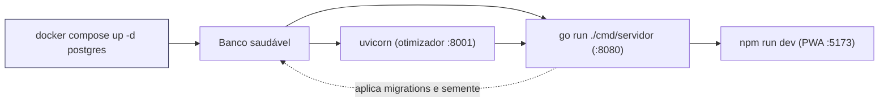

# Como rodar

Dois caminhos: **tudo em Docker** (mais simples, bom para demonstração) ou **serviços
locais com o banco em Docker** (melhor para desenvolver, com recarga automática).

## Pré-requisitos

| Ferramenta | Versão mínima | Necessária para |
|---|---|---|
| Docker + Compose | 24 | banco (sempre) e o modo containerizado |
| Go | 1.22 | rodar a API localmente |
| Python | 3.10 | rodar o otimizador localmente (o container usa 3.11) |
| Node.js | 20 | rodar o PWA localmente |

Antes de qualquer coisa, copie as variáveis de ambiente:

```bash
cp .env.exemplo .env
```

## Caminho A — tudo em Docker

```bash
docker compose up --build
```

Sobe os quatro serviços na ordem correta (o Compose espera o banco e o otimizador ficarem
saudáveis antes de subir a API). As migrations e a semente são aplicadas automaticamente
pela API no start, porque `APLICAR_MIGRACOES=true`.

| Serviço | URL |
|---|---|
| PWA | http://localhost:5173 |
| API Go | http://localhost:8080/api/v1 |
| Otimizador | http://localhost:8001/docs (Swagger do FastAPI) |
| PostgreSQL | localhost:5432 |

Para derrubar tudo e **apagar o banco**: `docker compose down -v`.

## Caminho B — desenvolvimento local

### 1. Banco

```bash
docker compose up -d postgres
```

### 2. Otimizador (Python)

```bash
cd modelo
python -m venv .venv
.venv/Scripts/activate          # Windows (PowerShell: .venv\Scripts\Activate.ps1)
pip install -r requirements.txt
uvicorn app.main:app --reload --port 8001
```

### 3. API (Go)

Em outro terminal — ela aplica as migrations sozinha ao subir:

```bash
cd api
go run ./cmd/servidor
```

### 4. PWA

```bash
cd pwa
npm install
npm run dev
```

## Ordem de inicialização



A API depende do banco **e** do otimizador: sem o serviço Python no ar, o endpoint de
recomendação responde `503 OTIMIZADOR_INDISPONIVEL` (o resto da API continua funcionando).

## Docker dentro do WSL2

Se o Docker roda **dentro do WSL** (e não via Docker Desktop com integração), rode os
comandos de dentro da distro:

```bash
wsl
cd /mnt/c/caminho/para/tcc
docker compose up -d --build
```

Dois detalhes que costumam morder nesse arranjo:

- **`error getting credentials … docker-credential-desktop.exe: exec format error`** — o
  `~/.docker/config.json` da distro herdou `"credsStore": "desktop.exe"`, que é um binário
  Windows e não executa no Linux. Remova essa chave do arquivo, ou contorne por comando:

  ```bash
  mkdir -p /tmp/cfgdocker && echo '{}' > /tmp/cfgdocker/config.json
  DOCKER_CONFIG=/tmp/cfgdocker docker compose up -d --build
  ```

- **Containers param sozinhos entre um comando e outro** — a VM do WSL desliga quando não
  há nenhuma sessão aberta, e leva os containers junto (eles saem com código 0). Mantenha
  um terminal WSL aberto durante o uso, ou acrescente `restart: unless-stopped` aos
  serviços do `docker-compose.yml`.

## Verificação rápida

```bash
# 1. Saúde geral (deve reportar banco e otimizador "ok")
curl http://localhost:8080/saude

# 2. Autenticar com o usuário de demonstração da semente
curl -X POST http://localhost:8080/api/v1/auth/entrar \
  -H "Content-Type: application/json" \
  -d '{"email":"demo@exemplo.com","senha":"demo1234"}'

# 3. Guardar o token e listar as listas de exemplo
TOKEN="<cole o token da resposta anterior>"
curl http://localhost:8080/api/v1/listas -H "Authorization: Bearer $TOKEN"

# 4. Gerar uma recomendação (troque o 1 pelo id da lista)
curl -X POST http://localhost:8080/api/v1/listas/1/recomendacoes \
  -H "Authorization: Bearer $TOKEN" -H "Content-Type: application/json" \
  -d '{"perfil":"equilibrado"}'
```

Repita o passo 4 com `"perfil":"economico"` e `"perfil":"conveniente"`: o econômico tende
a espalhar a compra por mais mercados, e o conveniente a concentrá-la em menos.

## Testes e portões de qualidade

```bash
# Otimizador
cd modelo
.venv/Scripts/python -m pytest testes -q
.venv/Scripts/python -m black --check .
.venv/Scripts/python -m ruff check .
.venv/Scripts/python scripts/validacao_exaustiva.py --repeticoes 30

# API
cd api
gofmt -l .        # não pode listar nada
go vet ./...
go test ./...

# PWA
cd pwa
npm run build

# Sistema ponta a ponta (exige a pilha de pe)
bash scripts/testes_de_sistema.sh
```

## Problemas comuns

| Sintoma | Causa provável | Solução |
|---|---|---|
| `503 OTIMIZADOR_INDISPONIVEL` | serviço Python fora do ar | conferir `curl http://localhost:8001/saude` |
| API não sobe, erro de conexão | Postgres ainda iniciando | aguardar o healthcheck ou `docker compose ps` |
| Migrations não aplicaram | `APLICAR_MIGRACOES` diferente de `true` | ajustar o `.env` e reiniciar a API |
| PWA não fala com a API | `VITE_API_URL` errada | conferir a variável e reiniciar o Vite (env é lida no build) |
| Recomendação sem candidatos | banco sem preços vigentes | conferir se a semente foi aplicada (`SELECT count(*) FROM precos`) |
| Service worker servindo versão antiga | precache do Workbox | recarregar com cache limpo ou desregistrar o SW nas DevTools |
