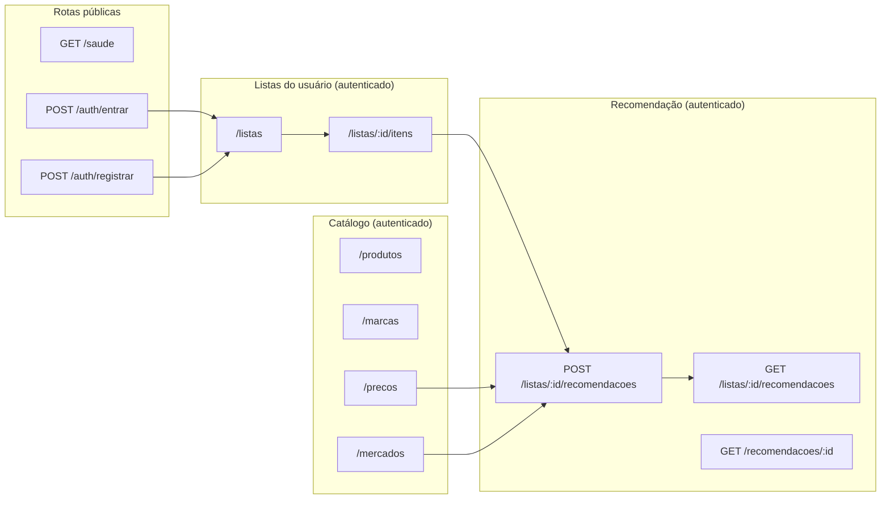

# Contrato da API REST — Go ↔ PWA

Fonte da verdade do contrato entre a API Go (Gin) e o PWA. Serve também como referência
para testes manuais com `curl` e para os cenários de sistema da Fase 4.

- Base URL: `http://localhost:8080/api/v1`
- Content-Type: `application/json`
- Autenticação: `Authorization: Bearer <token JWT>`

## Mapa de rotas



## Formato de erro

Toda falha responde com o mesmo envelope:

```json
{ "erro": { "codigo": "VALIDACAO", "mensagem": "quantidade deve ser maior que zero", "detalhes": null } }
```

| Código | HTTP | Quando |
|---|---|---|
| `VALIDACAO` | 400 | corpo malformado ou regra de entrada violada |
| `NAO_AUTENTICADO` | 401 | token ausente, inválido ou expirado |
| `NAO_AUTORIZADO` | 403 | recurso pertence a outro usuário |
| `NAO_ENCONTRADO` | 404 | recurso inexistente |
| `CONFLITO` | 409 | e-mail já cadastrado, marca duplicada |
| `OTIMIZADOR_INDISPONIVEL` | 503 | serviço Python fora do ar ou estourou o tempo |
| `ERRO_INTERNO` | 500 | falha inesperada |

## Saúde

`GET /saude` → `200`

```json
{ "status": "ok", "banco": "ok", "otimizador": "ok" }
```

## Autenticação

### `POST /auth/registrar`

```json
{ "nome": "Maria Silva", "email": "maria@exemplo.com", "senha": "segredo123" }
```

`201` →

```json
{
  "token": "eyJhbGciOi...",
  "usuario": { "id": 1, "nome": "Maria Silva", "email": "maria@exemplo.com" }
}
```

Senha com mínimo de 8 caracteres, armazenada com **bcrypt**. E-mail duplicado → `409`.

### `POST /auth/entrar`

```json
{ "email": "maria@exemplo.com", "senha": "segredo123" }
```

`200` → mesmo corpo do registro. Credencial inválida → `401` com mensagem genérica
(não revela se o e-mail existe).

## Catálogo

| Método | Rota | Descrição |
|---|---|---|
| `GET` | `/produtos?busca=arroz` | lista produtos, filtro opcional por nome |
| `POST` | `/produtos` | `{ "nome": "Arroz", "categoria": "Mercearia" }` |
| `GET` | `/produtos/:id/marcas` | marcas de um produto |
| `POST` | `/marcas` | `{ "produto_id": 1, "nome": "Tio João 5kg" }` |
| `GET` | `/mercados` | todos os mercados com coordenadas |
| `POST` | `/mercados` | `{ "nome": "...", "latitude": -7.2208, "longitude": -39.3042, "endereco": "..." }` |
| `GET` | `/precos?mercado_id=1&marca_id=7&vigentes=true` | preços; `vigentes=true` usa a view `precos_vigentes` |
| `POST` | `/precos` | registra um **novo snapshot** de preço |

### `POST /precos`

```json
{
  "marca_id": 7,
  "mercado_id": 1,
  "preco": 25.99,
  "unidade": "un",
  "quantidade_disponivel": 12,
  "coletado_em": "2026-09-06T10:00:00Z"
}
```

`coletado_em` é opcional (padrão: agora). **Não existe `PUT /precos/:id`**: a tabela é
append-only para preservar a série histórica, conforme a seção 4 do `CLAUDE.md`.

## Listas de compra

Todas escopadas ao usuário do token; acessar lista de outro usuário retorna `403`.

| Método | Rota | Corpo / Descrição |
|---|---|---|
| `GET` | `/listas` | listas do usuário, com contagem de itens |
| `POST` | `/listas` | `{ "nome": "Compras do mês" }` |
| `GET` | `/listas/:id` | lista com os itens expandidos (produto e marca resolvidos) |
| `PUT` | `/listas/:id` | `{ "nome": "..." }` |
| `DELETE` | `/listas/:id` | remove lista e itens em cascata |
| `POST` | `/listas/:id/itens` | `{ "produto_id": 1, "marca_id": 7, "quantidade": 2, "unidade": "un" }` |
| `PUT` | `/listas/:id/itens/:item_id` | mesmos campos |
| `DELETE` | `/listas/:id/itens/:item_id` | remove o item |

`marca_id` é **opcional**: quando nulo, qualquer marca do produto pode ser usada pelo
otimizador — o que costuma gerar mais economia. Quando informado, restringe os candidatos
àquela marca específica.

## Recomendação

### `POST /listas/:id/recomendacoes`

```json
{
  "perfil": "equilibrado",
  "origem": { "latitude": -7.213100, "longitude": -39.315300 }
}
```

| Campo | Obrigatório | Descrição |
|---|---|---|
| `perfil` | sim (salvo se `peso_conveniencia` for enviado) | `economico`, `equilibrado` ou `conveniente` |
| `peso_conveniencia` | não | peso numérico livre ≥ 0; **sobrepõe** o perfil. Existe para os experimentos da Fase 4 |
| `origem` | não | padrão: `ORIGEM_PADRAO_*` do servidor. Quando omitida, a resposta traz `origem_aproximada: true` |

Limite da PoC: listas com mais de **20 itens** ou cenários com mais de **8 mercados** são
rejeitados com `400 VALIDACAO` e mensagem descritiva. A instância nunca é processada
parcialmente.

Perfis e seus pesos:

| Perfil | `peso_conveniencia` | Comportamento esperado |
|---|---|---|
| `economico` | `0.0` | busca o menor preço, aceitando visitar muitos mercados |
| `equilibrado` | `1.0` | pondera preço e deslocamento |
| `conveniente` | `3.0` | concentra a compra em poucos mercados, mesmo pagando mais |

`201` →

```json
{
  "id": 15,
  "lista_id": 3,
  "gerado_em": "2026-09-06T13:40:12Z",
  "perfil": "equilibrado",
  "peso_conveniencia": 1.0,
  "origem_aproximada": false,
  "status": "OTIMO",
  "custo_itens_centavos": 11000,
  "custo_logistico_centavos": 1345,
  "custo_total_centavos": 12345,
  "custo_por_visita_centavos": 800,
  "custo_por_km_centavos": 120,
  "quantidade_mercados_visitados": 2,
  "distancia_total_km": 7.42,
  "rota": [ { "ordem": 1, "mercado_id": 3, "nome": "Mercado Central", "distancia_do_anterior_km": 2.1 } ],
  "compras_por_mercado": [
    {
      "mercado_id": 3,
      "nome": "Mercado Central",
      "endereco": "Av. Central, 100",
      "subtotal_centavos": 5198,
      "itens": [
        {
          "item_id": 10,
          "produto_nome": "Arroz",
          "marca_nome": "Tio João 5kg",
          "quantidade": 2,
          "unidade": "un",
          "preco_unitario_centavos": 2599,
          "custo_centavos": 5198
        }
      ]
    }
  ],
  "itens_nao_atendidos": [
    { "item_id": 12, "produto_nome": "Café", "motivo": "SEM_CANDIDATO_COM_ESTOQUE" }
  ],
  "economia": {
    "mercado_unico_nome": "Mercado Central",
    "custo_mercado_unico_centavos": 14000,
    "economia_centavos": 3000,
    "economia_percentual": 21.43,
    "observacao": null
  }
}
```

Valores monetários trafegam **sempre em centavos inteiros**; a formatação em reais é
responsabilidade do PWA. Se o serviço Python estiver indisponível, a resposta é `503`
com código `OTIMIZADOR_INDISPONIVEL` — a API nunca devolve uma recomendação parcial ou
inventada.

Lista vazia responde `201` com custos zerados e `compras_por_mercado` vazio; itens sem
oferta viável aparecem em `itens_nao_atendidos`. Nenhum desses casos gera `500`.

### Histórico

| Método | Rota | Descrição |
|---|---|---|
| `GET` | `/listas/:id/recomendacoes` | histórico resumido, mais recente primeiro |
| `GET` | `/recomendacoes/:id` | recomendação completa, reconstruída de `payload_resultado` |

O histórico é a trilha de auditoria usada nos testes de acurácia da Fase 4: permite
comparar a mesma lista sob os três perfis e ao longo de diferentes coletas de preço.
