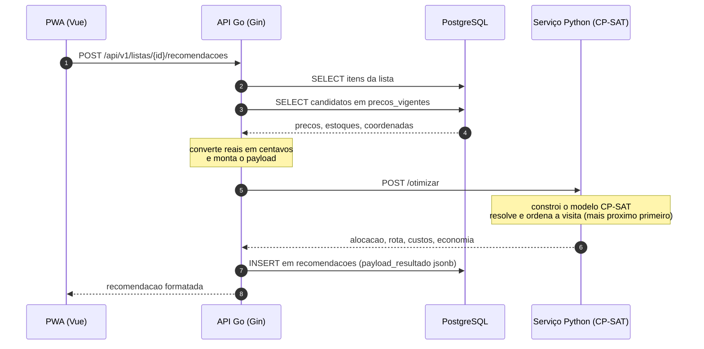

# Contrato de otimização — API Go ↔ Serviço Python

Este documento é a **fonte da verdade** do contrato HTTP entre a API Go e o serviço de
otimização em Python. Os dois lados são implementados de forma independente contra esta
especificação; qualquer mudança aqui exige atualizar os dois.

- Serviço: `modelo/` (FastAPI + OR-Tools CP-SAT)
- Endpoint: `POST /otimizar`
- Base URL padrão: `http://localhost:8001` (em Docker: `http://modelo:8001`)
- Content-Type: `application/json`

## Princípio de projeto

O serviço Python é **stateless** e não acessa o PostgreSQL. Ele recebe um payload já
montado — itens, candidatos de preço/estoque por mercado e coordenadas — e devolve a
alocação ótima. Isso mantém o núcleo de otimização puro, determinístico e testável
isoladamente, que é exatamente o que o capítulo de metodologia do TCC precisa demonstrar.



## Unidades e convenções

| Grandeza | Representação no contrato | Motivo |
|---|---|---|
| Dinheiro | inteiro em **centavos** (`_centavos`) | CP-SAT opera apenas com inteiros; evita erro de ponto flutuante |
| Distância | `float` em **quilômetros** (`_km`) | legibilidade; internamente o solver usa metros inteiros |
| Quantidade | `float` | permite `1.5 kg`; o custo é arredondado ao centavo mais próximo |
| Identificadores | `int` | são os IDs do PostgreSQL, repassados intactos |

O custo de um item em um mercado é calculado **pelo serviço Python**:

```
custo_centavos = round(preco_unitario_centavos * quantidade)
```

## Requisição — `POST /otimizar`

```json
{
  "origem": { "latitude": -7.213100, "longitude": -39.315300 },
  "peso_conveniencia": 1.0,
  "custo_por_visita_centavos": 800,
  "limite_tempo_segundos": 10.0,
  "mercados": [
    {
      "mercado_id": 1,
      "nome": "Supermercado Bom Preço",
      "latitude": -7.204200,
      "longitude": -39.320500
    }
  ],
  "itens": [
    {
      "item_id": 10,
      "descricao": "Arroz branco tipo 1 - 5kg",
      "quantidade": 2.0,
      "unidade": "un",
      "candidatos": [
        {
          "mercado_id": 1,
          "marca_id": 7,
          "marca_nome": "Tio João 5kg",
          "preco_unitario_centavos": 2599,
          "quantidade_disponivel": 12.0
        }
      ]
    }
  ]
}
```

### Campos da requisição

| Campo | Tipo | Obrigatório | Descrição |
|---|---|---|---|
| `origem.latitude` / `origem.longitude` | float | sim | ponto de partida e retorno do usuário; base da ordem de visita e do desempate |
| `peso_conveniencia` | float ≥ 0 | sim | escalarização do objetivo. `0` ignora o custo das paradas; valores maiores concentram a compra |
| `custo_por_visita_centavos` | int ≥ 0 | não (padrão `800`) | custo fixo atribuído a cada mercado visitado |
| `limite_tempo_segundos` | float > 0 | não (padrão `10`) | teto de tempo do solver |
| `mercados[]` | lista | sim | todos os mercados considerados; `mercado_id` único |
| `itens[]` | lista | sim | itens da lista de compras; pode ser vazia |
| `itens[].quantidade` | float > 0 | sim | quantidade pedida, na `unidade` informada |
| `itens[].candidatos[]` | lista | sim | ofertas conhecidas; pode ser vazia (item vira não atendido) |
| `candidatos[].quantidade_disponivel` | float ≥ 0 | sim | estoque no snapshot vigente |

### Regras de validação (HTTP 422 em caso de violação)

1. `mercado_id` de todo candidato precisa existir em `mercados[]`.
2. `mercado_id` não pode se repetir em `mercados[]`; `item_id` não pode se repetir em `itens[]`.
3. Um mesmo par (`item_id`, `mercado_id`) não pode aparecer duas vezes em `candidatos[]`.
4. `preco_unitario_centavos` deve ser inteiro positivo.
5. Latitudes em `[-90, 90]` e longitudes em `[-180, 180]`.

Um candidato com `quantidade_disponivel < quantidade` **não é erro**: ele é simplesmente
descartado na construção do modelo (restrição de estoque suficiente).

## Resposta — `200 OK`

```json
{
  "status": "OTIMO",
  "custo_itens_centavos": 11000,
  "custo_logistico_centavos": 1345,
  "custo_total_centavos": 12345,
  "valor_objetivo_centavos": 12345,
  "peso_conveniencia": 1.0,
  "custo_por_visita_centavos": 800,
  "quantidade_mercados_visitados": 2,
  "distancia_total_km": 7.42,
  "rota": [
    { "ordem": 1, "mercado_id": 3, "nome": "Mercado Central", "distancia_do_anterior_km": 2.10 },
    { "ordem": 2, "mercado_id": 1, "nome": "Supermercado Bom Preço", "distancia_do_anterior_km": 3.05 }
  ],
  "compras_por_mercado": [
    {
      "mercado_id": 3,
      "nome": "Mercado Central",
      "subtotal_centavos": 5198,
      "itens": [
        {
          "item_id": 10,
          "descricao": "Arroz branco tipo 1 - 5kg",
          "marca_id": 7,
          "marca_nome": "Tio João 5kg",
          "quantidade": 2.0,
          "unidade": "un",
          "preco_unitario_centavos": 2599,
          "custo_centavos": 5198
        }
      ]
    }
  ],
  "itens_nao_atendidos": [
    { "item_id": 12, "descricao": "Café torrado 500g", "motivo": "SEM_CANDIDATO_COM_ESTOQUE" }
  ],
  "economia": {
    "mercado_unico_id": 3,
    "mercado_unico_nome": "Mercado Central",
    "custo_mercado_unico_centavos": 14000,
    "distancia_mercado_unico_km": 4.8,
    "economia_centavos": 3000,
    "economia_percentual": 21.43,
    "itens_comparados": 8,
    "comparacao_parcial": false,
    "observacao": null
  },
  "diagnostico": {
    "status_solver": "OPTIMAL",
    "tempo_solver_segundos": 0.031,
    "quantidade_variaveis": 42,
    "quantidade_restricoes": 27
  }
}
```

### Campos da resposta

| Campo | Descrição |
|---|---|
| `status` | `OTIMO` (ótimo provado), `VIAVEL` (solução encontrada, limite de tempo atingido) ou `INVIAVEL` |
| `custo_itens_centavos` | soma dos itens efetivamente alocados |
| `custo_logistico_centavos` | `custo_por_visita * nº mercados`, **sem** o peso. A distância não é precificada |
| `custo_por_visita_centavos` | o parâmetro **efetivamente usado**: o enviado na requisição ou, na ausência dele, o padrão `MODELO_CUSTO_POR_VISITA_CENTAVOS`. Ecoá-lo é o que torna `custo_logistico_centavos` auditável |
| `custo_total_centavos` | `custo_itens + custo_logistico` — o que o usuário de fato gasta/despende |
| `valor_objetivo_centavos` | valor da função objetivo, **com** o peso aplicado e sem as penalidades |
| `distancia_total_km` | comprimento, em linha reta, do percurso sugerido (origem → mercados na ordem → origem). Informativo: não entra no custo |
| `rota[]` | mercados visitados na ordem sugerida: a partir da origem, sempre o mais próximo ainda não visitado. Vazia se nada foi alocado |
| `compras_por_mercado[]` | a recomendação em si: o que comprar em cada mercado |
| `itens_nao_atendidos[]` | itens sem alocação, com o motivo |
| `economia` | comparação com o baseline de mercado único (ver abaixo) |
| `diagnostico` | telemetria do solver, usada nos experimentos da Fase 4 |

### Motivos de item não atendido

| Motivo | Significado |
|---|---|
| `SEM_CANDIDATO` | nenhum preço cadastrado para o item em nenhum mercado |
| `SEM_CANDIDATO_COM_ESTOQUE` | há preço, mas nenhum mercado tem `quantidade_disponivel` suficiente |

### Baseline de economia

`economia` compara o custo da recomendação com o de **comprar tudo em um único mercado**.
A regra tem dois níveis, para nunca comparar coisas diferentes:

1. **Comparação completa** (`comparacao_parcial: false`) — existe pelo menos um mercado
   capaz de atender sozinho **todos** os itens que a solução atendeu. O baseline é o mais
   barato entre eles, e `itens_comparados` é o total de itens atendidos.
2. **Comparação parcial** (`comparacao_parcial: true`) — nenhum mercado atende sozinho a
   lista inteira. O baseline passa a ser o mercado de **maior cobertura** (desempate pelo
   menor custo), e a comparação considera **apenas os itens que esse mercado cobre**: o
   lado da recomendação é recalculado sobre esse mesmo subconjunto. `itens_comparados`
   informa o tamanho do subconjunto e `observacao` explica a limitação em texto.

Se nem sequer um mercado cobre um único item, todos os campos numéricos vêm `null` com
`observacao` preenchida — a economia nunca é inventada.

Nos dois casos a comparação é **só do que se paga no caixa**: a soma dos itens de cada lado.
O custo das paradas (`custo_por_visita`) fica de fora, porque ninguém o paga no mercado.
Na comparação completa, o lado da recomendação coincide com `custo_itens_centavos`. O
esforço aparece à parte: `distancia_mercado_unico_km` é a ida e volta da origem até o
mercado único, para ser comparada com `distancia_total_km` do roteiro.

### Desempate determinístico

Com `peso_conveniencia = 0` a parcela logística desaparece do objetivo e passam a existir
várias soluções de custo idêntico. Para que a mesma entrada produza sempre a mesma saída —
requisito da validação da Fase 4 — o solve tem **duas fases**:

1. minimiza a função objetivo e guarda o valor ótimo `Z*`;
2. fixa `objetivo == Z*` como restrição e minimiza, em ordem lexicográfica, o **número de
   mercados visitados** e depois a **soma das distâncias desses mercados à origem**.

O valor reportado em `valor_objetivo_centavos` é sempre o `Z*` da primeira fase; a segunda
fase apenas escolhe, entre as soluções ótimas, a mais conveniente.

### A distância não é precificada

O SAD decide por **preço e disponibilidade**. Não existe custo por quilômetro: a distância
só aparece no desempate (acima), na ordem de visita e em `distancia_total_km`, como
informação. A ordem de visita é montada depois do solve, num **único percurso**. O usuário
sai da origem uma vez, vai sempre ao mercado ainda não visitado mais próximo de onde está e
volta para casa no fim. O histórico das versões anteriores (ida e volta linearizada e
circuito no CP-SAT) está em `modelo/docs/formulacao-matematica.md` §7.

## Erros

| HTTP | Situação | Corpo |
|---|---|---|
| `422` | payload inválido (regras de validação acima) | detalhe padrão do FastAPI/Pydantic |
| `500` | falha inesperada no solver | `{"detail": "mensagem"}` |

O caso "nenhum item pôde ser atendido" **não** é erro: a resposta é `200` com
`compras_por_mercado` vazio, todos os itens em `itens_nao_atendidos` e `status` refletindo
o resultado do solver. Uma lista vazia também retorna `200`, com custos zerados.

## Endpoint auxiliar — `GET /saude`

```json
{ "status": "ok", "servico": "modelo-otimizacao", "versao": "1.0.0" }
```

Usado pelo healthcheck do Docker Compose e pela verificação de disponibilidade feita pela
API Go antes de aceitar requisições de recomendação.
