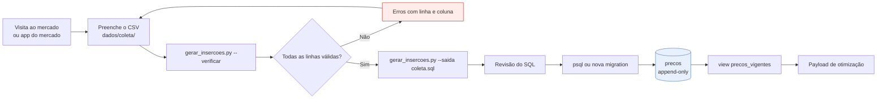
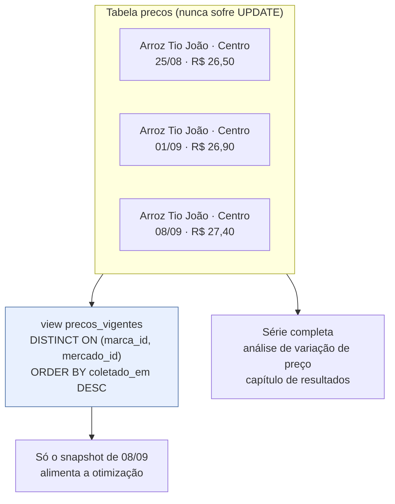

# Dados e coleta de preços

A coleta manual de preços é o **maior risco de atraso do projeto**, segundo o
`plano_desenvolvimento.md`. Este documento define o protocolo de coleta, o pipeline que
transforma a planilha em dados no banco, e descreve a base fictícia que existe hoje.

## Pipeline



O script gera **texto SQL** e nunca escreve no banco por conta própria. A revisão manual
entre a geração e a aplicação é deliberada: uma coleta com erro de digitação em massa é
mais fácil de descartar antes de entrar na série histórica do que depois.

## Protocolo de coleta

| Item | Definição |
|---|---|
| Frequência | **semanal**, sempre no mesmo dia da semana |
| Escopo | os 6 mercados de Juazeiro do Norte, dentro do raio de ~7 km do centro |
| Cesta | 18 produtos, 2 marcas cada |
| Fonte | preço de gôndola na visita presencial, ou app oficial do mercado |
| Registro | uma linha por (mercado, marca), inclusive quando o produto está em falta |

Regras que evitam viés nos dados:

- **Produto em falta registra-se com `quantidade_disponivel = 0`**, nunca omitindo a
  linha. Omitir faria o sistema tratar "em falta" como "não vendemos", que são coisas
  diferentes: a primeira é temporária e a segunda é estrutural.
- **Promoções entram pelo preço efetivamente pago**, com a observação registrada à parte.
  Promoção condicionada a cartão de fidelidade **não** entra: o modelo assume que qualquer
  pessoa consegue o preço registrado.
- **Estoque é estimado por observação** (aproximadamente quantas unidades há na gôndola).
  Não precisa de precisão: a restrição do modelo é `estoque >= quantidade pedida`, e o que
  importa é distinguir "tem bastante" de "tem pouco" e de "não tem".
- **Nomes de mercado, produto e marca precisam bater exatamente** com os cadastrados. O
  script resolve as chaves estrangeiras por nome; uma diferença de grafia produz um INSERT
  que não insere nada.

## O arquivo de coleta

Formato em `dados/coleta/`, cabeçalho obrigatório:

```
mercado,produto,marca,preco,unidade,quantidade_disponivel,coletado_em
```

| Coluna | Tipo | Obrigatório | Exemplo | Validação |
|---|---|---|---|---|
| `mercado` | texto | sim | `Atacadão do Limoeiro` | não vazio; precisa existir em `mercados.nome` |
| `produto` | texto | sim | `Arroz` | não vazio; precisa existir em `produtos.nome` |
| `marca` | texto | sim | `Tio João 5kg` | não vazio; precisa existir em `marcas.nome` |
| `preco` | decimal | sim | `22.90` | numérico e maior que zero; aceita vírgula decimal |
| `unidade` | texto | sim | `un` | um de `kg`, `g`, `L`, `ml`, `un` |
| `quantidade_disponivel` | decimal | sim | `35` | numérico e não negativo; `0` significa em falta |
| `coletado_em` | data ISO | sim | `2026-09-01` | formato `AAAA-MM-DD` |

`dados/coleta/modelo_coleta.csv` é a planilha em branco com duas linhas de exemplo.

## Comandos

```bash
# Valida sem gerar nada; aponta linha e coluna de cada problema
python dados/gerar_insercoes.py --entrada dados/coleta/coleta_2026-09-08.csv --verificar

# Gera o SQL depois que a validação passa
python dados/gerar_insercoes.py --entrada dados/coleta/coleta_2026-09-08.csv --saida coleta.sql
```

O script sai com código 1 em caso de erro, o que permite usá-lo como portão automatizado.
Exemplo de saída de erro:

```
5 problema(s) encontrado(s):
  linha 2, coluna mercado: valor obrigatorio vazio
  linha 2, coluna preco: preco nao numerico: 'abc'
  linha 2, coluna unidade: unidade 'litro' fora da lista permitida ['kg', 'g', 'L', 'ml', 'un']
  linha 2, coluna quantidade_disponivel: quantidade nao pode ser negativa
  linha 2, coluna coletado_em: data invalida '01-09-2026'; use o formato AAAA-MM-DD
```

Cada INSERT gerado traz um `WHERE NOT EXISTS` sobre o par (marca, mercado, `coletado_em`):
aplicar o mesmo arquivo duas vezes não duplica observações.

## Histórico append-only



Corrigir um preço errado também é um `INSERT`, com `coletado_em` posterior — nunca um
`UPDATE`. É esse mecanismo que permite **substituir a base fictícia pela coleta real sem
apagar nada**: basta inserir a coleta real com data posterior, e ela passa a prevalecer.

Cuidado prático: a view não desempata `coletado_em` idêntico. Evite registrar duas coletas
do mesmo par (marca, mercado) com exatamente o mesmo instante.

## A base de semente atual — FICTÍCIA

`api/migracoes/002_dados_semente.sql` carrega dados **inventados**, para o sistema rodar
ponta a ponta antes de a coleta de campo terminar. Nenhum preço foi observado em loja e
nenhum estabelecimento real é representado: os nomes são placeholders.

**Nenhum resultado do capítulo de resultados do TCC pode se basear nesses valores.**

### Mercados

| Mercado | Bairro | Distância aproximada do centro | Perfil de preço |
|---|---|---|---|
| Mercado Central do Juazeiro | Centro | ~0,2 km | mais caro |
| Supermercado Bom Preço Triângulo | Triângulo | ~1,1 km | caro |
| Supermercado Vila Nova Salesianos | Salesianos | ~1,5 km | intermediário |
| Hipermercado Lagoa Seca | Lagoa Seca | ~2,9 km | intermediário |
| Atacadão do Limoeiro | Limoeiro | ~5,1 km | barato |
| Supermercado Economia Muriti | Muriti | ~6,9 km | mais barato |

O gradiente **quanto mais longe, mais barato** é intencional: é ele que cria o trade-off
custo × conveniência que a função objetivo resolve. Sem esse gradiente, o problema seria
trivial e o capítulo de resultados não teria o que mostrar.

### Cesta

18 produtos de cesta básica (arroz, feijão, óleo, açúcar, café, leite, farinha, macarrão,
sal, molho de tomate, biscoito, margarina, ovos, sabonete, papel higiênico, detergente,
carne bovina, banana), com 2 marcas cada — 36 marcas ao todo — e 218 snapshots de preço
distribuídos em duas datas de coleta (25/08 e 01/09).

### Características intencionais

Cada uma existe para exercitar um caminho específico do sistema:

| Característica | O que exercita |
|---|---|
| Nenhum mercado é o mais barato em tudo | a decisão de dividir a compra; sem isso o ótimo seria sempre um mercado só |
| Dispersão de preço entre 10% e 30% na mesma marca | faixa realista; diferenças absurdas tornariam a otimização trivial |
| Mercados baratos mais distantes | o trade-off entre economia no item e custo do deslocamento |
| Nenhum mercado cobre sozinho os 18 produtos | o caminho de **comparação parcial** no baseline de economia |
| "Carne bovina" só em 2 mercados e "Banana prata" em 3 | cobertura desigual, que força visitas específicas |
| Duas marcas com `quantidade_disponivel = 0` | motivo `SEM_CANDIDATO_COM_ESTOQUE` |
| Duas marcas com estoque de 1 e 2 unidades | a restrição de estoque suficiente quando a quantidade pedida é maior |
| Duas datas de coleta para parte dos preços | a view `precos_vigentes` e o histórico append-only |

### Usuário de demonstração

| Campo | Valor |
|---|---|
| E-mail | `demo@exemplo.com` |
| Senha | `demo1234` |

O hash é bcrypt de custo 10 real, conferido contra a senha correta e contra uma senha
errada. Vêm junto **duas listas de exemplo**: uma cesta básica completa e uma lista curta,
esta última com ao menos um item de marca livre (`marca_id` nulo).

Para regerar o hash:

```bash
python -c "import bcrypt; print(bcrypt.hashpw(b'demo1234', bcrypt.gensalt(rounds=10, prefix=b'2a')).decode())"
```

## Substituindo pela coleta real

1. Confira que os 6 mercados reais estão em `mercados` com nome, endereço e coordenadas
   corretos (use `POST /api/v1/mercados` ou uma migration).
2. Confira produtos e marcas — os nomes precisam bater com o que vai no CSV.
3. Preencha o CSV da semana, valide e gere o SQL.
4. Aplique. Como `coletado_em` é posterior ao da semente, a coleta real passa a prevalecer
   automaticamente em `precos_vigentes`.
5. Só então rode os experimentos da Fase 4. Antes disso, qualquer número é fictício.

## Verificações de qualidade dos dados

Consultas para rodar depois de cada coleta:

```sql
-- Preços fora de faixa plausível (possível erro de digitação)
SELECT me.nome, ma.nome, pv.preco
  FROM precos_vigentes pv
  JOIN marcas ma ON ma.id = pv.marca_id
  JOIN mercados me ON me.id = pv.mercado_id
 WHERE pv.preco < 1 OR pv.preco > 200;

-- Coletas desatualizadas: pares sem observação nos últimos 10 dias
SELECT me.nome, ma.nome, pv.coletado_em
  FROM precos_vigentes pv
  JOIN marcas ma ON ma.id = pv.marca_id
  JOIN mercados me ON me.id = pv.mercado_id
 WHERE pv.coletado_em < now() - interval '10 days'
 ORDER BY pv.coletado_em;

-- Cobertura por mercado: quantas das 36 marcas cada um tem
SELECT me.nome, count(*) AS marcas_cobertas
  FROM precos_vigentes pv
  JOIN mercados me ON me.id = pv.mercado_id
 GROUP BY me.nome
 ORDER BY marcas_cobertas DESC;

-- Produtos sem nenhuma oferta: virariam itens não atendidos
SELECT p.nome
  FROM produtos p
 WHERE NOT EXISTS (
       SELECT 1 FROM precos_vigentes pv
         JOIN marcas ma ON ma.id = pv.marca_id
        WHERE ma.produto_id = p.id
 );

-- Variação de preço de uma marca ao longo do tempo, num mercado
SELECT p.coletado_em, p.preco
  FROM precos p
  JOIN marcas ma ON ma.id = p.marca_id
 WHERE ma.nome = 'Tio João 5kg' AND p.mercado_id = 1
 ORDER BY p.coletado_em;
```

| Risco | Como detectar | Efeito se passar |
|---|---|---|
| Preço digitado errado | primeira consulta | recomendação absurda, difícil de perceber |
| Coleta atrasada | segunda consulta | decisão tomada sobre preço velho |
| Cobertura insuficiente | terceira e quarta | muitos itens não atendidos |
| Nome divergente | INSERT que insere 0 linhas | dado some silenciosamente |

A última é a mais traiçoeira: como o script resolve chaves por nome, um `WHERE` que não
casa gera um comando válido que não insere nada. Depois de aplicar uma coleta, confira a
contagem de linhas inseridas contra a contagem de linhas do CSV.
