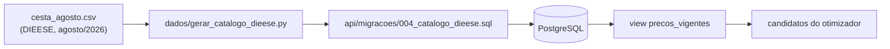

# Dados: a base da cesta básica do DIEESE

A PoC **não coleta preços em supermercados**. O escopo geográfico é **Juazeiro do
Norte/CE**, e o catálogo inteiro (supermercados, produtos, marcas e preços) vem da Pesquisa
Nacional da Cesta Básica de Alimentos do DIEESE, no arquivo `cesta_agosto.csv`, na raiz do
projeto. É uma decisão de escopo do autor, tomada em
2026-09-28 para simplificar a prova de conceito, e substitui o protocolo de coleta manual
em Juazeiro do Norte.

## Pipeline



O gerador usa só a biblioteca padrão e nunca escreve no banco: ele produz o SQL, que a API
aplica como migration na subida.

```bash
python3 dados/gerar_catalogo_dieese.py --entrada cesta_agosto.csv \
    --saida api/migracoes/004_catalogo_dieese.sql
```

## Como o CSV vira catálogo

O CSV tem uma linha por cidade e uma coluna por produto, com o preço médio em reais
(`"45,31"`) ou `-` quando a cidade não tem aquele produto na pesquisa.

| Conceito do sistema | De onde vem |
|---|---|
| **Supermercado** | um supermercado **fictício em Juazeiro do Norte** para cada nome de cidade do CSV (`Supermercado Fortaleza`), que pratica os preços DIEESE daquela cidade. A localização é fictícia: espiral determinística (de Vogel) num raio de 6 km do centro, na ordem do CSV, sem relação com os preços |
| **Produto** | cada coluna de produto (13 no total). A coluna "Total da Cesta" é ignorada |
| **Marca** | duas marcas **fictícias** por produto, porque a base não tem marca |
| **Preço** | preço DIEESE +8% na primeira marca, −8% na segunda. A média das duas é o preço publicado |
| **Disponibilidade** | célula preenchida = disponível; `-` = sem preço naquele supermercado |
| **Estoque** | a base não informa estoque; todo preço entra com 1000 unidades |
| **Data** | `coletado_em` = 2026-08-31 (mês de referência da pesquisa) |

São 28 supermercados. Macaé aparece no CSV com todas as células `-`: o "Supermercado Macaé"
existe, mas não oferta nada, e por isso nunca é escolhido.

### Produtos e unidades

A unidade é aquela a que o preço do DIEESE se refere. A quantidade de um item da lista é
lida nessa mesma unidade: 2 de "Carne bovina" são 2 kg.

| Coluna no CSV | Produto | Categoria | Unidade | Marcas fictícias |
|---|---|---|---|---|
| Carne | Carne bovina | Açougue | kg | Boi Nobre, Corte Bom |
| Leite | Leite integral | Laticínios | L | Vale Verde, Leiteria Serrana |
| Feijão | Feijão | Mercearia | kg | Grão de Ouro, Sertão Forte |
| Arroz | Arroz | Mercearia | kg | Campo Dourado, Arrozal |
| Farinha | Farinha | Mercearia | kg | Moinho Real, Farinheira do Vale |
| Batata | Batata | Hortifruti | kg | Horta Viva, Terra Boa |
| Tomate | Tomate | Hortifruti | kg | Horta Viva, Terra Boa |
| Pão | Pão francês | Padaria | kg | Trigal, Forno Bom |
| Café | Café em pó | Mercearia | kg | Serra Alta, Grão Torrado |
| Banana | Banana (dúzia) | Hortifruti | un (dúzia) | Horta Viva, Terra Boa |
| Açúcar | Açúcar | Mercearia | kg | Doce Lar, Canavial |
| Óleo | Óleo de soja (900 ml) | Mercearia | un (lata de 900 ml) | Soja Pura, Óleo Bom |
| Manteiga | Manteiga | Laticínios | kg | Vale Verde, Leiteria Serrana |

Premissas a declarar no texto do TCC:

- a banana é tratada como preço por **dúzia**, e o óleo como preço por **lata de 900 ml**;
- a "Farinha" do DIEESE é de mandioca no Norte e no Nordeste e de trigo no Centro-Sul, mas
  aparece como um produto só.

## Características do conjunto

- **Preços reais, dispersão real.** Nenhum preço é inventado; os supermercados, suas
  localizações e as marcas são fictícios.
- **Indisponibilidade real.** A Batata não é pesquisada nas 16 capitais do Norte e do
  Nordeste, então os 16 supermercados homônimos não a vendem, e o Supermercado Macaé não
  vende nada. Isso restringe a escolha de onde comprar batata, com dado real. Como os
  supermercados mais próximos do centro vendem batata, o item só fica sem atendimento se o
  recorte alcançar apenas supermercados do Norte e do Nordeste.
- **Nenhum supermercado é o mais barato em tudo.** Com o catálogo inteiro, o perfil
  econômico distribui os 13 itens por 11 supermercados.
- **Escala de cidade.** Os supermercados ficam a no máximo 6 km do centro, dentro do
  recorte de ~7 km do plano. Os raios oferecidos são 2, 5, 7 e 10 km, e o padrão (7 km)
  alcança todos.

## Histórico append-only

`precos` continua **append-only**. A leitura passa pela view `precos_vigentes`, que
seleciona o snapshot mais recente de cada par (marca, mercado). Uma pesquisa de outro mês
entra como novos INSERTs com `coletado_em` posterior, gerados a partir do novo CSV.

A migration 004 é a única exceção: ela **remove** o catálogo fictício de `002_dados_semente.sql`
(mercados de Juazeiro do Norte e preços inventados), junto com os itens de lista e as
recomendações que dependiam dele. As contas de usuário são preservadas. O usuário de
demonstração (`demo@exemplo.com` / `demo1234`) ganha a lista "Cesta básica do mês", com os
13 produtos e marca livre.

## Verificações

Depois de aplicar as migrations:

```sql
-- esperado: 28 mercados, 13 produtos, 26 marcas, 670 preços
SELECT (SELECT count(*) FROM mercados) AS mercados,
       (SELECT count(*) FROM produtos) AS produtos,
       (SELECT count(*) FROM marcas)   AS marcas,
       (SELECT count(*) FROM precos)   AS precos;
```

670 = 2 marcas × (27 supermercados com preços × 13 produtos − 16 células `-`).
