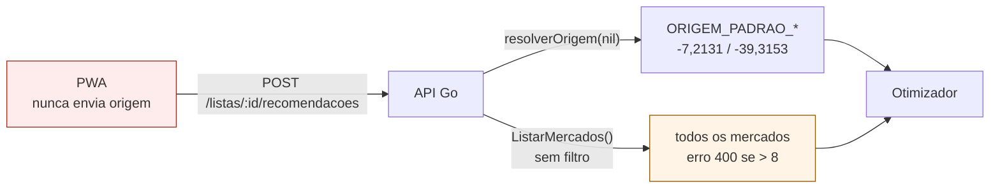
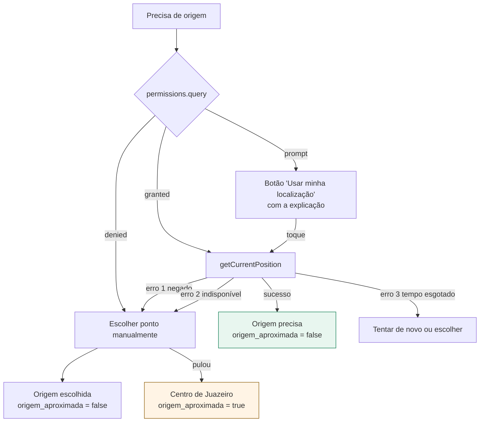

# Localização, raio de busca e como exibir o custo de deslocamento

Análise de três decisões acopladas: **como obter a posição do usuário**, **como deixá-lo
definir o raio de busca** e **em que unidade apresentar o custo logístico**. As três mexem
na mesma coisa — a parcela `custo_logistico(y)` da função objetivo (seção 5 do
`CLAUDE.md`) — e por isso são tratadas juntas.

> **Estado deste documento.** A análise abaixo descreve o sistema **antes** das mudanças.
> Os sete itens recomendados já foram implementados; o registro do que ficou como está na
> seção [Recomendação consolidada](#recomendação-consolidada), ao final.
>
> **Atualização posterior.** O achado 3 abaixo ("a linearização cobra bem mais caro do que
> a rota real") deixou de ser só um achado a declarar: foi **corrigido no modelo**, que
> agora resolve a seleção de mercados e a ordem de visita juntas via `AddCircuit` (ver
> `modelo/docs/formulacao-matematica.md` §7). Os números de sobrepreço, o limiar de R$/km e
> os exemplos de "ponto de equilíbrio" nesta página foram medidos **antes** da correção — o
> raciocínio de UX (mostrar o limiar em vez de um valor arbitrário) continua válido, mas os
> valores concretos (R$ 8,26, 14,25 km, R$ 0,58/km) estão desatualizados e precisam ser
> remedidos contra a resposta corrigida antes de irem para o texto final do TCC.

## Situação encontrada na análise



| Camada | O que já existe | O que falta |
|---|---|---|
| Otimizador | recebe `origem` e calcula haversine a partir dela | nada |
| API Go | aceita `origem` opcional, cai no centro de Juazeiro e devolve `origem_aproximada: true` — com teste | filtro por raio |
| PWA | o tipo `Origem` está declarado em `tipos.ts` | **nada preenche esse campo** |

### Três achados

**1. A origem é funcionalidade construída e nunca ligada.** `PedidoRecomendacao.Origem`
existe no contrato, o Go resolve, o teste
`TestOrigemAusenteUsaPadraoEMarcaComoAproximada` cobre os dois caminhos — e o PWA jamais
envia coordenada. Na prática **100% das recomendações do sistema partem do centro de
Juazeiro**, e todas trazem `origem_aproximada: true`. É a mesma classe do `aoExpirarSessao`
que já corrigimos: pronto de um lado, desconectado do outro.

**2. O teto de 8 mercados é uma parede, não um filtro.** `ListarMercados` traz todos, e o
serviço responde **400** se passarem de 8. Cadastrar um nono mercado não degrada o sistema:
quebra. Um raio resolveria isso pela raiz, transformando o teto em consequência de um
recorte em vez de um limite arbitrário.

**3. A linearização cobrava bem mais caro do que a rota real (corrigido depois desta
análise — ver a atualização no topo do documento).** Conferindo os números registrados na
época:

| Perfil | Logística cobrada | Traduzida em km | Rota real | Sobrepreço |
|---|---|---|---|---|
| Equilibrado (2 mercados) | R$ 25,77 | 8,14 km | 7,65 km | +6% |
| Econômico (6 mercados) | R$ 90,70 | 35,58 km | 21,90 km | **+62%** |

A parcela linearizada é `Σ_j 2·d(origem, j)` — uma ida e volta independente por mercado —
enquanto a rota real encadeia as paradas. Quanto mais mercados, mais o modelo cobra por
uma viagem que ninguém faz. **A linearização não é neutra: ela penaliza sistematicamente o
perfil econômico**, e o viés cresce com o número de paradas. Isso não invalida o modelo
(a linearidade é o que o mantém resolvível), mas é limitação que merece parágrafo próprio
no capítulo de metodologia, com esta tabela.

---

## 1. Como pedir a permissão de localização

### O que a API do navegador impõe

| Restrição | Consequência prática |
|---|---|
| Exige **contexto seguro** (HTTPS ou `localhost`) | funciona em `localhost:5173`, **não funciona** em `http://192.168.x.x:5173` |
| O aviso do navegador é **disparado pela primeira chamada** | não existe forma de "preparar" o pedido pela API |
| Negação é **pegajosa** | negou, o site não pode perguntar de novo; só nas configurações do navegador |
| `navigator.permissions.query` | lê o estado (`granted`/`prompt`/`denied`) **sem** disparar o aviso |

A primeira linha é armadilha real para a defesa: o `vite.config.ts` já usa `host: true`, e
abrir o PWA pelo IP da máquina no celular **desliga a geolocalização silenciosamente**.
Para demonstrar no aparelho é preciso HTTPS (um túnel, ou certificado local) — ou aceitar
a origem manual. Vale registrar isso no `como-rodar.md` antes de descobrir na hora.

### A regra que decorre disso: nunca gastar o aviso à toa

Como a negação é irreversível pela aplicação, **pedir no carregamento da tela é o pior
momento possível**: o usuário ainda não sabe para que serve, nega por reflexo, e a
funcionalidade morre para aquele navegador. O padrão correto é o *priming*:

1. Explicar antes, em texto, o que se ganha: *"Usar sua localização deixa a distância e a
   ordem do roteiro corretas. Sem ela, calculamos a partir do centro de Juazeiro."*
2. Só chamar `getCurrentPosition()` **depois de um toque explícito** em "Usar minha
   localização".
3. Se negar, não insistir: mostrar a alternativa manual, sem repetir o pedido.

Isso é a H3 (controle e liberdade) somada à H1 — e o botão dedicado dá ao usuário um lugar
para voltar quando mudar de ideia.

### Cadeia de origem, sem beco sem saída



O caminho de baixo já existe e funciona; o que falta é tudo acima dele. Os três códigos de
erro precisam de mensagens distintas — "você negou o acesso", "o aparelho não conseguiu
localizar" e "demorou demais" pedem ações diferentes do usuário (H9).

### Opções recomendadas para a chamada

```
enableHighAccuracy: false    mercados estão a quilômetros; o GPS fino só gasta bateria e tempo
timeout: 10000               acima disso, oferecer a alternativa manual
maximumAge: 300000           posição de 5 minutos atrás serve; evita novo acionamento do GPS
```

### Privacidade — e isto é conteúdo de TCC

Coordenada de pessoa física é **dado pessoal pela LGPD** (Lei 13.709/2018). O trabalho
ganha ao declarar explicitamente três garantias, todas baratas de cumprir aqui:

- **Finalidade**: a coordenada serve só para calcular distância naquela requisição.
- **Não persistência**: hoje `recomendacoes.payload_resultado` guarda a *resposta* do
  otimizador, não o pedido — então a origem não é gravada. **Essa propriedade deve ser
  preservada de propósito**, não por acaso, e vale um teste que a trave.
- **Consentimento revogável**: o usuário pode voltar a "usar o centro da cidade" a qualquer
  momento, sem perder as listas.

---

## 2. Raio de busca definido pelo usuário

### Onde filtrar

| Lugar | Avaliação |
|---|---|
| No otimizador | **errado** — ele é stateless e não deve decidir escopo |
| Na API, em Go, após carregar tudo | aceitável nesta escala e mais simples de testar |
| No SQL, com haversine no `WHERE` | **correto** — é o lugar do recorte, e o teto de 8 deixa de ser parede |

Recomendo o SQL: o repositório ganha `ListarMercadosProximos(ctx, origem, raioKm)` e o teto
de mercados passa a ser consequência do recorte. O `ListarMercados` sem filtro continua
existindo para a tela de mercados.

### Três cuidados que decidem se isso funciona

**O raio precisa partir da origem real, não do centro.** Se o usuário concedeu a
localização e o filtro roda a partir de `ORIGEM_PADRAO_*`, "5 km de mim" vira
silenciosamente "5 km do centro" — exatamente o tipo de mentira de estado que o achado A01
tratou. Origem e raio andam juntos ou nenhum dos dois vale.

**Raio menor cria itens não atendidos.** Encolher o recorte remove mercados, e itens caem
em `u[i] = 1`. A interface precisa ligar causa e efeito, porque o usuário vai ler "nenhum
mercado tem esse item" quando a verdade é "nenhum mercado *dentro do seu raio*". Antes de
gerar, mostrar a contagem resolve: *"7 mercados neste raio"* — e a contagem cai em tempo
real ao trocar a distância.

**Linha reta não é rota.** O haversine mede o voo do pássaro. Em Juazeiro, com o Rio
Salgado e o eixo da Padre Cícero, um mercado a 3 km em linha reta pode estar a 6 km de
carro. O rótulo tem de dizer **"em linha reta"** — mesma honestidade da distinção entre
distância linearizada e rota real que o contrato já faz.

### Escolha do controle

Chips de valores fixos, não deslizante: em celular, o deslizante exige precisão que a
decisão não tem, e o valor escolhido fica difícil de reproduzir num experimento.

```
[ 2 km ]  [ 5 km ]  [ 7 km ]  [ 10 km ]  [ toda a cidade ]
```

O padrão deve ser **7 km**, que é o recorte declarado no `plano_desenvolvimento.md`.

### Consequência metodológica

O raio muda a instância do problema. Duas execuções com raios diferentes **não são
comparáveis**, e a Fase 4 depende de comparar execuções. Então `recomendacoes` precisa
gravar o raio ao lado de `parametro_peso_conveniencia`, do mesmo jeito e pelo mesmo motivo.
Sem isso, o histórico vira um conjunto de resultados sem procedência.

---

## 3. Reais ou outra unidade para o deslocamento?

### O que não está em discussão

**Dentro do modelo, tem de ser dinheiro** (ou qualquer escalar único). A função objetivo
soma preço com inconveniência; somar exige unidade comum, e o CP-SAT exige inteiro. Os
centavos ficam. A pergunta é só sobre a **tela**.

### O problema da exibição atual

"Deslocamento estimado **R$ 25,77**" carrega três defeitos:

1. **Precisão falsa.** Os centavos vêm de `MODELO_CUSTO_POR_KM_CENTAVOS = 120`, uma
   constante de ambiente. Exibir duas casas decimais promete uma medição que não existe.
2. **Não é o dinheiro do usuário.** R$ 1,20/km é aproximadamente combustível e desgaste de
   **carro**. Para quem vai de moto o número é outro; a pé ou de bicicleta é perto de zero.
3. **Some com o preço sob um rótulo só** — o achado A02, já corrigido na separação
   "você paga" × "custo da decisão", mas o valor em reais continua lá.

### As alternativas

| Forma | A favor | Contra |
|---|---|---|
| **Reais** (hoje) | mesma unidade do preço; soma direta | parâmetro arbitrário exibido como medição |
| **Grandezas físicas** — km e nº de paradas | objetivas, verificáveis, já estão na resposta | não somam com o preço |
| **Tempo estimado** | é a moeda que se sente numa tarefa de rua | introduz outro parâmetro (velocidade média) |
| **Ponto de equilíbrio** | devolve o julgamento ao usuário | exige uma frase a mais na tela |

### A recomendação: ponto de equilíbrio

A melhor resposta não é trocar a unidade — é **inverter quem arbitra o parâmetro**. Em vez
de o sistema afirmar que rodar 1 km custa R$ 1,20, ele informa o limiar em que a decisão
vira, e deixa o usuário dizer de que lado está. Com os números reais registrados:

> O perfil **Econômico** economiza **R$ 8,26** em produtos, mas exige **4 paradas a mais**
> e **14,25 km a mais**.
> Compensa se, para você, essas paradas e esses quilômetros custarem menos de R$ 8,26 —
> o que, ignorando o incômodo das paradas, dá cerca de **R$ 0,58 por quilômetro**.

Quem anda de moto (~R$ 0,25/km) conclui na hora que o econômico vale. Quem anda de carro
(~R$ 1,20/km) conclui que não — e é exatamente por isso que o modelo escolheu o
equilibrado. **O número explica a recomendação em vez de só anunciá-la.**

Isto é análise de sensibilidade, e é o que separa um sistema de *apoio* à decisão de um que
simplesmente decide. Endereça de uma vez o achado A15 (o sistema não explica o porquê) e
transforma a maior fragilidade do modelo — um parâmetro arbitrário — no seu argumento mais
forte.

### Como fica a tela

| Camada | O que mostrar |
|---|---|
| Resposta | "Você paga R$ 308,65" · "2 mercados · 7,65 km" |
| Justificativa | a frase do ponto de equilíbrio, por perfil não escolhido |
| Detalhes técnicos | "Deslocamento estimado: R$ 25,77 — calculado a R$ 8,00 por parada e R$ 1,20/km" |

O valor em reais **não sai**: desce para os detalhes técnicos, agora com os parâmetros à
vista, o que o torna auditável em vez de misterioso. Continua sendo a função objetivo, e
continua indo para o histórico.

---

## Recomendação consolidada

| # | Mudança | Camada | Esforço | Situação |
|---|---|---|---|---|
| 1 | Ponto de equilíbrio na tela de resultado | PWA | baixo | **feito** |
| 2 | Mover o valor em reais para os detalhes, com os parâmetros | PWA + Go + Python | baixo | **feito** |
| 3 | Ligar a origem: *priming*, `getCurrentPosition`, os três erros | PWA | médio | **feito** |
| 4 | Origem manual como alternativa à negação | PWA | médio | **feito** |
| 5 | `ListarMercadosProximos` e chips de raio | Go + PWA | médio | **feito** |
| 6 | Gravar o raio em `recomendacoes` | Go + banco | baixo | **feito** |
| 7 | Registrar a armadilha do contexto seguro | docs | baixo | **feito** |

Os sete itens estão implementados. O que segue registra como cada um ficou.

### O que os itens 1 e 2 entregaram

O limiar é `Δpreço / Δdistância` entre duas soluções, calculado em
`pwa/src/utilitarios/comparacao.ts` — não introduz parâmetro novo. Com a base de semente:

> **Econômico** — Economiza R$ 8,26, mas exige 4 paradas e 14,25 km a mais.
> *Compensa se, para você, rodar 1 km custar menos de R$ 0,58.*

Para o item 2, o contrato passou a ecoar `custo_por_visita_centavos` e
`custo_por_km_centavos` do otimizador até o PWA, de modo que os detalhes técnicos mostrem
"R$ 8,00 por parada e R$ 1,20 por quilômetro" sem repetir constantes no cliente. Isso
também tornou possível **medir o viés da linearização direto da resposta** — foi assim que
a tabela de sobrepreço da seção anterior foi produzida, e ela agora consta da
[formulação matemática](../modelo/docs/formulacao-matematica.md), corrigindo a afirmação
anterior de que a diferença seria pequena o bastante para não inverter decisões.

Verificado na pilha real: parâmetros ecoados nos três perfis, limiar de R$ 0,58/km conferido
fora do código, 45 testes do otimizador e portões de Go e do PWA limpos.

### O que os itens 3 a 7 entregaram

**Onde cada peça ficou:**

| Peça | Arquivo |
|---|---|
| Acesso ao navegador, contexto seguro e os três erros | `pwa/src/utilitarios/localizacao.ts` |
| Escolha de origem e raio, com preferência persistida | `pwa/src/stores/origem.ts` |
| *Priming*, alternativa manual e chips de raio | `pwa/src/componentes/SeletorDeOrigem.vue` |
| Recorte por distância em SQL | `Repositorio.ListarMercadosProximos` |
| Validação do recorte e teto da PoC | `Recomendacao.selecionarMercados` |
| Coluna de procedência | `api/migracoes/003_raio_da_recomendacao.sql` |

**As três garantias de privacidade foram cumpridas como declarado.** A coordenada serve
apenas ao cálculo daquela requisição; o `localStorage` guarda só o *modo* escolhido e o
raio, nunca a posição; e voltar a "usar o centro" é um toque. A posição é rebuscada no
início da sessão apenas quando a permissão já está concedida — estado em que o navegador
não exibe aviso algum, então não há pedido às escondidas.

**O raio depende da origem por construção.** `raioParaEnvio` devolve `undefined` enquanto a
origem for a padrão, e os chips ficam desabilitados com a explicação. Não é possível, pela
interface, obter um recorte medido de um ponto que não é o do usuário.

**Verificação:** 7 cenários novos no `scripts/testes_de_sistema.sh` (S13–S18 e B13), que
passou a somar **35 cenários com 0 falhas**. Cobrem origem informada saindo de aproximada,
o raio ecoado na resposta, a contagem de mercados no recorte, e os dois caminhos de erro —
raio que não alcança mercado nenhum e raio negativo — que respondem 400 com mensagem, nunca
500.

### Dois defeitos que só o uso real revelou

A primeira versão do recorte tinha dois problemas, ambos corrigidos.

**O otimizador recusava o payload com 422.** O filtro por raio reduzia a lista de
`mercados`, mas `montarItens` continuava montando candidatos a partir de **todas** as
ofertas vigentes. O resultado era um payload internamente inconsistente — um candidato do
item apontando para um mercado ausente da lista — e o serviço Python o rejeitava inteiro,
com razão: seria uma alocação que o modelo não sabe custear.

O invariante "todo candidato referencia um mercado conhecido" era garantido por acidente
enquanto o conjunto de mercados era sempre o cadastro inteiro. Ao introduzir um
subconjunto, ele passou a precisar ser garantido de propósito: `montarItens` agora recebe
os mercados selecionados e descarta oferta de fora do recorte.

**O raio escolhido não valia na primeira geração.** `restaurar()` é assíncrona e pode
demorar segundos — obter a posição do GPS é lento —, mas `main.ts` a disparava sem esperar,
e o `onMounted` da tela de resultado gerava assim que a lista carregava. Numa carga direta
da tela, a recomendação saía **antes de a origem existir**: sem coordenada e sem raio. A
restauração terminava depois e atualizava o cabeçalho, deixando a tela anunciar "sua
localização · 7 km" sobre um resultado que não usou nenhum dos dois.

A correção memoriza a restauração — chamadas concorrentes compartilham a mesma promessa — e
a tela passa a aguardá-la junto com o carregamento da lista antes de resolver.

Os cenários S17 e S18 guardam a primeira regressão: um raio de 3 km, que exclui mercados,
precisa devolver `OTIMO` e considerar menos mercados que um raio amplo. A segunda foi
confirmada à mão contra a pilha real — com raio de 2 km a partir de uma posição de GPS, os
dois únicos mercados dentro do círculo são exatamente os dois que aparecem no roteiro.

## Para o texto do TCC

- **Análise de sensibilidade** como recurso de interface, não só de capítulo de resultados:
  o ponto de equilíbrio é a devolução explícita do julgamento ao decisor humano, que é a
  definição de SAD.
- **Quantificação do viés da linearização** — a tabela de sobrepreço (+6% com dois
  mercados, +62% com seis) mede uma limitação que hoje o texto só descreve em palavras, e
  fundamenta a roteirização real como trabalho futuro.
- **LGPD e dado de geolocalização**: finalidade, não persistência e consentimento
  revogável, com a propriedade de não gravar a coordenada travada por teste.
