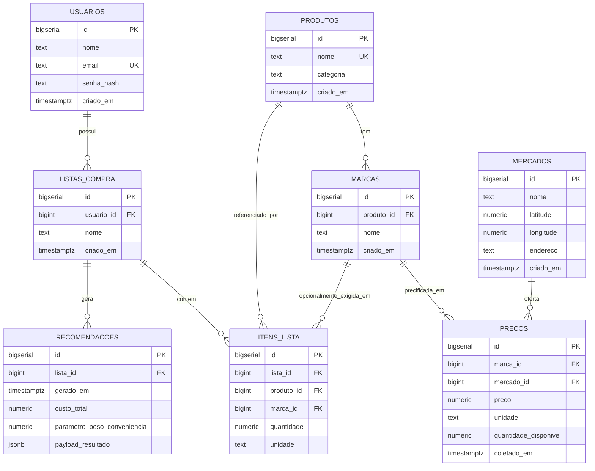
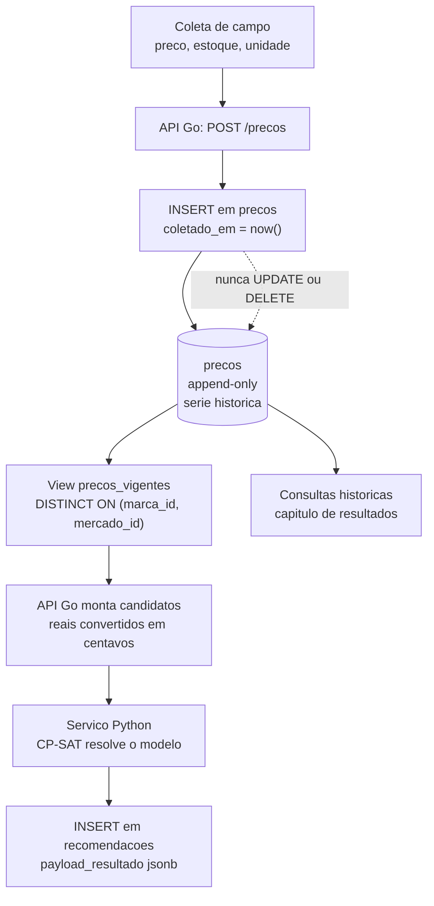

# Modelo de Dados

Documentação do esquema PostgreSQL 16 do Sistema de Apoio à Decisão para Compras de
Supermercado. O esquema é criado pela migration
[`api/migracoes/001_esquema_inicial.sql`](../api/migracoes/001_esquema_inicial.sql).

O banco é a fonte única de verdade e é acessado exclusivamente pela API Go. O serviço
Python de otimização é stateless: recebe por HTTP um payload já montado e devolve JSON,
sem qualquer conexão com o Postgres. A extensão PostGIS não é utilizada — a distância
entre mercados é calculada por haversine na aplicação, a partir das colunas `latitude` e
`longitude` de `mercados`.

## 1. Diagrama entidade-relacionamento



Cardinalidades relevantes:

- Um usuário possui zero ou mais listas de compra; a exclusão do usuário remove suas
  listas (`ON DELETE CASCADE`).
- Uma lista contém zero ou mais itens e pode gerar várias recomendações — uma por
  execução do otimizador, tipicamente com pesos de conveniência distintos.
- Um produto genérico tem zero ou mais marcas; a marca não existe fora do produto
  (`ON DELETE CASCADE`).
- Um par (marca, mercado) acumula vários registros em `precos` ao longo do tempo, um por
  coleta. As FKs de `precos` são `ON DELETE RESTRICT`: um mercado ou uma marca já
  precificados não podem ser apagados sem destruir a série histórica.
- `itens_lista.marca_id` é opcional. Quando nulo, o usuário é indiferente à marca e o
  otimizador pode escolher qualquer marca do produto.

## 2. Dicionário de dados

### 2.1 `usuarios`

| Coluna | Tipo | Obrigatório | Descrição |
| --- | --- | --- | --- |
| `id` | `BIGSERIAL` | sim | Chave primária. |
| `nome` | `TEXT` | sim | Nome de exibição do usuário. |
| `email` | `TEXT` | sim | Identificador de login. Índice único `ux_usuarios_email`. |
| `senha_hash` | `TEXT` | sim | Hash da senha gerado pela API Go (bcrypt/argon2). |
| `criado_em` | `TIMESTAMPTZ` | sim | Data de cadastro. Padrão `now()`. |

### 2.2 `produtos`

| Coluna | Tipo | Obrigatório | Descrição |
| --- | --- | --- | --- |
| `id` | `BIGSERIAL` | sim | Chave primária. |
| `nome` | `TEXT` | sim | Nome do item genérico, ex. "Arroz". Único no catálogo. |
| `categoria` | `TEXT` | sim | Agrupamento de catálogo, ex. "Mercearia". Uso apenas de interface. |
| `criado_em` | `TIMESTAMPTZ` | sim | Data de cadastro. Padrão `now()`. |

### 2.3 `marcas`

| Coluna | Tipo | Obrigatório | Descrição |
| --- | --- | --- | --- |
| `id` | `BIGSERIAL` | sim | Chave primária. |
| `produto_id` | `BIGINT` | sim | FK para `produtos.id`, `ON DELETE CASCADE`. |
| `nome` | `TEXT` | sim | Variante comercial, ex. "Arroz Tio João 5kg". |
| `criado_em` | `TIMESTAMPTZ` | sim | Data de cadastro. Padrão `now()`. |

Restrição `ux_marcas_produto_nome` garante unicidade de `(produto_id, nome)`.
Índice `ix_marcas_produto_id` apoia a expansão "produto → marcas candidatas".

### 2.4 `mercados`

| Coluna | Tipo | Obrigatório | Descrição |
| --- | --- | --- | --- |
| `id` | `BIGSERIAL` | sim | Chave primária. |
| `nome` | `TEXT` | sim | Nome do supermercado. |
| `latitude` | `NUMERIC(9,6)` | sim | Graus decimais WGS84, `CHECK` entre -90 e 90. |
| `longitude` | `NUMERIC(9,6)` | sim | Graus decimais WGS84, `CHECK` entre -180 e 180. |
| `endereco` | `TEXT` | sim | Endereço textual para exibição na recomendação. |
| `criado_em` | `TIMESTAMPTZ` | sim | Data de cadastro. Padrão `now()`. |

A precisão `NUMERIC(9,6)` cobre seis casas decimais, resolução aproximada de 0,11 m no
equador — folgada para o recorte de bairro da PoC.

### 2.5 `precos`

| Coluna | Tipo | Obrigatório | Descrição |
| --- | --- | --- | --- |
| `id` | `BIGSERIAL` | sim | Chave primária. |
| `marca_id` | `BIGINT` | sim | FK para `marcas.id`, `ON DELETE RESTRICT`. |
| `mercado_id` | `BIGINT` | sim | FK para `mercados.id`, `ON DELETE RESTRICT`. |
| `preco` | `NUMERIC(10,2)` | sim | Preço unitário em reais, `CHECK (preco > 0)`. |
| `unidade` | `TEXT` | sim | Unidade do preço: `kg`, `g`, `L`, `ml` ou `un`. |
| `quantidade_disponivel` | `NUMERIC(12,3)` | sim | Estoque observado, `CHECK >= 0`. Zero indica indisponibilidade. |
| `coletado_em` | `TIMESTAMPTZ` | sim | Momento da coleta; define o snapshot vigente e ordena a série. |

Índice `ix_precos_marca_mercado_coleta` sobre `(marca_id, mercado_id, coletado_em DESC)`
serve tanto à view `precos_vigentes` quanto às consultas de série histórica;
`ix_precos_mercado_id` apoia relatórios por mercado.

### 2.6 `listas_compra`

| Coluna | Tipo | Obrigatório | Descrição |
| --- | --- | --- | --- |
| `id` | `BIGSERIAL` | sim | Chave primária. |
| `usuario_id` | `BIGINT` | sim | FK para `usuarios.id`, `ON DELETE CASCADE`. |
| `nome` | `TEXT` | sim | Rótulo da lista, ex. "Compra do mês". |
| `criado_em` | `TIMESTAMPTZ` | sim | Data de criação. Padrão `now()`. |

### 2.7 `itens_lista`

| Coluna | Tipo | Obrigatório | Descrição |
| --- | --- | --- | --- |
| `id` | `BIGSERIAL` | sim | Chave primária. Corresponde ao índice `i` de `x[i][j]`. |
| `lista_id` | `BIGINT` | sim | FK para `listas_compra.id`, `ON DELETE CASCADE`. |
| `produto_id` | `BIGINT` | sim | FK para `produtos.id`, `ON DELETE RESTRICT`. |
| `marca_id` | `BIGINT` | não | FK para `marcas.id`. Nulo = indiferença de marca. |
| `quantidade` | `NUMERIC(12,3)` | sim | Quantidade desejada, `CHECK (quantidade > 0)`. |
| `unidade` | `TEXT` | sim | Unidade da quantidade: `kg`, `g`, `L`, `ml` ou `un`. |

### 2.8 `recomendacoes`

| Coluna | Tipo | Obrigatório | Descrição |
| --- | --- | --- | --- |
| `id` | `BIGSERIAL` | sim | Chave primária. |
| `lista_id` | `BIGINT` | sim | FK para `listas_compra.id`, `ON DELETE CASCADE`. |
| `gerado_em` | `TIMESTAMPTZ` | sim | Momento da execução do otimizador. Padrão `now()`. |
| `custo_total` | `NUMERIC(10,2)` | sim | Custo financeiro da alocação, em reais. |
| `parametro_peso_conveniencia` | `NUMERIC(6,3)` | sim | Peso da parcela logística na função objetivo. |
| `payload_resultado` | `JSONB` | sim | Resposta JSON íntegra do serviço de otimização. |

### 2.9 View `precos_vigentes`

| Coluna | Tipo | Descrição |
| --- | --- | --- |
| `preco_id` | `BIGINT` | `precos.id` do snapshot vigente, para rastreabilidade. |
| `marca_id` | `BIGINT` | Marca precificada. |
| `mercado_id` | `BIGINT` | Mercado que oferta a marca. |
| `preco` | `NUMERIC(10,2)` | Preço vigente em reais. |
| `unidade` | `TEXT` | Unidade do preço. |
| `quantidade_disponivel` | `NUMERIC(12,3)` | Estoque da última coleta. |
| `coletado_em` | `TIMESTAMPTZ` | Data do snapshot vigente. |

## 3. `precos` como tabela append-only

A tabela `precos` nunca sofre `UPDATE` nem `DELETE`. Cada coleta de campo insere um novo
registro com seu próprio `coletado_em`. Três razões sustentam a decisão:

1. **Fundamentação teórica do TCC.** A série histórica de preços é dado primário para
   discutir variação de preço entre mercados e ao longo do tempo, um dos argumentos que
   justificam a existência do sistema. Sobrescrever o preço destruiria essa evidência.
2. **Reprodutibilidade dos experimentos.** Uma recomendação gerada em determinada data
   só pode ser reproduzida se os preços daquele instante continuarem no banco. Sem isso,
   a validação da Fase 4 não poderia ser reexecutada.
3. **Auditoria da coleta.** Como a coleta é manual, erros de digitação são esperados. Com
   histórico preservado, a correção é um novo snapshot e o registro errado permanece
   visível para inspeção, em vez de desaparecer.

O custo dessa escolha é que "o preço atual" deixa de ser uma leitura direta da tabela.
É esse papel que a view `precos_vigentes` cumpre.

```sql
CREATE OR REPLACE VIEW precos_vigentes AS
SELECT DISTINCT ON (p.marca_id, p.mercado_id)
       p.id AS preco_id,
       p.marca_id,
       p.mercado_id,
       p.preco,
       p.unidade,
       p.quantidade_disponivel,
       p.coletado_em
  FROM precos p
 ORDER BY p.marca_id, p.mercado_id, p.coletado_em DESC;
```

O `DISTINCT ON (p.marca_id, p.mercado_id)` é uma extensão do PostgreSQL que mantém apenas
a **primeira linha de cada grupo** definido pela lista entre parênteses. Qual linha é a
"primeira" depende inteiramente do `ORDER BY`, que por exigência da cláusula precisa
começar exatamente pelas mesmas expressões do `DISTINCT ON`. Ao acrescentar
`coletado_em DESC` como terceiro critério, ordena-se cada grupo (marca, mercado) da coleta
mais recente para a mais antiga e conserva-se a mais recente. O resultado é uma linha por
par (marca, mercado): o snapshot vigente.

Comparada à alternativa clássica — subconsulta com `MAX(coletado_em)` e junção de volta
em `precos`, ou uma função de janela `ROW_NUMBER()` filtrada por `= 1` — a formulação com
`DISTINCT ON` percorre a tabela uma única vez e casa diretamente com o índice
`ix_precos_marca_mercado_coleta (marca_id, mercado_id, coletado_em DESC)`, cuja ordem
física é a mesma do `ORDER BY` da view.

A API Go consulta sempre `precos_vigentes`, nunca `precos`, ao montar os candidatos da
otimização. `precos` é lida diretamente apenas nas análises históricas do capítulo de
resultados.

## 4. Representação monetária: `NUMERIC` no banco, centavos inteiros no otimizador

No banco, dinheiro é `NUMERIC(10,2)`. `NUMERIC` é aritmética decimal exata: não há o erro
de representação binária de `REAL`/`DOUBLE PRECISION`, no qual valores como 0,10 não têm
representação finita e somas de muitos itens acumulam desvio. A escala fixa em 2 casas
também documenta a semântica da coluna e impede que um preço com precisão espúria entre
no banco. O teto de 10 dígitos comporta valores muito acima de qualquer item de cesta
básica.

No serviço de otimização, o CP-SAT trabalha **apenas com inteiros**: variáveis,
coeficientes e função objetivo são inteiros. Passar reais ao solver exigiria arredondar em
algum ponto, e arredondar coeficientes da função objetivo altera qual solução é ótima —
inaceitável em um trabalho cuja Fase 4 compara o resultado do solver com enumeração
exaustiva.

A conversão acontece na aplicação, em dois pontos simétricos:

1. **Saída do banco → payload do otimizador.** A API Go multiplica o `NUMERIC` por 100 e
   converte para inteiro, obtendo centavos. Como a escala já é 2, a multiplicação é exata
   e não há arredondamento.
2. **Resposta do otimizador → persistência.** O `custo_total` em centavos devolvido pelo
   serviço Python é dividido por 100 e gravado em `recomendacoes.custo_total` como
   `NUMERIC(10,2)`.

A conversão fica na aplicação, e não no banco, porque é um requisito do solver, não do
domínio: o modelo relacional continua expressando o conceito "preço em reais", e o
otimizador recebe a unidade de que precisa.

Do lado Go, o `NUMERIC` deve ser lido como decimal (por exemplo `pgtype.Numeric` do
`pgx`), nunca como `float64`, sob pena de reintroduzir no cliente o erro que o tipo do
banco evita.

## 5. `recomendacoes.payload_resultado` como trilha de auditoria

`payload_resultado` guarda, em `JSONB`, a resposta completa do serviço de otimização —
não um resumo. Espera-se ali, no mínimo: a alocação item→mercado, o conjunto de mercados
visitados, o custo financeiro e o custo logístico separados, o status retornado pelo
CP-SAT (`OPTIMAL`, `FEASIBLE`, `INFEASIBLE`) e o tempo de resolução.

O motivo é a Fase 4 do plano de desenvolvimento, cuja avaliação de acurácia compara, para
instâncias pequenas, o custo devolvido pelo CP-SAT com o custo obtido por enumeração
exaustiva em `scripts/validacao_exaustiva.py`. Essa comparação exige recuperar execuções
passadas com todos os seus detalhes — inclusive o `parametro_peso_conveniencia` usado,
gravado em coluna própria justamente para poder ser filtrado em SQL.

`JSONB` é adequado aqui porque a forma exata da resposta ainda deve evoluir ao longo das
Fases 2 e 3 (por exemplo, quando `custo_logistico` passar de "número de mercados
visitados" para distância haversine, ou quando uma rota ordenada for incluída).
Normalizar essa estrutura em tabelas agora obrigaria a alterar o esquema a cada mudança do
contrato, sem benefício: o payload é lido inteiro, para auditoria, e não consultado campo
a campo em caminho crítico. Se alguma consulta analítica sobre o conteúdo do JSON se
tornar frequente, um índice GIN sobre a coluna pode ser adicionado em migration futura.

A recomendação é sempre persistida, tenha o solver encontrado o ótimo ou não. O registro
de execuções inviáveis é parte dos casos de borda previstos na Fase 4 (item sem estoque em
qualquer mercado, lista vazia, mercado único).

## 6. Consultas de exemplo

### 6.1 Candidatos de preço vigente para uma lista

Monta as tuplas (item, marca, mercado, preço, estoque) que a API Go converte no payload
do otimizador. Respeita a semântica de `itens_lista.marca_id`: quando informado, restringe
àquela marca; quando nulo, aceita qualquer marca do produto. Só retorna candidatos com
estoque suficiente para a quantidade pedida.

```sql
SELECT il.id            AS item_id,
       il.produto_id,
       il.quantidade,
       il.unidade       AS unidade_pedida,
       m.id             AS marca_id,
       m.nome           AS marca_nome,
       mk.id            AS mercado_id,
       mk.nome          AS mercado_nome,
       mk.latitude,
       mk.longitude,
       pv.preco,
       pv.unidade       AS unidade_preco,
       pv.quantidade_disponivel,
       pv.coletado_em
  FROM itens_lista il
  JOIN marcas m
    ON m.produto_id = il.produto_id
   AND (il.marca_id IS NULL OR m.id = il.marca_id)
  JOIN precos_vigentes pv
    ON pv.marca_id = m.id
  JOIN mercados mk
    ON mk.id = pv.mercado_id
 WHERE il.lista_id = $1
   AND pv.quantidade_disponivel >= il.quantidade
 ORDER BY il.id, pv.preco;
```

Um item que não retorne nenhuma linha é indisponível em toda a região — caso de borda que
a API deve tratar antes de chamar o otimizador, sob pena de o modelo ficar inviável.

### 6.2 Evolução histórica do preço de uma marca em um mercado

Lê `precos` diretamente, já que o objeto de interesse é a série, não o vigente. A coluna
`variacao_desde_anterior` alimenta os gráficos do capítulo de resultados.

```sql
SELECT coletado_em,
       preco,
       quantidade_disponivel,
       preco - lag(preco) OVER (ORDER BY coletado_em) AS variacao_desde_anterior
  FROM precos
 WHERE marca_id   = $1
   AND mercado_id = $2
 ORDER BY coletado_em;
```

### 6.3 Custo da mesma lista comparado entre mercados

Simula "comprar tudo em um único mercado" para cada mercado que consiga atender a lista
inteira. É o baseline contra o qual a economia da recomendação multi-mercado é medida, e
alimenta a métrica de economia estimada exibida no frontend.

```sql
WITH candidatos AS (
    SELECT il.id AS item_id,
           il.quantidade,
           pv.mercado_id,
           min(pv.preco * il.quantidade) AS custo_item
      FROM itens_lista il
      JOIN marcas m
        ON m.produto_id = il.produto_id
       AND (il.marca_id IS NULL OR m.id = il.marca_id)
      JOIN precos_vigentes pv
        ON pv.marca_id = m.id
     WHERE il.lista_id = $1
       AND pv.quantidade_disponivel >= il.quantidade
     GROUP BY il.id, il.quantidade, pv.mercado_id
),
total_itens AS (
    SELECT count(*) AS n FROM itens_lista WHERE lista_id = $1
)
SELECT mk.nome                  AS mercado,
       count(c.item_id)         AS itens_atendidos,
       round(sum(c.custo_item), 2) AS custo_lista_completa
  FROM candidatos c
  JOIN mercados mk ON mk.id = c.mercado_id
 CROSS JOIN total_itens t
 GROUP BY mk.id, mk.nome, t.n
HAVING count(c.item_id) = t.n
 ORDER BY custo_lista_completa;
```

O `HAVING` descarta mercados que não cobrem todos os itens: comparar um carrinho parcial
com um carrinho completo distorceria a economia calculada.

## 7. Ciclo de vida de um registro de preço



Uma correção de preço não altera o registro anterior: entra como novo `INSERT` com
`coletado_em` posterior e passa automaticamente a ser o vigente para a view, enquanto o
registro corrigido permanece disponível para auditoria da coleta.
