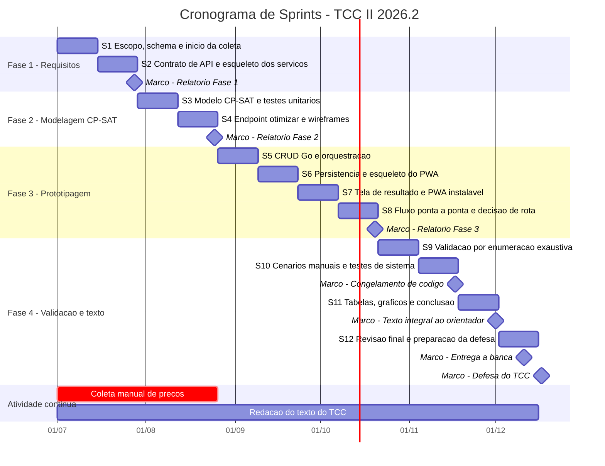
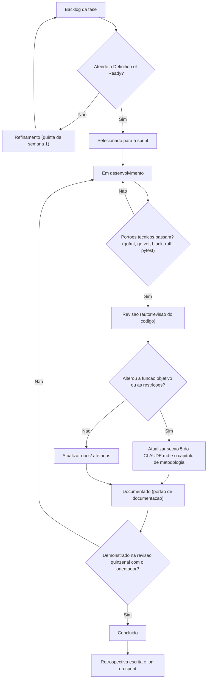

# Plano de Sprints — TCC II (2026.2)

Sistema de Apoio à Decisão para Compras de Supermercado.
Documento de gestão do projeto: adapta o framework Scrum a um time de uma pessoa, mapeia as
quatro fases do `plano_desenvolvimento.md` em sprints de duas semanas entre julho e dezembro
de 2026, e define os critérios de qualidade, os riscos monitorados e as métricas de
acompanhamento.

Referências obrigatórias: `plano_desenvolvimento.md` (cronograma e riscos) e `CLAUDE.md`
(escopo técnico, modelo de dados e função objetivo).

---

## 1. Adaptação do Scrum para um time de uma pessoa

O Scrum pressupõe um time multifuncional de 3 a 9 pessoas e uma boa parte das suas
cerimônias existe para resolver problemas de coordenação entre pessoas. Com N = 1, esses
problemas não existem, e manter as cerimônias na forma canônica geraria apenas custo de
processo sem contrapartida. O que se preserva aqui é o núcleo empírico do framework:
iterações curtas de duração fixa, um incremento verificável ao fim de cada iteração,
inspeção regular por um agente externo (o orientador) e adaptação do plano.

### 1.1 Papéis acumulados pelo aluno

| Papel Scrum | Quem exerce | Como é exercido na prática |
|---|---|---|
| Product Owner | Aluno, com validação do orientador | Define e prioriza o backlog a partir do `plano_desenvolvimento.md`; o orientador atua como stakeholder que aceita ou rejeita o incremento na revisão quinzenal. |
| Scrum Master | Aluno (autogestão) | Protege o timebox, mantém o registro de riscos atualizado e impede o crescimento de escopo vedado pela seção 7 do `CLAUDE.md`. |
| Developer | Aluno | Executa código, testes, coleta de dados e redação do texto acadêmico. |
| Stakeholder / cliente | Orientador e banca | Aceitam o incremento e o texto; a banca é o cliente final do artefato acadêmico. |

O risco central do acúmulo de papéis é o aluno como Product Owner autorizar a si mesmo
mudanças de escopo que o Scrum Master deveria barrar. A mitigação é procedimental: qualquer
alteração de escopo em relação ao `plano_desenvolvimento.md` só é aceita se for registrada na
revisão quinzenal com o orientador e refletida no cronograma deste documento.

### 1.2 Cerimônias mantidas

| Cerimônia | Formato adaptado | Frequência | Duração | Justificativa |
|---|---|---|---|---|
| Planejamento de sprint | Sessão individual escrita: selecionar itens do backlog da fase, checar a Definition of Ready, escrever o objetivo da sprint em uma frase | Início de cada sprint (segunda-feira) | 45–60 min | É a cerimônia que mais sobrevive a N = 1: sem ela não há timebox nem compromisso verificável. |
| Revisão quinzenal com o orientador | Substitui a Sprint Review. Demonstração do incremento executando de fato (endpoint respondendo, tela navegável, script rodando) mais um resumo de uma página | Fim de cada sprint | 30–45 min | Fornece a inspeção externa que o Scrum obtém do time e dos stakeholders. Sem isso, a iteração vira trabalho solitário sem ponto de verificação. |
| Retrospectiva curta escrita | Três campos em texto no fim da seção de log de sprint: o que funcionou, o que atrasou, o que mudo na próxima | Fim de cada sprint | 15 min | O valor da retrospectiva com N = 1 é o registro histórico. Além de corrigir o processo, o log alimenta a seção de metodologia e as limitações do texto do TCC. |
| Refinamento de backlog | Revisão dos itens da próxima sprint contra a Definition of Ready | Meio da sprint (quinta-feira da semana 1) | 20 min | Evita que a sprint seguinte comece com itens mal especificados, principal causa de estouro de timebox em projeto individual. |

### 1.3 Cerimônias descartadas

| Cerimônia | Decisão | Justificativa |
|---|---|---|
| Daily Scrum (15 min em pé, diário) | Descartada na forma canônica | O objetivo da daily é sincronizar pessoas e expor impedimentos ao time. Com N = 1 não há sincronização a fazer. É substituída por um registro diário de duas linhas no log de sprint (o que fiz, o que trava), que preserva a rastreabilidade sem a reunião. |
| Estimativa por Planning Poker / story points | Descartada | Planning Poker é um mecanismo de convergência de estimativas entre pessoas. Com um estimador único não há divergência a resolver. Substituída por estimativa em horas de trabalho disponíveis por sprint. |
| Velocity e burn-down como instrumento de previsão | Descartada como previsão, mantida como observação | Com N = 1 e disponibilidade irregular (provas, feriados, trabalho), a série de velocity é ruidosa demais para prever. Ver a seção 7 para as métricas efetivamente adotadas. |
| Sprint Goal negociado com o PO | Simplificado | Mantém-se o objetivo de sprint em uma frase, mas sem negociação — é autoimposto e validado na revisão quinzenal seguinte. |
| Incremento potencialmente lançável em produção | Descartado | O artefato é uma prova de conceito acadêmica, não um produto. O critério de pronto é "demonstrável e documentado", não "publicável". Consistente com a seção 7 do `CLAUDE.md`, que veda infraestrutura de produção. |

### 1.4 Capacidade e calendário de trabalho

Premissa de capacidade adotada no planejamento: **16 a 20 horas úteis por semana**, ou seja,
**32 a 40 horas por sprint**, das quais aproximadamente **25% são reservadas à redação do
texto do TCC** ao longo de todas as fases, e não apenas na Fase 4. Escrever o texto somente
no fim é a falha mais comum em TCC e não é praticada aqui: cada sprint tem um item de
redação associado.

Sprints com feriados nacionais relevantes (07/09, 12/10, 02/11, 15/11) e com período de
provas da instituição têm capacidade reduzida e recebem menos itens de backlog, o que está
refletido no volume de itens das sprints 6, 8 e 9.

---

## 2. Mapeamento Fase → Sprints

Doze sprints de 14 dias, de 01/07/2026 a 15/12/2026, seguidas de uma janela de defesa.
Os limites de sprint não coincidem exatamente com os limites de mês; onde há transbordo, ele
está indicado explicitamente na coluna de observações.

### 2.1 Visão geral

| Sprint | Período | Fase | Objetivo em uma frase |
|---|---|---|---|
| S1 | 01/07 – 14/07 | Fase 1 | Travar o escopo de dados e o schema, e iniciar a coleta de preços. |
| S2 | 15/07 – 28/07 | Fase 1 | Congelar o contrato de API e colocar os três serviços de pé conversando. |
| S3 | 29/07 – 11/08 | Fase 2 | Implementar o núcleo do modelo CP-SAT com testes unitários. |
| S4 | 12/08 – 25/08 | Fase 2 | Expor `/otimizar` sobre o contrato congelado e desenhar os wireframes. |
| S5 | 26/08 – 08/09 | Fase 3 | Completar o CRUD Go e a orquestração da chamada ao otimizador. |
| S6 | 09/09 – 22/09 | Fase 3 | Persistir recomendações e entregar o esqueleto navegável do PWA. |
| S7 | 23/09 – 06/10 | Fase 3 | Fechar a tela de resultado com economia estimada e habilitar o PWA. |
| S8 | 07/10 – 20/10 | Fase 3 | Fechar o fluxo ponta a ponta e decidir sobre a distância real. |
| S9 | 21/10 – 03/11 | Fase 4 | Validar o otimizador por enumeração exaustiva. |
| S10 | 04/11 – 17/11 | Fase 4 | Cenários manuais representativos e testes de sistema; congelar o código. |
| S11 | 18/11 – 01/12 | Fase 4 | Consolidar tabelas e gráficos e fechar o capítulo de resultados. |
| S12 | 02/12 – 15/12 | Fase 4 | Revisão final do texto, entrega à banca e ensaio da defesa. |

### 2.2 Fase 1 — Análise de Sistemas e Requisitos (Julho)

#### Sprint 1 — 01/07/2026 a 14/07/2026

**Objetivo:** travar os números de escopo do projeto e ter o schema do Postgres aplicado,
com a coleta manual de preços já em curso.

| Item de backlog | Entregável verificável |
|---|---|
| Preencher e travar a seção "Decisão de escopo" do `plano_desenvolvimento.md` (cidade, nº de mercados, nº de itens, frequência de coleta) | Seção preenchida e revisada com o orientador; números citáveis no texto do TCC |
| Levantar requisitos funcionais e não funcionais (tempo de resposta do otimizador, nº máximo de itens e mercados na PoC) | `docs/requisitos.md` com RF e RNF numerados e rastreáveis |
| Modelar o schema conforme a seção 4 do `CLAUDE.md` e escrever as migrations iniciais | Migrations aplicadas em Postgres 16 local via `docker compose up -d postgres`; `\dt` lista as 8 tabelas |
| Definir o protocolo de coleta manual de preços (planilha padrão, campos, periodicidade) e executar a primeira rodada | Planilha da rodada 1 preenchida para ao menos 3 mercados |
| Redação: iniciar o capítulo de metodologia com a descrição do escopo | Rascunho do capítulo com a subseção de delimitação de escopo |

**Risco mitigado:** atraso na coleta manual de preços — a coleta começa na sprint 1, antes de
qualquer código de aplicação, exatamente como prescreve o `plano_desenvolvimento.md`.
Secundariamente, mitiga escopo indefinido, que é o que trava a validação da Fase 4.

#### Sprint 2 — 15/07/2026 a 28/07/2026

**Objetivo:** congelar o contrato de API entre Go e Python e ter os três serviços rodando e
se comunicando com um exemplo trivial ponta a ponta.

| Item de backlog | Entregável verificável |
|---|---|
| Especificar o contrato JSON de request/response de `/otimizar` (itens, candidatos de preço por mercado, coordenadas, peso de conveniência; resposta com alocação, custo total e mercados visitados) | `docs/contrato-api.md` com exemplos de payload válidos, marcado como congelado |
| Esqueleto da API Go + Gin com healthcheck e conexão ao Postgres | `go run ./cmd/server` sobe; `GET /health` retorna 200 com status do banco |
| Esqueleto do serviço Python FastAPI com um exemplo trivial de CP-SAT | `uvicorn app.main:app --port 8001` sobe; endpoint de exemplo resolve uma instância de 2 itens e 2 mercados |
| Chamada HTTP interna Go → Python funcionando com payload de exemplo | Log da API Go mostrando resposta do otimizador; teste de integração mínimo |
| Segunda rodada de coleta de preços | Planilha da rodada 2, cobertura ampliada para o total de mercados do escopo |
| Redação: registrar a arquitetura e o contrato no capítulo de metodologia | Subseção de arquitetura escrita, com o diagrama da seção 2 do `CLAUDE.md` |

**Risco mitigado:** integração dos três serviços atrasar. Congelar o contrato cedo e provar a
comunicação com um exemplo trivial elimina a integração do caminho crítico das fases 2 e 3.

**Marco acadêmico:** entrega do relatório da Fase 1 ao orientador em 28/07/2026.

### 2.3 Fase 2 — Modelagem Matemática e Design (Agosto)

#### Sprint 3 — 29/07/2026 a 11/08/2026

**Objetivo:** implementar o modelo CP-SAT completo com `custo_logistico` igual ao número de
mercados visitados, coberto por testes unitários com resultado conhecido manualmente.

| Item de backlog | Entregável verificável |
|---|---|
| Implementar as variáveis `x[i][j]` e `y[j]`, a restrição de atribuição única, a restrição de estoque suficiente e o acoplamento `x[i][j] <= y[j]` | Módulo do modelo em `modelo/` com type hints e docstrings explicando cada variável |
| Implementar a função objetivo `min custo_total(x) + peso_conveniencia * custo_logistico(y)` com `custo_logistico = sum(y[j])` | Função objetivo isolada e parametrizável por `peso_conveniencia` |
| Definir os 3 perfis fixos de peso (econômico, equilibrado, conveniente) com os valores numéricos justificados | `docs/perfis-peso.md` com os valores e a justificativa de cada perfil |
| Testes unitários com instâncias pequenas de resultado calculado à mão | `pytest` verde, mínimo de 6 casos incluindo item indisponível e mercado único |
| Tratamento de infactibilidade (item sem estoque em nenhum mercado) | Teste que verifica retorno explícito de infactibilidade, não exceção genérica |
| Redação: formalizar o modelo matemático no capítulo de metodologia | Formulação em notação matemática, coerente com a seção 5 do `CLAUDE.md` |

**Risco mitigado:** subjetividade do peso multiobjetivo. Fixar três perfis discretos com
valores justificados, em vez de um slider contínuo, torna o resultado reprodutível e
defensável perante a banca.

#### Sprint 4 — 12/08/2026 a 25/08/2026

**Objetivo:** expor `/otimizar` no FastAPI sobre o contrato congelado, validado com dados
reais já coletados, e ter os wireframes das telas principais aprovados.

| Item de backlog | Entregável verificável |
|---|---|
| Endpoint `POST /otimizar` no FastAPI com validação Pydantic de entrada e saída | Requisição de exemplo do `docs/contrato-api.md` retorna alocação e custo total |
| Rodar o otimizador com a base real de preços coletada nas sprints 1 e 2 | Resultado de uma cesta real registrado em `docs/` como evidência da entrega do mês |
| Medição do tempo de solve para a instância de escopo máximo definida na Fase 1 | Tabela com tempo de solve por perfil de peso; baseline registrado |
| Wireframes das telas de formulário de lista e de resultado | Wireframes em `docs/` e aprovados na revisão quinzenal |
| Concluir a coleta de preços do escopo travado | Base carregada no Postgres com histórico de ao menos 4 rodadas |
| Redação: descrever a implementação do modelo e o protocolo de coleta | Subseções de implementação e de coleta de dados escritas |

**Risco mitigado:** tempo de solve do CP-SAT crescer. A medição de baseline nesta sprint é o
que permite detectar o crescimento cedo, quando ainda há tempo de reduzir a instância.

**Marco acadêmico:** entrega do relatório da Fase 2 ao orientador em 25/08/2026.

### 2.4 Fase 3 — Prototipagem e Implementação (Setembro–Outubro)

A sprint 5 inicia em 26/08, ainda em agosto; a sprint 9 é a primeira da Fase 4 e inicia em
21/10, ainda em outubro. Esses transbordos são deliberados: mantêm sprints de duração fixa e
concentram a folga no fim da Fase 3, onde está o item opcional de distância real.

#### Sprint 5 — 26/08/2026 a 08/09/2026

**Objetivo:** CRUD completo de listas e itens na API Go, com a orquestração da chamada ao
serviço Python funcionando sobre dados reais do banco.

| Item de backlog | Entregável verificável |
|---|---|
| CRUD de `listas_compra` e `itens_lista` com handlers finos e lógica em `internal/service` | Endpoints testados via cliente HTTP; testes de handler no Go |
| Endpoints de consulta de `produtos`, `marcas`, `mercados` e `precos` | Consulta retorna o snapshot mais recente por marca e mercado, sem sobrescrever histórico |
| Montagem do payload de otimização em Go a partir do banco e chamada ao serviço Python | Requisição real gera recomendação a partir de uma lista persistida |
| Autenticação mínima de usuário (hash de senha, sessão simples) | Login funcional; endpoints de lista exigem usuário autenticado |
| Redação: capítulo de metodologia com a camada de API | Subseção de implementação da API escrita |

**Risco mitigado:** integração dos três serviços atrasar. É aqui que a integração real, com
dados do banco em vez de payload de exemplo, é exercitada — ainda com dois meses de folga.

#### Sprint 6 — 09/09/2026 a 22/09/2026

**Objetivo:** persistir a recomendação para auditoria e ter o esqueleto navegável do PWA
consumindo a API.

| Item de backlog | Entregável verificável |
|---|---|
| Persistência em `recomendacoes` (custo total, `parametro_peso_conveniencia`, `payload_resultado` jsonb) | Cada chamada de otimização grava uma linha auditável; consulta por lista funciona |
| Projeto Vue 3 + Vite + TypeScript inicializado com roteamento e cliente HTTP | `npm run dev` sobe o app; navegação entre as telas do wireframe |
| Tela de formulário de lista de compras, otimizada para preenchimento no celular | Criação de lista pelo PWA persiste no Postgres via API Go |
| Seleção de perfil de peso na interface (econômico, equilibrado, conveniente) | Perfil escolhido chega ao otimizador e altera o resultado de forma observável |
| Redação: escrever a seção de resultados parciais da prototipagem | Rascunho com capturas de tela do protótipo |

**Risco mitigado:** perda de rastreabilidade dos resultados. Sem a persistência de
`recomendacoes`, a validação da Fase 4 não teria como reproduzir e auditar as saídas.

#### Sprint 7 — 23/09/2026 a 06/10/2026

**Objetivo:** entregar a tela de resultado com economia estimada e transformar o app em PWA
instalável.

| Item de backlog | Entregável verificável |
|---|---|
| Tela de resultado: mercados na ordem sugerida, itens por mercado, custo por mercado e custo total | Tela renderiza a recomendação real de uma cesta completa |
| Cálculo e exibição da economia estimada em relação a comprar tudo em um único mercado | Valor de economia conferido manualmente contra a base de preços |
| Configuração de `vite-plugin-pwa`: manifest, ícones e service worker | Lighthouse reconhece o app como instalável; telas estáticas abrem offline |
| Tratamento de erro na interface: lista vazia, item sem estoque, otimizador indisponível | Mensagens específicas por caso, verificadas manualmente |
| Redação: consolidar as subseções de implementação do frontend | Subseção do PWA escrita |

**Risco mitigado:** o requisito de PWA ser deixado para o fim e não caber. Manifest e service
worker entram aqui, e não na sprint 8, onde a folga está reservada ao fluxo ponta a ponta.

#### Sprint 8 — 07/10/2026 a 20/10/2026

**Objetivo:** fechar o fluxo ponta a ponta com dados reais e tomar a decisão formal sobre o
item opcional de distância real.

| Item de backlog | Entregável verificável |
|---|---|
| Cenários ponta a ponta: usuário cria lista, gera recomendação, visualiza resultado | Roteiro de 3 cenários executado e registrado em `docs/` |
| Decisão registrada sobre `custo_logistico` com distância real (haversine ou Routing do OR-Tools) | Decisão escrita com justificativa; se aprovada, implementação nesta sprint |
| Se a distância real for implementada: atualizar a seção 5 do `CLAUDE.md` e o capítulo de metodologia | Ambos os documentos atualizados no mesmo commit da mudança do modelo |
| Correção da dívida técnica acumulada nas sprints 5 a 7 | `gofmt`, `go vet`, `golangci-lint`, `black`, `ruff` limpos em todo o repositório |
| Redação: fechar o capítulo de desenvolvimento | Capítulo completo entregue ao orientador |

**Risco mitigado:** escopo de rota/logística virar um projeto à parte. A decisão é tomada em
um ponto único e datado do cronograma, com critério objetivo — só avança se as sprints 1 a 7
tiverem sido concluídas dentro do prazo.

**Marco acadêmico:** entrega do relatório da Fase 3 ao orientador em 20/10/2026.

### 2.5 Fase 4 — Testes e Avaliação de Acurácia (Novembro–Dezembro)

#### Sprint 9 — 21/10/2026 a 03/11/2026

**Objetivo:** validar formalmente o otimizador por enumeração exaustiva em instâncias
pequenas.

| Item de backlog | Entregável verificável |
|---|---|
| Implementar `scripts/validacao_exaustiva.py` conforme a seção 5 do `CLAUDE.md` | Script enumera todas as combinações de alocação para instâncias pequenas |
| Executar a comparação entre custo por enumeração e custo devolvido pelo CP-SAT | Tabela de convergência com no mínimo 20 instâncias, todas com diferença nula |
| Documentar a metodologia de validação e os limites de tamanho da enumeração | `docs/validacao.md` com o protocolo e a justificativa do corte de tamanho |
| Reexecutar a medição de tempo de solve e comparar com o baseline da sprint 4 | Tabela comparativa; acionamento do plano B se o tempo exceder o RNF |
| Redação: escrever o capítulo de validação e acurácia | Capítulo com a metodologia de validação escrita |

**Risco mitigado:** ausência de evidência de corretude do otimizador, que é a contribuição
central do trabalho. Sem esta sprint não há capítulo de resultados defensável.

#### Sprint 10 — 04/11/2026 a 17/11/2026

**Objetivo:** executar os cenários manuais representativos e a bateria de testes de sistema, e
congelar o código.

| Item de backlog | Entregável verificável |
|---|---|
| Cálculo manual documentado de 2 a 3 cenários representativos, incluindo a cesta básica completa | Planilha de cálculo manual com comparação contra a saída do sistema |
| Testes de sistema do happy path | Roteiro executado e registrado com evidências |
| Testes de borda: item sem estoque em nenhum mercado, lista vazia, único mercado disponível, todos os preços iguais | Cada caso com comportamento esperado documentado |
| Comparação dos 3 perfis de peso sobre a mesma cesta | Tabela mostrando o trade-off custo versus nº de mercados por perfil |
| Congelamento de código (feature freeze) em 17/11/2026 | Tag no repositório; a partir daqui só correção de defeito bloqueante |
| Redação: preencher o capítulo de resultados com os dados obtidos | Capítulo de resultados em versão completa |

**Risco mitigado:** entrar em dezembro ainda alterando código. O congelamento formal libera
as sprints 11 e 12 integralmente para o texto e a defesa.

#### Sprint 11 — 18/11/2026 a 01/12/2026

**Objetivo:** consolidar tabelas e gráficos e fechar o capítulo de resultados e a conclusão.

| Item de backlog | Entregável verificável |
|---|---|
| Gerar as tabelas e gráficos de resultado (convergência, economia por cenário, trade-off por perfil, tempo de solve) | Figuras e tabelas prontas e numeradas, prontas para inserção no texto |
| Escrever a discussão dos resultados e as limitações do trabalho | Seções de discussão e limitações escritas |
| Escrever a conclusão e os trabalhos futuros (rota real, mais mercados, coleta automatizada) | Capítulo de conclusão escrito |
| Revisar a coerência entre a seção 5 do `CLAUDE.md`, o código do modelo e o capítulo de metodologia | Checklist de coerência assinado; divergências corrigidas |
| Entregar a versão integral do texto ao orientador em 01/12/2026 | Documento completo enviado para revisão |

**Risco mitigado:** divergência entre o que o código faz e o que o texto afirma, que é a
principal fonte de questionamento em banca.

#### Sprint 12 — 02/12/2026 a 15/12/2026

**Objetivo:** incorporar a revisão do orientador, entregar a versão final à banca e ensaiar a
defesa.

| Item de backlog | Entregável verificável |
|---|---|
| Incorporar as correções apontadas pelo orientador | Lista de apontamentos com status de tratamento |
| Revisão de formatação, normas da instituição, referências e sumário | Documento conforme o template institucional |
| Entrega da versão final à banca em 11/12/2026 | Protocolo de entrega |
| Preparar a apresentação de defesa (15 a 20 minutos) e o roteiro de demonstração ao vivo | Slides prontos e demonstração ensaiada com fallback em vídeo gravado |
| Ensaio cronometrado da defesa e preparação de respostas para as perguntas prováveis | Duas sessões de ensaio registradas |

**Risco mitigado:** falha da demonstração ao vivo na defesa. O vídeo gravado como fallback é
produzido nesta sprint, sobre o código já congelado.

**Marco acadêmico:** defesa em 17/12/2026 (data a confirmar com a coordenação).

---

## 3. Cronograma (diagrama de Gantt)



Duas barras contínuas atravessam o cronograma e merecem destaque. A **coleta manual de
preços** é marcada como crítica e ocupa integralmente as fases 1 e 2, encerrando em 25/08;
é o item de maior risco de atraso do projeto. A **redação do texto** começa no primeiro dia e
não se concentra na Fase 4, o que evita o gargalo típico de dezembro.

---

## 4. Definition of Ready

Um item só entra em uma sprint se satisfizer todos os critérios abaixo. Itens que não os
satisfazem permanecem no backlog da fase e são tratados no refinamento.

| # | Critério | Verificação |
|---|---|---|
| DoR-1 | O item tem um objetivo escrito em uma frase, sem ambiguidade de escopo | Frase presente no item |
| DoR-2 | O entregável verificável está definido: existe uma ação concreta que demonstra a conclusão (comando que roda, tela que abre, arquivo que existe) | Coluna "entregável verificável" preenchida |
| DoR-3 | As dependências estão resolvidas ou explicitamente listadas (contrato de API congelado, dados de preço disponíveis, schema aplicado) | Lista de dependências no item |
| DoR-4 | O item está dentro do escopo do `plano_desenvolvimento.md` e não viola a seção 7 do `CLAUDE.md` | Conferência contra a seção 7 |
| DoR-5 | Existe estimativa em horas e ela cabe na capacidade restante da sprint | Soma das estimativas ≤ capacidade planejada |
| DoR-6 | Se o item toca a função objetivo ou as restrições do modelo, o impacto documental já está previsto como subtarefa | Subtarefa de atualização do `CLAUDE.md` e da metodologia presente |
| DoR-7 | Se o item depende de dados de preço, os dados necessários já foram coletados | Verificação na base do Postgres |

## 5. Definition of Done

Um item só é considerado concluído se satisfizer todos os portões abaixo. Os portões
técnicos derivam da seção 6 do `CLAUDE.md` e não são negociáveis por pressão de prazo.

| # | Portão | Comando ou evidência |
|---|---|---|
| DoD-1 | Código Go formatado e sem alertas de análise estática | `gofmt -l ./api` sem saída; `go vet ./...` limpo; `golangci-lint run` limpo |
| DoD-2 | Código Python formatado e sem alertas de lint | `black --check .` e `ruff check .` limpos |
| DoD-3 | Suíte de testes Python verde | `pytest` sem falhas; sem testes marcados como skip não justificados |
| DoD-4 | Testes Go verdes quando houver código Go no item | `go test ./...` sem falhas |
| DoD-5 | Toda função pública do serviço de otimização tem type hints e docstring explicando as variáveis do modelo | Revisão de código do próprio autor antes do commit |
| DoD-6 | Documentação em `docs/` atualizada para refletir a mudança (requisitos, contrato de API, validação, perfis de peso) | Diff em `docs/` no mesmo commit ou no commit imediatamente seguinte |
| DoD-7 | **Se a função objetivo ou as restrições do modelo foram alteradas:** a seção 5 do `CLAUDE.md` e o capítulo de metodologia do texto do TCC foram atualizados na mesma entrega | Regra explícita da seção 6 do `CLAUDE.md`; verificação obrigatória na revisão |
| DoD-8 | Mensagem de commit descritiva, em idioma consistente com o restante do projeto, sem mistura de idiomas no mesmo commit | Histórico do repositório |
| DoD-9 | O entregável foi demonstrado funcionando, não apenas descrito | Execução na revisão quinzenal com o orientador |
| DoD-10 | Snapshots de preço foram inseridos como novos registros, nunca sobrescrevendo `precos` | Conferência de contagem de linhas na tabela `precos` após a carga |

O portão DoD-7 é o mais importante do ponto de vista acadêmico: ele impede que o texto do TCC
descreva um modelo diferente do que o código executa, situação que compromete a validade do
capítulo de resultados e é facilmente detectável pela banca.

---

## 6. Registro de riscos

Escala de probabilidade e impacto: Baixa, Média, Alta.
Os três primeiros riscos derivam diretamente da seção "Riscos e mitigação" do
`plano_desenvolvimento.md`; os demais são riscos técnicos e de projeto acrescentados.

| ID | Risco | Prob. | Impacto | Mitigação | Sprints monitoradas | Gatilho do plano B |
|---|---|---|---|---|---|---|
| R1 | Atraso na coleta manual de preços (depende de deslocamento e de terceiros) | Alta | Alto | Iniciar a coleta na S1, antes de qualquer código de aplicação; planilha padronizada; rodadas semanais; meta de cobertura por sprint | S1 a S4, com verificação de cobertura em toda revisão quinzenal | Ao fim da S3, menos de 70% das combinações marca × mercado do escopo coletadas. **Plano B:** reduzir de 5–8 para 4 mercados e de 15–20 para 10 itens genéricos, registrando a redução como limitação no texto |
| R2 | Escopo de rota e logística vira um projeto à parte e consome a Fase 3 | Média | Alto | Manter `custo_logistico = nº de mercados visitados` como padrão de entrega; a distância real é item explicitamente opcional, com decisão datada na S8 | S3 (modelo), S8 (decisão formal) | Qualquer sprint da Fase 3 encerrada com itens obrigatórios pendentes. **Plano B:** cancelar a distância real; entregar somente o proxy de nº de mercados e mover rota real para "trabalhos futuros" |
| R3 | Subjetividade do ajuste de peso multiobjetivo enfraquece a defesa | Média | Médio | Substituir o slider contínuo por 3 perfis fixos (econômico, equilibrado, conveniente) com valores numéricos justificados e documentados em `docs/perfis-peso.md` | S3 (definição), S10 (comparação entre perfis) | Na revisão da S4, o orientador considerar os valores dos perfis arbitrários. **Plano B:** derivar os pesos empiricamente, calibrando pelo custo médio de deslocamento por mercado na cidade do escopo, e documentar a derivação |
| R4 | Tempo de solve do CP-SAT cresce além do RNF ao escalar itens e mercados | Média | Médio | Medir baseline na S4 e remedir na S9; fixar limite de tempo no solver; manter a instância dentro do teto de itens e mercados definido na Fase 1 | S4 (baseline), S9 (remedição), S10 (cenários completos) | Solve acima do RNF de tempo de resposta definido na S1 para a instância de escopo máximo. **Plano B:** aplicar `max_time_in_seconds` no CP-SAT e aceitar a melhor solução factível encontrada, documentando o gap de otimalidade reportado pelo solver; se persistir, reduzir o número de mercados da instância |
| R5 | Integração dos três serviços atrasa e vira gargalo na Fase 3 | Média | Alto | Congelar o contrato de API na S2 e provar a comunicação Go → Python com payload de exemplo já na S2; integração com dados reais do banco antecipada para a S5 | S2, S5, S8 | Ao fim da S5 a chamada Go → Python com dados reais do Postgres não funcionar ponta a ponta. **Plano B:** simplificar o contrato ao mínimo (lista de itens e matriz de preços), removendo campos opcionais como coordenadas, e adiar a riqueza do payload |
| R6 | Sobreposição entre desenvolvimento e redação do texto compromete o texto | Média | Alto | Reservar aproximadamente 25% da capacidade de cada sprint para redação, com um item de escrita em toda sprint; congelamento de código na S10 | Todas as sprints | Ao fim da S8, o capítulo de desenvolvimento não estar escrito. **Plano B:** antecipar o congelamento de código para o fim da S9 e converter a S10 em sprint exclusiva de redação |
| R7 | Indisponibilidade do aluno por provas, trabalho ou saúde reduz a capacidade planejada | Média | Médio | Planejar com a faixa inferior de capacidade (32 h/sprint); reduzir carga nas sprints com feriados; manter folga na S8 | Todas as sprints, na retrospectiva escrita | Duas sprints consecutivas com menos de 60% dos itens concluídos. **Plano B:** replanejar o backlog restante cortando itens opcionais (distância real, autenticação além do mínimo, refinamento visual do PWA) |
| R8 | Perda ou inconsistência da base de preços coletada manualmente | Baixa | Alto | Planilhas versionadas no repositório; carga sempre por inserção de novos registros em `precos`, nunca por atualização; backup em nuvem após cada rodada | S1 a S4, e antes de cada carga | Divergência entre a contagem de linhas esperada e a efetiva em `precos` após uma carga. **Plano B:** recarregar a partir das planilhas versionadas; se irrecuperável, refazer a rodada de coleta mais recente |
| R9 | Demonstração ao vivo falha na defesa (ambiente, rede, banco) | Baixa | Médio | Roteiro de demonstração ensaiado na S12; ambiente local sem dependência de rede externa | S12 | Qualquer falha em um dos dois ensaios cronometrados. **Plano B:** apresentar o vídeo gravado da demonstração, produzido na S12 sobre o código congelado |

---

## 7. Fluxo de trabalho de um item de backlog



O portão de documentação (nó **J**) é intencionalmente inescapável: nenhum caminho leva de
"Em desenvolvimento" a "Concluído" sem passar por ele. Essa é a tradução operacional da regra
da seção 6 do `CLAUDE.md`, e existe porque, em um projeto de uma pessoa, a documentação é a
primeira coisa sacrificada sob pressão de prazo — e é justamente ela que se transforma no
texto do TCC.

---

## 8. Métricas leves de acompanhamento

Com N = 1 e capacidade irregular, séries estatísticas como velocity não têm poder preditivo:
a amostra é pequena, a variância é dominada por fatores externos (provas, feriados, trabalho)
e a tentação de "acertar a velocity" distorce o planejamento. As métricas abaixo foram
escolhidas por serem baratas de coletar (menos de 5 minutos por sprint), objetivas e
diretamente acionáveis.

| Métrica | Definição | Coleta | Meta | Ação quando fora da meta |
|---|---|---|---|---|
| Itens concluídos por sprint | Nº de itens que atingiram a Definition of Done ÷ nº de itens planejados | Fim de cada sprint, na retrospectiva | ≥ 80% | Abaixo de 80% em duas sprints consecutivas: aciona o plano B de R7 e replaneja o backlog restante |
| Dias de atraso acumulados na coleta de preços | Diferença, em dias, entre a data planejada e a data efetiva de conclusão de cada rodada de coleta, somada desde a S1 | Fim de cada rodada de coleta | ≤ 7 dias acumulados até o fim da S3 | Acima de 7 dias: revisar a meta de cobertura; acima de 14 dias: aciona o plano B de R1 (redução de escopo de dados) |
| Cobertura da fase | % de checkboxes da fase corrente no `plano_desenvolvimento.md` já concluídos, comparado ao % de tempo decorrido da fase | Fim de cada sprint | Cobertura ≥ tempo decorrido − 15 pontos percentuais | Defasagem maior que 15 pontos: reclassificar itens opcionais como fora de escopo já na revisão quinzenal seguinte |
| Cobertura de dados coletados | % de combinações marca × mercado do escopo travado com ao menos um snapshot em `precos` | Após cada carga no Postgres | 100% até o fim da S4 | Ver gatilho de R1 |
| Páginas de texto escritas por sprint | Nº de páginas do documento do TCC produzidas ou revisadas substancialmente na sprint | Fim de cada sprint | ≥ 3 páginas por sprint nas fases 1 a 3 | Duas sprints sem produção de texto: aciona o plano B de R6 |
| Tempo de solve da instância de referência | Segundos até a solução ótima na instância de escopo máximo, por perfil de peso | S4, S9 e S10 | Dentro do RNF definido na S1 | Ver gatilho de R4 |
| Dívida de portões técnicos | Nº de portões da Definition of Done pendentes ao fim da sprint | Fim de cada sprint | Zero | Qualquer pendência vira o primeiro item da sprint seguinte, antes de qualquer item novo |

Todas as métricas são registradas em uma tabela única no log de sprint, junto com a
retrospectiva escrita. Ao fim do projeto, essa tabela é evidência direta para a seção de
metodologia e para a discussão de limitações do texto do TCC — o processo de gestão passa a
ser, ele próprio, um resultado documentado do trabalho.

---

## 9. Registro de log de sprint (modelo)

Modelo a ser replicado ao fim de cada sprint, mantendo o histórico do projeto.

```
## Sprint N — DD/MM a DD/MM

Objetivo: <uma frase>

Itens planejados: N   |   Concluídos: N   |   Percentual: NN%

Métricas:
- Atraso acumulado na coleta: N dias
- Cobertura da fase: NN% concluído / NN% de tempo decorrido
- Páginas de texto: N
- Portões de DoD pendentes: N

Retrospectiva:
- O que funcionou:
- O que atrasou:
- O que mudo na próxima sprint:

Deliberações da revisão com o orientador:
- 

Riscos acionados nesta sprint:
- 
```
