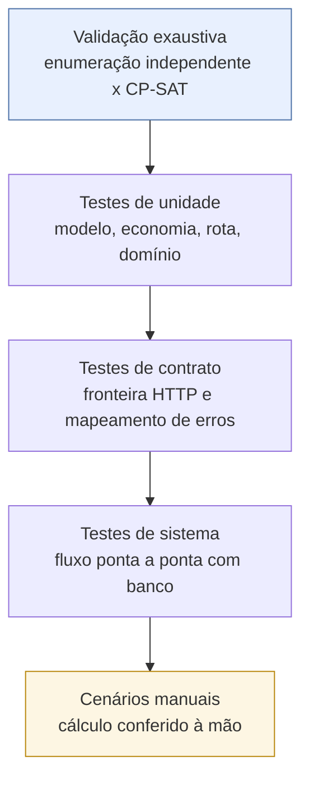
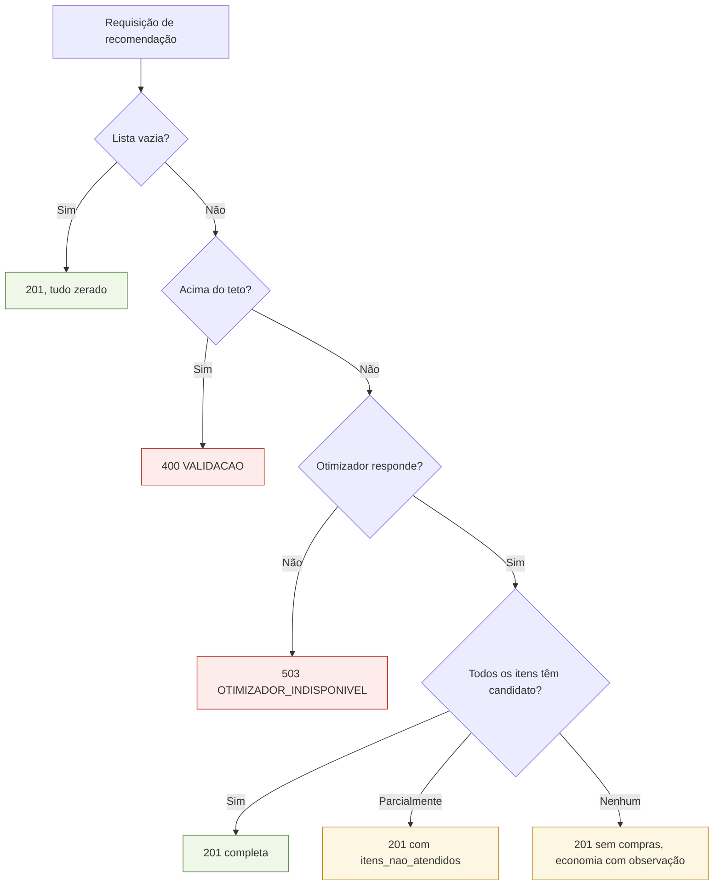

# Plano de testes

Como o sistema é verificado, o que já foi verificado de fato e o que ainda depende de
ambiente ou de dados reais. Base do capítulo de resultados (Fase 4 do
`plano_desenvolvimento.md`).

## Pirâmide de verificação



A camada mais importante é a do topo, e não a da base: para um trabalho de otimização, a
pergunta que a banca faz é "como você sabe que a recomendação é ótima?", não "o endpoint
responde 200?".

## Estado atual da execução

| Camada | Comando | Situação |
|---|---|---|
| Validação exaustiva | `python modelo/scripts/validacao_exaustiva.py --repeticoes 200 --semente 2026` | **executado** — 200/200 instâncias convergiram |
| Unidade e contrato (otimizador) | `pytest testes -q` | **executado** — 45 testes verdes |
| Estilo Python | `black --check .` e `ruff check .` | **executado** — limpos |
| Unidade e contrato (API) | `go test ./...` | **executado** — verdes |
| Estilo e análise (API) | `gofmt -l .`, `go vet ./...` | **executado** — limpos |
| Tipos e build (PWA) | `npm run build` | **executado** — build e service worker gerados |
| Sistema ponta a ponta | `bash scripts/testes_de_sistema.sh` | **executado** — 28/28 cenários, 0 falhas |

O roteiro de sistema está automatizado em
[`../scripts/testes_de_sistema.sh`](../scripts/testes_de_sistema.sh): ele autentica,
exercita os cenários abaixo contra a API real e sai com código 1 se algum falhar.

```bash
docker compose up -d --build
bash scripts/testes_de_sistema.sh
```

### Ambiente da execução registrada

Docker 29.8 e Compose v5.5 rodando **dentro do WSL2 (Ubuntu)**, com os quatro serviços
subidos por `docker compose up -d --build`. As migrations e a semente foram aplicadas pela
própria API na subida.

| Verificação de infraestrutura | Resultado |
|---|---|
| Migrations aplicadas | `001_esquema_inicial.sql`, `002_dados_semente.sql` |
| Snapshots em `precos` | 218 |
| Linhas em `precos_vigentes` | 194 (24 superadas por coleta mais recente) |
| Marcas | 36 |
| `GET /saude` | `{"status":"ok","banco":"ok","otimizador":"ok"}` |
| PWA em `:5173` | `200`, título `Compra Certa` |
| Swagger do otimizador em `:8001/docs` | `200` |

## Camada 1 — validação exaustiva

Detalhes em [`../modelo/docs/validacao-e-testes.md`](../modelo/docs/validacao-e-testes.md);
tabela por instância em [`relatorio-validacao.md`](relatorio-validacao.md).

O que ela prova: para toda instância pequena gerada, a alocação devolvida pelo CP-SAT tem
**exatamente** o mesmo valor de objetivo que o mínimo encontrado percorrendo todas as
atribuições possíveis, medido por uma implementação independente da função objetivo.

| Métrica | Valor |
|---|---|
| Instâncias | 200 |
| Semente | 2026 |
| Convergência | 100% |
| Alocações avaliadas | 5.843 |
| Tempo da enumeração | 0,0131 s |
| Tempo do CP-SAT | 0,6967 s |

## Camada 2 — testes de unidade

| Alvo | Arquivo | Cobre |
|---|---|---|
| Haversine | `modelo/testes/test_logistica.py` | distâncias geodésicas conhecidas, simetria, raio do recorte |
| Modelo CP-SAT | `modelo/testes/test_modelo_cpsat.py` | trade-offs com ótimo calculado à mão, efeito do peso, estoque, determinismo |
| Economia | `modelo/testes/test_economia.py` | os dois níveis do baseline de mercado único |
| Dinheiro | `api/internal/dominio/dinheiro_test.go` | conversão reais↔centavos, arredondamento, reversibilidade |
| Perfis | `api/internal/dominio/perfil_test.go` | tradução perfil↔peso |
| Montagem do payload | `api/internal/servico/recomendacao_test.go` | peso livre sobrepondo perfil, escolha de candidato, ordenação determinística |

## Camada 3 — testes de contrato

| Alvo | Arquivo | Cobre |
|---|---|---|
| `POST /otimizar` | `modelo/testes/test_api.py` | forma da resposta, as 5 regras de validação (422), teto da PoC |
| Erros da API | `api/internal/transporte/erros_test.go` | os 7 códigos do contrato, erro embrulhado, não vazamento de detalhe interno |

## Camada 4 — testes de sistema (executados)

Pré-requisitos: `docker compose up -d --build` com os quatro serviços saudáveis.
Automatizados em [`../scripts/testes_de_sistema.sh`](../scripts/testes_de_sistema.sh).

### Caminho feliz


| # | Cenário | Passos | Resultado esperado |
|---|---|---|---|
| S01 | Saúde | `GET /saude` | `200` com `banco: ok` e `otimizador: ok` |
| S02 | Migrations e semente | inspecionar o banco | 8 tabelas, a view `precos_vigentes`, 6 mercados, 18 produtos, 36 marcas, 218 preços |
| S03 | Login demo | `POST /auth/entrar` com `demo@exemplo.com` / `demo1234` | `200` com token |
| S04 | Listas de exemplo | `GET /listas` | as 2 listas da semente |
| S05 | Recomendação equilibrada | `POST /listas/{id}/recomendacoes` perfil `equilibrado` | `201`, `status: OTIMO`, rota não vazia |
| S06 | Persistência | `GET /listas/{id}/recomendacoes` | a recomendação recém-gerada no histórico |
| S07 | Imutabilidade | `GET /recomendacoes/{id}` duas vezes | corpos idênticos; nada é recalculado |
| S08 | Fluxo no PWA | login → lista → perfil → resultado | roteiro exibido na ordem da rota, com economia |

### Comparação dos três perfis (experimento da Fase 4)

| # | Cenário | Verificação |
|---|---|---|
| S09 | Mesma lista nos 3 perfis | `economico` visita mais mercados e gasta menos em itens que `conveniente` |
| S10 | Monotonicidade | ao aumentar `peso_conveniencia`, o nº de mercados não aumenta |
| S11 | Determinismo | mesma lista e mesmo perfil, duas vezes: alocação idêntica |

S10 é a verificação mais informativa das três: ela testa a **coerência da escalarização**,
não apenas que o endpoint responde.

### Resultado da comparação de perfis (executado)

Cesta básica completa da semente — 18 itens, 6 mercados, origem no centro de Juazeiro do
Norte:

| Perfil | Itens | Logística | **Total** | Mercados | Distância |
|---|---|---|---|---|---|
| `economico` | R$ 300,39 | R$ 90,70 | **R$ 391,09** | 6 | 21,90 km |
| `equilibrado` | R$ 308,65 | R$ 25,77 | **R$ 334,42** | 2 | 7,65 km |
| `conveniente` | R$ 308,65 | R$ 25,77 | **R$ 334,42** | 2 | 7,65 km |

Este é o **resultado central do trabalho**, e ele mostra o trade-off funcionando: o perfil
econômico realmente encontra a cesta mais barata em itens (R$ 300,39, R$ 8,26 a menos), mas
para isso precisa visitar **todos os seis mercados** e percorrer 21,9 km — o que custa
R$ 90,70 de deslocamento. O ganho de R$ 8,26 no preço é consumido várias vezes pelo custo
de ir buscá-lo.

Duas observações que valem para o texto do TCC:

1. **`equilibrado` e `conveniente` convergem para a mesma solução** nesta base. A dispersão
   de preços da semente fictícia não é larga o bastante para que um terceiro mercado se
   pague nem com peso 1. Isso não é defeito do modelo — é uma característica dos dados, e é
   exatamente o tipo de coisa que a coleta real pode mudar. Vale reexecutar esta tabela
   depois da coleta em campo.
2. O baseline de economia caiu no caminho de **comparação parcial**: nenhum dos seis
   mercados atende sozinho os 18 itens, então a comparação usou o de maior cobertura
   (Hipermercado Lagoa Seca, 17 dos 18 itens) e reportou `comparacao_parcial: true`. A
   economia declarada foi de R$ 0,69 (0,22%) sobre esse subconjunto — um número pequeno,
   mas honesto, e preferível a inflá-lo comparando cestas de tamanhos diferentes.

### Tempo de resposta (executado)

Instância típica de 18 itens × 6 mercados, medindo o ciclo completo
`POST /listas/:id/recomendacoes` (banco + montagem do payload + solver + persistência):

| Execução | Tempo total |
|---|---|
| 1 | 0,036 s |
| 2 | 0,056 s |
| 3 | 0,033 s |

Bem abaixo do requisito não funcional de tempo de resposta do otimizador. Sobra folga
grande até o teto da PoC (20 × 8).

### Casos de borda

| # | Cenário | Como provocar | Resultado esperado |
|---|---|---|---|
| B01 | Lista vazia | lista sem itens | `201` com custos zerados, `compras_por_mercado` vazio. **Nunca 500** |
| B02 | Item sem preço em nenhum mercado | produto sem preço cadastrado | `201` com `SEM_CANDIDATO` |
| B03 | Item sem estoque suficiente | quantidade maior que todo estoque | `201` com `SEM_CANDIDATO_COM_ESTOQUE` |
| B04 | Mercado único | manter só um mercado | `201` alocando tudo nele |
| B05 | Nenhum item atendível | lista só com itens sem oferta | `201`, tudo em `itens_nao_atendidos`, economia com `observacao` |
| B06 | Teto de itens | lista com 21 itens | `400 VALIDACAO` citando o teto |
| B07 | Otimizador fora do ar | `docker compose stop modelo` | `503 OTIMIZADOR_INDISPONIVEL`; CRUD segue funcionando |
| B08 | Lista de outro usuário | token do usuário A na lista do B | `403 NAO_AUTORIZADO` |
| B09 | Token expirado | esperar a expiração ou adulterar o token | `401`; o PWA volta ao login |
| B10 | Unidade inválida | item com unidade `litro` | `400 VALIDACAO` |
| B11 | E-mail duplicado | cadastrar o mesmo e-mail | `409 CONFLITO` |
| B12 | Origem omitida | recomendação sem `origem` | `origem_aproximada: true` |
| B13 | Offline no PWA | modo offline nas DevTools | telas abrem; gerar recomendação mostra erro claro |



A regra que atravessa todos os casos: **nenhuma condição de dados produz erro 500**. Erro
só existe para falha de infraestrutura (`503`) ou entrada inválida (`400`).

## Camada 5 — cenários manuais (a fazer com dados reais)

Exigido pela Fase 4. Para 2 ou 3 cestas representativas:

1. Levantar à mão, na planilha da coleta real, o preço de cada item em cada mercado.
2. Calcular manualmente o custo de comprar tudo em cada mercado isoladamente.
3. Calcular manualmente a melhor divisão para cada um dos três perfis.
4. Comparar com a recomendação do sistema e **documentar as divergências**, se houver.
5. Registrar o ganho de economia e a variação no número de mercados.

Este é o experimento que produz a tabela do capítulo de resultados. Sem ele, há
demonstração de corretude matemática (camada 1), mas não de **utilidade prática**, que é o
que o trabalho se propõe a mostrar.

## Portões de qualidade

```bash
# Otimizador
cd modelo
.venv/Scripts/python -m pytest testes -q
.venv/Scripts/python -m black --line-length 100 --check .
.venv/Scripts/python -m ruff check .
.venv/Scripts/python scripts/validacao_exaustiva.py --repeticoes 60

# API
cd api
gofmt -l .
go vet ./...
go test ./...

# PWA
cd pwa
npm run build

# Dados
python dados/gerar_insercoes.py --entrada dados/coleta/coleta_2026-09-01.csv --verificar
```

Todos fazem parte da Definition of Done em
[`plano-de-sprints.md`](plano-de-sprints.md).

## O que falta para fechar a Fase 4

- [x] ~~Rodar o roteiro de testes de sistema com o Docker de pé~~ — 28/28 cenários, 0 falhas.
- [ ] Substituir a semente fictícia pela coleta real de Juazeiro do Norte.
- [ ] Repetir a validação exaustiva com dados reais.
- [ ] Executar os cenários manuais da camada 5.
- [x] ~~Medir o tempo de resposta com a instância típica (18 × 6)~~ — 33 a 56 ms, com folga
      grande sobre o RNF.
- [ ] Consolidar os resultados em tabelas e gráficos.
