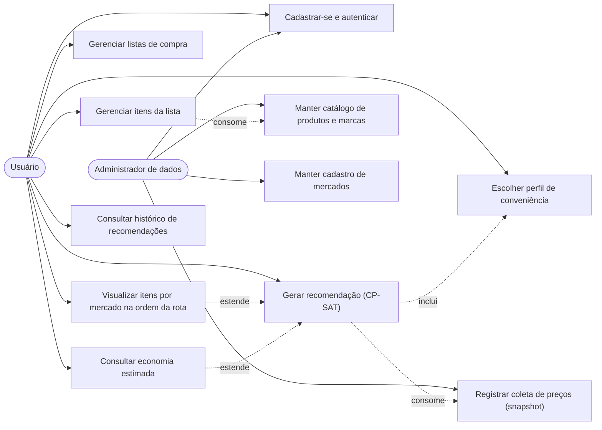

# Requisitos — SAD para Compras de Supermercado

Documento de requisitos da PoC (Fase 1 do `plano_desenvolvimento.md`). Complementa
`docs/visao-geral.md` e o contrato técnico do `CLAUDE.md`.

Convenções de identificação:

- **RF** — requisito funcional
- **RNF** — requisito não funcional
- **RN** — regra de negócio
- **HU** — história de usuário
- **CB** — caso de borda

Atores:

- **Usuário** — consumidor doméstico que monta listas e solicita recomendações.
- **Administrador de dados** — na PoC, o próprio autor do TCC; mantém o catálogo e registra
  as coletas semanais de preço.

---

## 1. Casos de uso

---

## 2. Requisitos funcionais

### 2.1 Identidade e acesso

| ID | Requisito | Prioridade |
|---|---|---|
| **RF01** | O sistema deve permitir o cadastro de usuário com nome, e-mail e senha, rejeitando e-mail já cadastrado. | Alta |
| **RF02** | O sistema deve autenticar o usuário por e-mail e senha e emitir um token de sessão para as requisições subsequentes. | Alta |
| **RF03** | O sistema deve restringir o acesso às listas, itens e recomendações ao usuário que os criou. | Alta |

### 2.2 Listas de compra

| ID | Requisito | Prioridade |
|---|---|---|
| **RF04** | O sistema deve permitir criar, listar, renomear e excluir listas de compra do usuário autenticado. | Alta |
| **RF05** | O sistema deve permitir adicionar, editar e remover itens de uma lista, informando produto, marca (opcional), quantidade e unidade. | Alta |
| **RF06** | O sistema deve permitir que um item seja registrado sem marca definida, indicando que qualquer marca do produto é aceitável. | Alta |
| **RF07** | O sistema deve validar que a quantidade de um item é um número estritamente positivo. | Alta |
| **RF08** | O sistema deve permitir reutilizar uma lista existente para gerar novas recomendações, sem duplicá-la. | Média |

### 2.3 Catálogo e dados de mercado

| ID | Requisito | Prioridade |
|---|---|---|
| **RF09** | O sistema deve manter um catálogo de produtos genéricos (nome, categoria). | Alta |
| **RF10** | O sistema deve manter marcas vinculadas a um produto (ex.: produto "arroz", marca "Tio João"). | Alta |
| **RF11** | O sistema deve manter o cadastro de mercados com nome, endereço, latitude e longitude. | Alta |
| **RF12** | O sistema deve registrar preços como snapshot append-only, contendo marca, mercado, preço, unidade, quantidade disponível e data/hora da coleta. | Alta |
| **RF13** | O sistema não deve permitir atualização nem exclusão de registros de preço já gravados; uma correção é feita inserindo um novo snapshot. | Alta |
| **RF14** | O sistema deve considerar, na montagem dos candidatos de otimização, apenas o snapshot mais recente de cada par (marca, mercado). | Alta |
| **RF15** | O sistema deve permitir consultar a série histórica de preços de uma marca em um mercado. | Média |

### 2.4 Recomendação

| ID | Requisito | Prioridade |
|---|---|---|
| **RF16** | O sistema deve permitir gerar uma recomendação para uma lista, recebendo o perfil de conveniência (`economico`, `equilibrado`, `conveniente`) e, opcionalmente, as coordenadas de origem do usuário. | Alta |
| **RF17** | O sistema deve aceitar, além dos perfis nomeados, um valor numérico livre de `peso_conveniencia`, para os experimentos de sensibilidade da Fase 4. | Alta |
| **RF18** | O sistema deve aplicar os parâmetros logísticos padrão de custo por visita (R$ 8,00) e custo por quilômetro (R$ 1,20), permitindo sobrescrevê-los na requisição. | Média |
| **RF19** | O sistema deve montar o payload de otimização com, para cada item, todos os mercados candidatos com preço vigente e estoque suficiente, além das coordenadas dos mercados e da origem. | Alta |
| **RF20** | O sistema deve delegar a resolução do modelo ao serviço Python (CP-SAT) via HTTP interno, sem replicar a lógica de otimização na API Go. | Alta |
| **RF21** | O sistema deve retornar a alocação de cada item ao mercado escolhido, com o preço unitário e o subtotal aplicados. | Alta |
| **RF22** | O sistema deve retornar a lista de mercados a visitar em uma ordem sugerida de visita, partindo da origem informada. | Alta |
| **RF23** | O sistema deve retornar a decomposição do custo: custo dos produtos, custo logístico (visitas e distância) e valor da função objetivo. | Alta |
| **RF24** | O sistema deve retornar explicitamente os itens **não atendidos**, com o motivo (sem preço cadastrado ou estoque insuficiente). | Alta |
| **RF25** | O sistema deve calcular e exibir a economia estimada frente ao cenário de referência "comprar tudo no melhor mercado único capaz de atender a lista". | Alta |
| **RF26** | O sistema deve persistir cada recomendação gerada (lista, data/hora, custo total, peso de conveniência e payload completo do resultado) para auditoria e para os testes de acurácia. | Alta |
| **RF27** | O sistema deve permitir consultar o histórico de recomendações de uma lista, ordenado da mais recente para a mais antiga. | Média |
| **RF28** | O sistema deve permitir reabrir uma recomendação do histórico exatamente como foi gerada, sem recalcular. | Média |

### 2.5 Interface (PWA)

| ID | Requisito | Prioridade |
|---|---|---|
| **RF29** | O PWA deve oferecer um formulário de montagem de lista otimizado para uso no celular, com busca de produto e adição rápida de itens. | Alta |
| **RF30** | O PWA deve exibir o resultado com os itens agrupados por mercado, na ordem da rota, indicando o subtotal de cada mercado. | Alta |
| **RF31** | O PWA deve destacar a economia estimada e o número de mercados a visitar no topo da tela de resultado. | Alta |
| **RF32** | O PWA deve exibir os itens não atendidos em uma seção separada e visualmente distinta do restante do resultado. | Alta |
| **RF33** | O PWA deve permitir alternar o perfil de conveniência e regerar a recomendação sem refazer a lista. | Média |
| **RF34** | O PWA deve ser instalável no dispositivo (manifest + service worker). | Média |

---

## 3. Requisitos não funcionais

| ID | Categoria | Requisito e meta mensurável |
|---|---|---|
| **RNF01** | Desempenho | O serviço de otimização deve responder em **menos de 2 s** (p95, medido no servidor, excluindo latência de rede) para o teto da PoC de **20 itens × 30 mercados**. |
| **RNF02** | Desempenho | O endpoint de geração de recomendação da API Go deve responder em **menos de 3 s** ponta a ponta (p95) na mesma instância de teto, incluindo montagem do payload e persistência. |
| **RNF03** | Capacidade | A PoC deve suportar instâncias de até **20 itens × 30 mercados** (o catálogo tem 28 supermercados), com pelo menos 2 marcas candidatas por item. Instâncias acima do teto devem ser rejeitadas com erro descritivo, não processadas parcialmente. |
| **RNF04** | Corretude | O solver deve ser configurado com limite de tempo explícito e reportar o status da solução (`OPTIMAL`, `FEASIBLE`, `INFEASIBLE`); o resultado devolvido deve carregar esse status. |
| **RNF05** | Corretude | Em instâncias pequenas (até 6 itens × 4 mercados), o custo ótimo do CP-SAT deve coincidir com o obtido por enumeração exaustiva em `modelo/scripts/validacao_exaustiva.py`, com tolerância de R$ 0,01. |
| **RNF06** | Segurança | Senhas devem ser armazenadas exclusivamente como hash **bcrypt** (custo mínimo 10). Senha em texto claro nunca é persistida nem registrada em log. |
| **RNF07** | Segurança | Todo endpoint que manipule listas, itens ou recomendações deve exigir autenticação e verificar a propriedade do recurso. |
| **RNF08** | Integridade de dados | O histórico de preços deve ser preservado integralmente: a tabela `precos` é append-only, sem `UPDATE` nem `DELETE` na aplicação. |
| **RNF09** | Integridade de dados | Toda recomendação persistida deve permitir reconstituir a decisão: parâmetros de entrada, pesos aplicados e payload de resultado ficam gravados em `recomendacoes`. |
| **RNF10** | Disponibilidade offline | O PWA deve ser instalável e servir o app shell offline (telas estáticas e última lista visualizada); operações que exigem o servidor devem falhar com mensagem clara, sem tela em branco. |
| **RNF11** | Portabilidade | Os três serviços devem subir localmente com Docker Compose e uma sequência documentada de comandos, sem configuração manual além de variáveis de ambiente. |
| **RNF12** | Manutenibilidade | Código Go com `gofmt` e `golangci-lint` limpos; Python com `black` e `ruff` limpos; toda função pública do serviço de otimização com type hints e docstring descrevendo as variáveis do modelo. |
| **RNF13** | Testabilidade | O serviço Python deve ser stateless e testável isoladamente, recebendo o payload completo por HTTP, sem acesso ao banco. |
| **RNF14** | Usabilidade | O fluxo "abrir lista → escolher perfil → ver recomendação" deve ser concluído em no máximo 3 toques a partir da tela de listas. |
| **RNF15** | Precisão numérica | Valores monetários devem ser tratados sem erro de ponto flutuante acumulado na comparação de soluções: internamente em centavos (inteiros) no modelo CP-SAT, convertidos para reais apenas na apresentação. |
| **RNF16** | Idioma | Interface, mensagens de erro e dados são exclusivamente em português brasileiro; não há suporte a i18n. |

---

## 4. Regras de negócio

| ID | Regra |
|---|---|
| **RN01** | Cada item da lista é comprado em **exatamente um** mercado. Não há divisão de quantidade de um mesmo item entre mercados. |
| **RN02** | Um item só pode ser alocado a um mercado que esteja marcado como visitado: `x[i][j] <= y[j]`. |
| **RN03** | Um mercado só é candidato para um item se possuir preço vigente para a marca aceitável e `quantidade_disponivel >= quantidade pedida` do item. |
| **RN04** | Item sem nenhum mercado candidato viável é reportado como **não atendido**. Ele é removido do modelo de otimização, não invalida a recomendação e **nunca** provoca erro de execução. |
| **RN05** | Se o item da lista tem marca definida, apenas os preços daquela marca são candidatos. Se não tem marca, todas as marcas do produto são candidatas, e o modelo escolhe a mais vantajosa. |
| **RN06** | O preço considerado é o do snapshot mais recente do par (marca, mercado). Snapshots anteriores permanecem no banco e são usados apenas para consulta histórica. |
| **RN07** | O custo total dos produtos é a soma de `preco_unitario * quantidade` sobre todos os itens atendidos. |
| **RN08** | O custo logístico (de conveniência) é `custo_por_visita * (nº de mercados visitados)`. A distância percorrida **não é precificada** (revisão de escopo de 2026-09-28). |
| **RN09** | A função objetivo minimizada é `custo_total(x) + peso_conveniencia * custo_logistico(y)`. |
| **RN10** | Os perfis mapeiam para pesos fixos: `economico` = 0,0; `equilibrado` = 1,0; `conveniente` = 3,0. Um `peso_conveniencia` numérico informado explicitamente prevalece sobre o perfil. |
| **RN11** | Com `peso_conveniencia` igual a 0,0, o custo logístico não influencia a decisão; a solução minimiza apenas o gasto com produtos. |
| **RN12** | Se a origem do usuário não for informada, usa-se o ponto de referência (centro de Juazeiro do Norte/CE) e a recomendação sinaliza que a distância é aproximada. |
| **RN13** | A economia estimada é a diferença entre o custo do cenário de referência (melhor mercado único capaz de atender o maior número de itens) e o custo dos produtos na solução recomendada, considerando apenas itens atendidos em ambos os cenários. |
| **RN14** | Recomendações são imutáveis após gravadas. Alterar a lista não altera recomendações anteriores; gera-se uma nova. |
| **RN15** | Empates entre soluções de mesmo valor objetivo são resolvidos preferindo o menor número de mercados visitados e, persistindo o empate, os mercados mais próximos da origem. |
| **RN16** | A ordem de visita é um único percurso: a partir da origem, sempre o mercado ainda não visitado mais próximo de onde o usuário está, voltando à origem no fim. |
| **RN17** | O escopo é Juazeiro do Norte/CE. Os preços vêm da base da cesta básica do DIEESE: cada nome de cidade vira um supermercado fictício em Juazeiro com os preços daquela cidade; os produtos são os da cesta e cada um tem duas marcas fictícias. Célula sem preço na base = produto indisponível naquele supermercado. |

---

## 5. Histórias de usuário

### HU01 — Montar a lista de compras

**Como** consumidor doméstico, **quero** montar minha lista informando produto, marca opcional
e quantidade, **para** ter a base da compra registrada e reutilizável.

Critérios de aceite:

- **Dado** que estou autenticado e em uma lista aberta, **quando** adiciono o produto "arroz"
  com quantidade 5 e unidade "kg", **então** o item aparece na lista com esses dados.
- **Dado** que adiciono um item sem informar a marca, **quando** salvo, **então** o item é
  aceito e sinalizado como "qualquer marca".
- **Dado** que informo quantidade 0 ou negativa, **quando** tento salvar, **então** o sistema
  recusa com mensagem indicando que a quantidade deve ser positiva.
- **Dado** que a lista tem itens, **quando** removo um item, **então** ele deixa de constar e
  as recomendações já geradas permanecem inalteradas.

### HU02 — Escolher o perfil de conveniência

**Como** consumidor doméstico, **quero** escolher entre economizar mais ou visitar menos
mercados, **para** que a recomendação respeite o tempo que tenho disponível.

Critérios de aceite:

- **Dado** que abro a tela de geração de recomendação, **quando** ela carrega, **então** vejo
  os três perfis (`economico`, `equilibrado`, `conveniente`) com o `equilibrado` pré-selecionado.
- **Dado** que seleciono `conveniente`, **quando** gero a recomendação, **então** o
  `peso_conveniencia` aplicado é 3,0 e consta na resposta.
- **Dado** a mesma lista e os mesmos preços, **quando** comparo o resultado de `conveniente`
  com o de `economico`, **então** o número de mercados visitados no `conveniente` é menor ou
  igual ao do `economico`.

### HU03 — Gerar a recomendação

**Como** consumidor doméstico, **quero** que o sistema calcule onde comprar cada item,
**para** não precisar comparar preços manualmente.

Critérios de aceite:

- **Dado** que a lista tem itens com preços cadastrados, **quando** solicito a recomendação,
  **então** recebo a alocação de cada item a exatamente um mercado.
- **Dado** que a recomendação foi gerada, **quando** inspeciono o resultado, **então** todo
  mercado que recebeu ao menos um item consta na lista de mercados a visitar.
- **Dado** que a instância está no teto da PoC (20 itens × 8 mercados), **quando** solicito a
  recomendação, **então** a resposta chega em menos de 3 s.
- **Dado** que o solver conclui, **quando** leio a resposta, **então** ela informa o status da
  solução e a decomposição entre custo dos produtos e custo logístico.

### HU04 — Ver os itens por mercado na ordem da rota

**Como** consumidor doméstico, **quero** ver o que comprar em cada mercado na ordem em que vou
visitá-los, **para** executar a compra sem consultar a lista inteira a cada parada.

Critérios de aceite:

- **Dado** que a recomendação envolve 3 mercados, **quando** abro a tela de resultado,
  **então** vejo 3 blocos, um por mercado, na ordem sugerida de visita.
- **Dado** um bloco de mercado, **quando** o leio, **então** vejo nome e endereço do mercado,
  os itens com quantidade e preço unitário, e o subtotal daquela parada.
- **Dado** que estou na tela de resultado, **quando** marco um item como já comprado,
  **então** ele fica visualmente diferenciado, sem alterar a recomendação persistida.

### HU05 — Entender quanto estou economizando

**Como** consumidor doméstico, **quero** ver a economia estimada frente a comprar tudo em um
mercado só, **para** julgar se as visitas extras valem a pena.

Critérios de aceite:

- **Dado** que a recomendação foi gerada, **quando** abro o resultado, **então** vejo o custo
  total, o custo do cenário de mercado único de referência e a diferença entre eles.
- **Dado** que o cenário de referência é apresentado, **quando** o leio, **então** o mercado
  usado como referência é identificado pelo nome.
- **Dado** que a solução recomendada usa um único mercado, **quando** abro o resultado,
  **então** a economia exibida é R$ 0,00 e o texto explica que o mercado único já é o ótimo.

### HU06 — Lidar com itens que ninguém tem

**Como** consumidor doméstico, **quero** saber quais itens da minha lista nenhum mercado pode
atender, **para** providenciá-los por outro meio.

Critérios de aceite:

- **Dado** que um item não tem preço cadastrado em nenhum mercado, **quando** gero a
  recomendação, **então** ele aparece na seção "itens não atendidos" com o motivo "sem preço
  cadastrado", e os demais itens são alocados normalmente.
- **Dado** que um item tem preço mas nenhum mercado com estoque suficiente, **quando** gero a
  recomendação, **então** ele aparece como não atendido com o motivo "estoque insuficiente".
- **Dado** que existem itens não atendidos, **quando** leio o custo total, **então** ele
  contabiliza apenas os itens atendidos, e isso é indicado na tela.

### HU07 — Consultar recomendações anteriores

**Como** consumidor doméstico, **quero** consultar recomendações que já gerei, **para**
comparar decisões ao longo do tempo.

Critérios de aceite:

- **Dado** que gerei 3 recomendações para a mesma lista, **quando** abro o histórico,
  **então** vejo as 3 ordenadas da mais recente para a mais antiga, com data, perfil usado e
  custo total.
- **Dado** que abro uma recomendação antiga, **quando** ela carrega, **então** vejo o mesmo
  conteúdo de quando foi gerada, mesmo que os preços tenham mudado desde então.
- **Dado** que sou outro usuário, **quando** tento acessar a recomendação alheia pelo
  identificador, **então** recebo negação de acesso.

### HU08 — Registrar a coleta semanal de preços

> **Fora do escopo desde a revisão de 2026-09-28.** Os preços vêm da base do DIEESE, e não
> há coleta. O mecanismo de snapshot append-only (e o endpoint `POST /precos`) continua
> existindo.

**Como** administrador de dados, **quero** registrar os preços coletados na semana, **para**
manter a base atualizada e preservar a série histórica.

Critérios de aceite:

- **Dado** que coletei o preço de uma marca em um mercado, **quando** registro o snapshot,
  **então** um novo registro é inserido com data/hora de coleta, sem alterar registros
  anteriores.
- **Dado** que registrei um preço errado, **quando** preciso corrigi-lo, **então** insiro um
  novo snapshot mais recente; não existe operação de edição ou exclusão do anterior.
- **Dado** que existem múltiplos snapshots do mesmo par (marca, mercado), **quando** uma
  recomendação é gerada, **então** apenas o mais recente é usado como candidato.

### HU09 — Manter o catálogo e os mercados

**Como** administrador de dados, **quero** cadastrar produtos, marcas e mercados com suas
coordenadas, **para** que o otimizador tenha os candidatos e as distâncias corretas.

Critérios de aceite:

- **Dado** que cadastro um mercado, **quando** informo nome, endereço, latitude e longitude,
  **então** ele passa a ser considerado nas recomendações que tenham preços vinculados a ele.
- **Dado** que tento cadastrar um mercado sem coordenadas, **quando** salvo, **então** o
  sistema recusa, informando que latitude e longitude são obrigatórias para o cálculo de
  distância.
- **Dado** que cadastro uma marca, **quando** salvo, **então** ela fica obrigatoriamente
  vinculada a um produto existente.

### HU10 — Usar o aplicativo no mercado, com sinal ruim

**Como** consumidor doméstico, **quero** abrir a recomendação já gerada mesmo com internet
instável, **para** consultá-la dentro do supermercado.

Critérios de aceite:

- **Dado** que instalei o PWA e já visualizei uma recomendação, **quando** abro o aplicativo
  sem conexão, **então** o app shell carrega e a última recomendação visualizada é exibida.
- **Dado** que estou offline, **quando** tento gerar uma nova recomendação, **então** recebo
  mensagem clara de indisponibilidade, sem travamento nem tela em branco.

---

## 6. Casos de borda

| ID | Caso | Comportamento esperado |
|---|---|---|
| **CB01** | Lista vazia (sem itens) | A geração de recomendação retorna sucesso com custo total R$ 0,00, nenhum mercado a visitar e mensagem "lista sem itens". Não é erro. |
| **CB02** | Item sem preço cadastrado em nenhum mercado | Item classificado como não atendido, motivo "sem preço cadastrado"; a recomendação prossegue com os demais itens (RN04). |
| **CB03** | Item com preço, mas nenhum mercado com estoque suficiente | Item classificado como não atendido, motivo "estoque insuficiente"; a recomendação prossegue (RN03, RN04). |
| **CB04** | Todos os itens não atendidos | Retorno bem-sucedido, custo R$ 0,00, nenhum mercado visitado, e todos os itens listados como não atendidos com seus motivos. |
| **CB05** | Um único mercado disponível na base | Todos os itens atendíveis são alocados a esse mercado; economia estimada exibida como R$ 0,00, pois a referência coincide com a solução. |
| **CB06** | Empate de custo entre duas soluções | Aplica-se o critério de desempate da RN15 (menos mercados, depois menor distância). |
| **CB07** | Origem não informada pelo usuário | Usa-se o ponto de referência do escopo (centro de Juazeiro do Norte/CE) e a resposta sinaliza que a distância é aproximada (RN12). |
| **CB08** | `peso_conveniencia` igual a 0,0 (perfil `economico`) | A parcela logística não influencia a solução; ainda assim o custo logístico é calculado e exibido informativamente. |
| **CB09** | Item duplicado na mesma lista (mesmo produto e marca) | Os itens são tratados como linhas independentes do modelo; cada um recebe sua alocação, podendo cair em mercados diferentes. |
| **CB10** | Instância acima do teto da PoC (mais de 20 itens ou mais de 30 mercados) | Requisição rejeitada com erro descritivo informando o limite da PoC (RNF03). |
| **CB11** | Serviço de otimização indisponível | A API Go retorna erro de dependência indisponível, com contexto no log; nenhuma recomendação parcial é persistida. |
| **CB12** | Preços coletados há muito tempo (série desatualizada) | A recomendação é gerada normalmente, mas a resposta informa a data do snapshot mais antigo utilizado. |
| **CB13** | Dois mercados com coordenadas idênticas | O cálculo de distância retorna 0 km entre eles; cada mercado continua contando como uma visita distinta no custo logístico. |

---

## 7. Rastreabilidade requisito × fase

| Fase | Requisitos cobertos |
|---|---|
| Fase 1 — Análise e Requisitos | RF01–RF15, RNF06, RNF08, RNF11, RNF12, RNF16 |
| Fase 2 — Modelagem Matemática | RF17–RF24, RN01–RN15, RNF01, RNF04, RNF13, RNF15 |
| Fase 3 — Prototipagem e Implementação | RF16, RF25–RF34, RNF02, RNF07, RNF09, RNF10, RNF14 |
| Fase 4 — Testes e Acurácia | RNF03, RNF05, CB01–CB13 |
