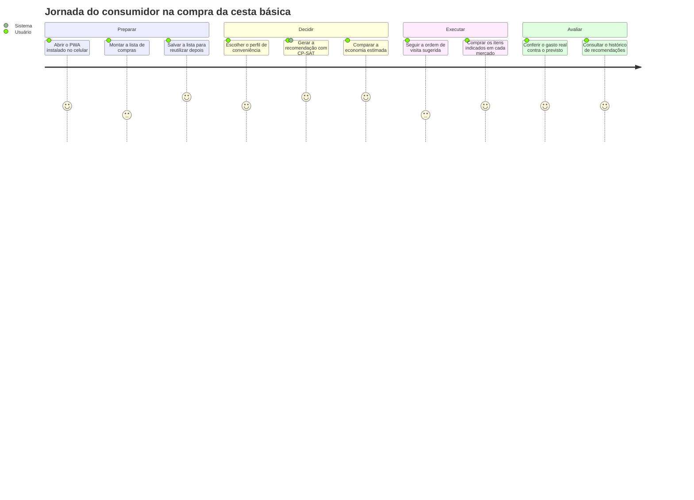

# Visão Geral do Produto — SAD para Compras de Supermercado

Documento de produto do TCC. Define o problema, o público, a proposta de valor, os limites
de escopo da prova de conceito (PoC) e o mapeamento entre as fases do
`plano_desenvolvimento.md` e os artefatos do repositório.

Documentos relacionados: `CLAUDE.md` (contrato técnico), `plano_desenvolvimento.md`
(cronograma), `docs/requisitos.md` (requisitos, histórias e regras de negócio).

---

## 1. O problema

O preço de um mesmo produto de cesta básica varia significativamente entre supermercados de
uma mesma cidade, e a variação não é uniforme: o mercado mais barato em arroz raramente é o
mais barato em óleo ou café. Diante disso, o consumidor enfrenta um dilema que ele resolve
hoje "no olho":

- **Comprar tudo em um único mercado** é conveniente, mas paga-se caro nos itens em que
  aquele mercado é mais caro que os concorrentes.
- **Pulverizar a compra entre vários mercados** captura o menor preço de cada item, mas cada
  visita adicional impõe custo real: deslocamento, combustível, tempo e desgaste.

O consumidor não tem instrumento para responder à pergunta central: **a economia obtida ao
visitar um mercado a mais compensa o custo de ir até ele?** Encartes, aplicativos de
mercados individuais e comparadores de preço mostram preços isolados, mas nenhum resolve a
alocação conjunta de uma lista inteira sob restrição de deslocamento.

Esse é um problema de decisão combinatória com objetivos conflitantes — exatamente a classe
de problema que um Sistema de Apoio à Decisão (SAD) apoiado em otimização matemática
endereça.

## 2. Público-alvo

| Papel | Descrição | Necessidade principal |
|---|---|---|
| Consumidor doméstico | Responsável pela compra mensal/quinzenal da família, compra presencialmente, tem veículo próprio ou transporte disponível | Reduzir o valor da compra sem transformar o sábado inteiro em roteiro de mercados |
| Administrador de dados | No contexto da PoC, o próprio autor do TCC | Cadastrar mercados, produtos, marcas e registrar as coletas semanais de preço |
| Banca avaliadora | Professores avaliadores do TCC | Verificar o rigor da formulação matemática, a reprodutibilidade e a validação da acurácia |

## 3. Proposta de valor

O sistema recebe uma lista de compras e um **perfil de conveniência** escolhido pelo usuário,
e devolve uma recomendação executável:

> "Vá a estes N mercados, nesta ordem, e compre estes itens em cada um. O total é R$ X, com
> economia estimada de R$ Y frente a comprar tudo em um único mercado."

Diferenciais da abordagem:

1. **Decisão conjunta, não item a item.** A alocação de todos os itens e a escolha dos
   mercados são resolvidas no mesmo modelo de otimização, respeitando a interdependência
   entre elas.
2. **Trade-off explícito e parametrizável.** O usuário não recebe uma resposta única: ele
   escolhe entre perfis (`economico`, `equilibrado`, `conveniente`) que deslocam a solução ao
   longo da fronteira custo × conveniência.
3. **Custo logístico monetizado.** O deslocamento entra na função objetivo em reais (custo
   fixo por visita + custo por quilômetro rodado), tornando a comparação com o custo dos
   produtos direta e defensável.
4. **Ótimo comprovável.** A solução é produzida pelo solver CP-SAT do Google OR-Tools e
   validada por enumeração exaustiva em instâncias pequenas (Fase 4).

## 4. Como funciona (visão de alto nível)

1. O usuário monta a lista de compras no PWA (produto, marca opcional, quantidade, unidade).
2. O usuário escolhe o perfil de conveniência e, opcionalmente, informa o ponto de origem.
3. A API Go monta o payload de otimização: para cada item, os mercados candidatos com o
   preço mais recente e estoque suficiente, mais as coordenadas dos mercados e da origem.
4. O serviço Python resolve o modelo com CP-SAT e devolve a alocação item→mercado, os
   mercados visitados, a ordem sugerida de visita e a decomposição do custo.
5. A API persiste a recomendação (tabela `recomendacoes`) e a devolve formatada ao PWA.
6. O PWA exibe os itens agrupados por mercado, na ordem da rota, com a economia estimada.

## 5. Modelo de decisão (resumo)

Formulação completa em `CLAUDE.md`, seção 5. Resumo para leitura de produto:

- `x[i][j] = 1` se o item `i` é comprado no mercado `j`; `y[j] = 1` se o mercado `j` é
  visitado.
- Cada item é comprado em **exatamente um** mercado que o tenha em estoque suficiente.
- `x[i][j] <= y[j]`: só se compra onde se visita.
- Função objetivo (escalarização por soma ponderada):

  `min custo_total(x) + peso_conveniencia * custo_logistico(y)`

- `custo_logistico(y)` = `custo_por_visita * (nº de mercados visitados)` +
  `custo_por_km * (distância haversine de ida e volta entre a origem e cada mercado
  visitado)`.

### Perfis de conveniência

| Perfil | `peso_conveniencia` | Comportamento esperado |
|---|---|---|
| `economico` | 0,0 | Ignora o deslocamento; busca o menor gasto possível em produtos, ainda que visite muitos mercados |
| `equilibrado` | 1,0 | Trata o custo logístico em reais no mesmo peso do custo dos produtos |
| `conveniente` | 3,0 | Penaliza fortemente cada visita; tende a concentrar a compra em poucos mercados |

Parâmetros logísticos padrão da PoC: **custo por visita = R$ 8,00**; **custo por km = R$ 1,20**.

A API continua aceitando um **peso numérico livre** além dos três perfis nomeados, porque os
experimentos de sensibilidade da Fase 4 precisam varrer a fronteira de trade-off com passos
finos.

## 6. Escopo da PoC

### 6.1 Dentro do escopo

- Cadastro e autenticação de usuário (e-mail + senha com hash bcrypt).
- CRUD de listas de compra e de seus itens.
- Catálogo de produtos, marcas e mercados (gerido pelo administrador de dados).
- Registro de preços e disponibilidade como **snapshot append-only** (nunca sobrescrever).
- Geração de recomendação com escolha de perfil de conveniência.
- Tela de resultado: itens agrupados por mercado, na ordem da rota, com economia estimada.
- Histórico de recomendações geradas, para auditoria e para os testes de acurácia.
- Distância por fórmula de haversine sobre latitude/longitude (sem serviço externo de rotas).
- PWA instalável com app shell disponível offline.

### 6.2 Fora do escopo (explícito)

Conforme a seção 7 do `CLAUDE.md`, os itens abaixo **não** serão implementados sem pedido
explícito do autor, e sua ausência é uma decisão de projeto, não uma pendência:

| Fora do escopo | Justificativa |
|---|---|
| Pagamento / checkout / e-commerce | A compra é presencial; o sistema é de apoio à decisão, não transacional |
| Delivery ou integração com entregadores | Fora do problema de pesquisa |
| Multi-tenant | Uma única instância acadêmica, um único conjunto de dados |
| Internacionalização (i18n) | Interface e dados exclusivamente em português brasileiro |
| Autenticação social (OAuth Google/Facebook) | Complexidade sem contribuição para o TCC |
| Kubernetes, CI/CD complexo, observabilidade de produção | PoC acadêmica com prazo fixo |
| Troca do OR-Tools por outro solver | Impactaria o capítulo de metodologia (`CLAUDE.md`, seção 5) |
| Scraping automatizado de preços | Coleta é manual e semanal, por decisão de escopo |
| Roteamento viário real (Google Maps, OSRM) | Haversine é suficiente para a PoC; Routing do OR-Tools é evolução opcional |

## 7. Escopo de dados

O **recorte geográfico é uma decisão de escopo travada**: o trabalho todo gira em torno de
**Juazeiro do Norte/CE**. Cidade, ponto de referência, raio, número de mercados e cesta de
produtos são definitivos e vão para o texto do TCC.

> **Atenção:** o que é **fictício** são apenas os **dados de preço, estoque e os nomes dos
> estabelecimentos** hoje carregados pela semente (`api/migracoes/002_dados_semente.sql`).
> Eles existem para o sistema rodar ponta a ponta antes de a coleta de campo terminar e
> **serão substituídos pela coleta real** em Juazeiro do Norte. Nenhum resultado do
> capítulo de resultados do TCC pode se basear nos valores da semente.

| Parâmetro | Valor |
|---|---|
| Cidade de coleta | Juazeiro do Norte / CE |
| Ponto de referência (centro) | latitude -7,2131 / longitude -39,3153 |
| Raio de abrangência | aproximadamente 7 km do centro |
| Nº de supermercados | 6 |
| Nº de produtos de cesta básica | 18 |
| Marcas por produto | 2 (aproximadamente 36 marcas no total) |
| Frequência de coleta de preços | semanal, manual |
| Tamanho típico da instância de otimização | 18 itens × 6 mercados |
| Teto suportado pela PoC | 20 itens × 8 mercados |

O teto (20 × 8) é deliberadamente maior que a instância típica (18 × 6) para que os testes de
desempenho da Fase 4 exercitem uma folga sobre o caso real.

## 8. Fases do plano × artefatos do repositório

| Fase | Período | Objetivo | Artefatos concretos |
|---|---|---|---|
| **Fase 1** — Análise e Requisitos | Julho | Requisitos, schema, contrato de API, esqueleto dos 3 serviços, início da coleta | `docs/visao-geral.md`, `docs/requisitos.md`, `api/migracoes/` (schema inicial), `api/` (servidor Gin de pé), `modelo/` (FastAPI respondendo com exemplo trivial de CP-SAT), `docker-compose.yml` |
| **Fase 2** — Modelagem Matemática e Design | Agosto | Modelo CP-SAT, endpoint `/otimizar`, testes unitários, wireframes | `modelo/` (variáveis `x[i][j]`/`y[j]`, restrições, função objetivo ponderada), testes unitários em `modelo/`, wireframes em `docs/` |
| **Fase 3** — Prototipagem e Implementação | Setembro–Outubro | CRUD completo, orquestração, persistência da recomendação, PWA ponta a ponta | `api/` (CRUD, cliente do otimizador, gravação em `recomendacoes`), `api/migracoes/` (migrations complementares), `pwa/` (formulário de lista, tela de resultado, manifest + service worker) |
| **Fase 4** — Testes e Avaliação de Acurácia | Novembro–Dezembro | Validação por enumeração exaustiva, cenários manuais, casos de borda, consolidação | `modelo/scripts/validacao_exaustiva.py`, relatório de validação em `docs/`, tabelas/gráficos de resultados em `docs/` |

## 9. Jornada do usuário

## 10. Métricas de sucesso da PoC

| Métrica | Alvo |
|---|---|
| Convergência com a enumeração exaustiva | 100% de coincidência do custo ótimo em instâncias pequenas |
| Tempo de resposta do otimizador | menor que 2 s no teto da PoC (20 itens × 8 mercados) |
| Economia demonstrável | recomendação do perfil `economico` estritamente menor ou igual ao melhor mercado único, em todos os cenários testados |
| Cobertura da lista | itens sem candidato viável reportados como não atendidos, sem erro de execução |
| Reprodutibilidade | toda recomendação persistida com seus parâmetros e payload de resultado |

## 11. Glossário

| Termo | Definição |
|---|---|
| **SAD (Sistema de Apoio à Decisão)** | Sistema de informação que apoia um decisor humano em decisões semiestruturadas, combinando dados, modelo analítico e interface. Recomenda, não decide pelo usuário. |
| **MILP (Programação Linear Inteira Mista)** | Classe de problemas de otimização com variáveis inteiras/binárias e restrições lineares. A alocação item→mercado deste projeto é modelada nessa classe. |
| **CP-SAT** | Solver de programação por restrições com base em satisfatibilidade booleana, do Google OR-Tools (`ortools.sat.python.cp_model`). Resolve o modelo deste projeto e comprova a otimalidade da solução. |
| **Função objetivo** | Expressão matemática minimizada pelo solver. Aqui: `custo_total(x) + peso_conveniencia * custo_logistico(y)`. |
| **Escalarização por soma ponderada** | Técnica de otimização multiobjetivo que converte múltiplos objetivos em um único, somando-os com pesos. Variar o peso percorre a fronteira de soluções eficientes. |
| **Custo logístico** | Componente da função objetivo que monetiza o deslocamento: custo fixo por mercado visitado somado ao custo por quilômetro percorrido (haversine, ida e volta origem↔mercado). |
| **Perfil de conveniência** | Preset nomeado do `peso_conveniencia` (`economico` = 0,0; `equilibrado` = 1,0; `conveniente` = 3,0) que traduz o trade-off para uma escolha compreensível ao usuário final. |
| **Haversine** | Fórmula que calcula a distância em linha reta sobre a superfície da Terra entre dois pares de latitude/longitude. Usada como proxy de deslocamento na PoC. |
| **Snapshot de preço** | Registro imutável de preço e disponibilidade em um instante. Preços nunca são atualizados no lugar: cada coleta insere uma nova linha, preservando a série histórica. |
