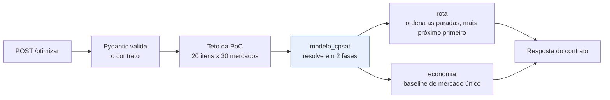

# Serviço de otimização (`modelo/`)

Serviço HTTP **stateless** que resolve a alocação de compras: recebe uma lista de itens
com os candidatos de preço e estoque por mercado, e devolve em qual mercado comprar cada
item, em que ordem visitá-los e quanto se economiza.

É o núcleo acadêmico do TCC. Não acessa banco de dados, não conhece usuário e não tem
estado — o que o torna determinístico e testável isoladamente.

## Documentação

| Documento | Conteúdo |
|---|---|
| [`formulacao-matematica.md`](formulacao-matematica.md) | **o modelo**: conjuntos, variáveis, restrições, função objetivo, desempate e ordem de visita |
| [`guia-cpsat.md`](guia-cpsat.md) | como o CP-SAT é usado na prática e por que ele, e não outro solver |
| [`validacao-e-testes.md`](validacao-e-testes.md) | estratégia de testes e a validação por enumeração exaustiva da Fase 4 |
| [`../../docs/contrato-otimizacao.md`](../../docs/contrato-otimizacao.md) | o contrato HTTP com a API Go, campo a campo |

## Estrutura

```
modelo/
├── app/
│   ├── main.py                     # FastAPI: GET /saude, POST /otimizar
│   ├── configuracao.py             # variáveis de ambiente MODELO_*
│   ├── esquemas.py                 # modelos Pydantic do contrato
│   └── otimizacao/
│       ├── modelo_cpsat.py         # formulação e resolução em duas fases
│       ├── logistica.py            # distância em linha reta
│       ├── rota.py                 # ordem de visita: o mais próximo primeiro
│       └── economia.py             # baseline de mercado único
├── testes/                         # pytest
├── scripts/validacao_exaustiva.py  # validação da Fase 4
└── docs/
```

## Fluxo interno de uma requisição



## Como rodar

```bash
cd modelo
python -m venv .venv
.venv/Scripts/activate                    # Windows; no Linux: source .venv/bin/activate
pip install -r requirements.txt
uvicorn app.main:app --reload --port 8001
```

Documentação interativa da API em <http://localhost:8001/docs>.

Em Docker o serviço sobe junto com o restante do sistema: `docker compose up`.

## Como testar

```bash
.venv/Scripts/python -m pytest testes -q
.venv/Scripts/python -m black --line-length 100 --check .
.venv/Scripts/python -m ruff check .
.venv/Scripts/python scripts/validacao_exaustiva.py --repeticoes 60
```

O script de validação sai com código 1 se o CP-SAT divergir da enumeração exaustiva em
qualquer instância, e serve como portão de qualidade.

## Variáveis de ambiente

| Variável | Padrão | Descrição |
|---|---|---|
| `MODELO_PORTA` | `8001` | porta do serviço |
| `MODELO_LIMITE_TEMPO_SEGUNDOS` | `10` | teto de tempo do solver por fase |
| `MODELO_CUSTO_POR_VISITA_CENTAVOS` | `800` | custo fixo por mercado visitado |
| `MODELO_MAXIMO_ITENS` | `20` | teto de itens da PoC |
| `MODELO_MAXIMO_MERCADOS` | `30` | teto de mercados da PoC (o catálogo tem 28 supermercados) |

Os padrões logísticos podem ser sobrescritos por requisição — a API Go os envia
explicitamente.

## Convenções

- Python 3.10+ (o container usa 3.11); nada de sintaxe exclusiva de versões mais novas.
- Identificadores, docstrings e comentários em **português brasileiro**.
- `black` com linha de 100 e `ruff` limpos; toda função pública com type hints e docstring
  explicando as variáveis do modelo, como exige a seção 6 do `CLAUDE.md`.
- Dinheiro sempre em **centavos inteiros**; nunca `float` em valor monetário.
