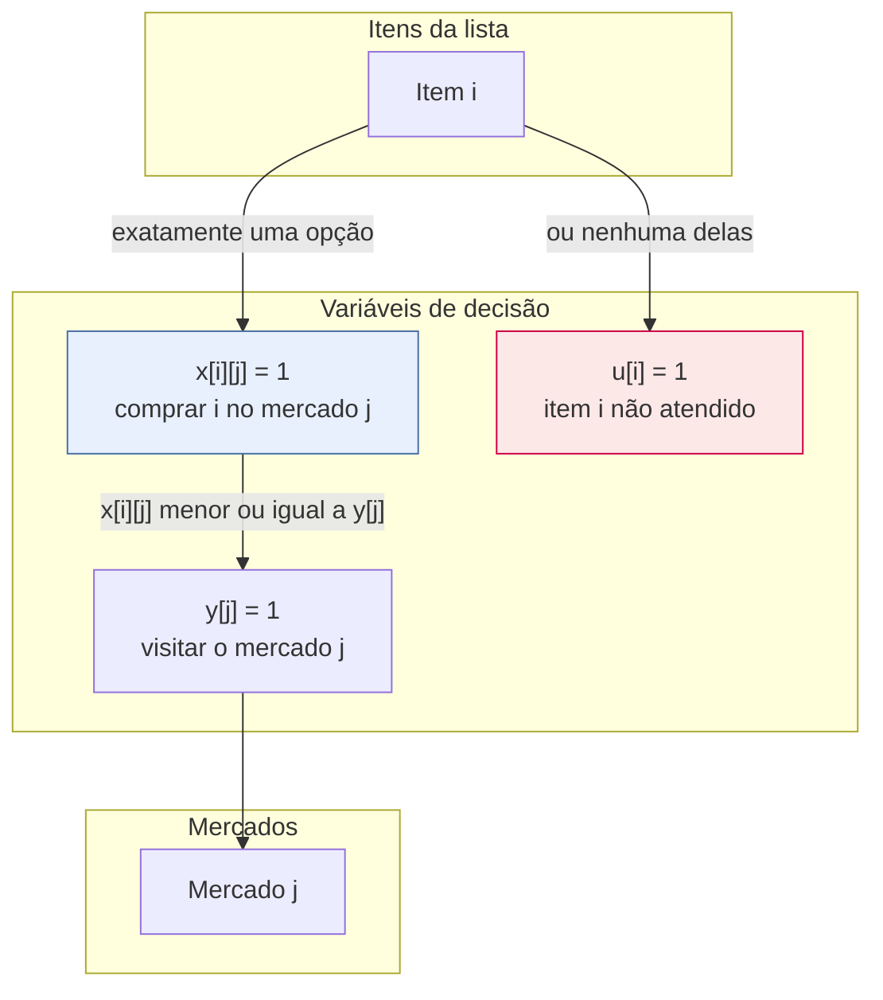
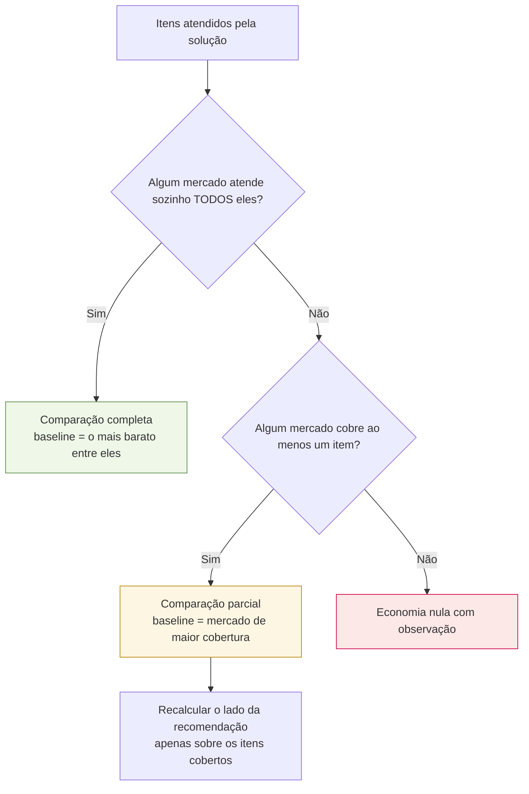

# Formulação matemática

Este é o documento central do trabalho: descreve o modelo de Programação Inteira que
decide **onde comprar cada item**. Ele é a fonte do capítulo de metodologia do TCC e
espelha exatamente o código de [`app/otimizacao/modelo_cpsat.py`](../app/otimizacao/modelo_cpsat.py).

## 1. O problema

Dada uma lista de compras e um conjunto de supermercados de Juazeiro do Norte/CE, cada um
com seus preços e estoques, decidir em qual mercado comprar cada item, minimizando
simultaneamente:

- o **custo financeiro** — a soma do que se paga pelos itens;
- o **custo logístico** — o incômodo de visitar vários mercados espalhados pela cidade.

Os dois objetivos são conflitantes: o menor preço quase sempre exige visitar mais lojas.
É esse conflito que o modelo resolve de forma explícita e auditável.

## 2. Conjuntos

| Símbolo | Significado |
|---|---|
| $I$ | itens da lista de compras, indexados por $i$ |
| $J$ | mercados considerados, indexados por $j$ |
| $C \subseteq I \times J$ | **pares candidatos**: existe preço cadastrado de $i$ em $j$ **e** o estoque cobre a quantidade pedida |

A restrição de estoque não aparece como desigualdade no modelo: ela é aplicada na
**construção de $C$**. Um par que não atende ao estoque simplesmente não gera variável.
Isso reduz o modelo e torna a restrição impossível de violar por construção.

## 3. Parâmetros

| Símbolo | Descrição | Unidade |
|---|---|---|
| $p_{ij}$ | preço unitário do item $i$ no mercado $j$ | centavos |
| $q_i$ | quantidade pedida do item $i$ | unidade do item |
| $c_{ij}$ | custo total do item $i$ comprado em $j$ | centavos |
| $d_j$ | distância de ida e volta entre a origem e o mercado $j$ | metros |
| $f$ | custo fixo por mercado visitado (padrão R$ 8,00) | centavos |
| $k$ | custo por quilômetro percorrido (padrão R$ 1,20) | centavos |
| $\ell_j$ | custo logístico de visitar o mercado $j$ | centavos |
| $\lambda$ | peso de conveniência (escalarização) | adimensional |
| $M$ | penalidade de não atendimento | centavos |

O custo de um item e o custo logístico de um mercado são:

$$c_{ij} = \left\lfloor p_{ij} \cdot q_i + 0{,}5 \right\rfloor \qquad
\ell_j = f + \left\lfloor \frac{k \cdot d_j}{1000} + 0{,}5 \right\rfloor$$

O arredondamento é sempre **meio para cima**, nunca o `round` embutido do Python, que usa
arredondamento bancário — sob ele o custo de um item dependeria da paridade do resultado,
e a reprodutibilidade exigida pela Fase 4 se perderia.

## 4. Variáveis de decisão

$$
x_{ij} \in \{0,1\} \quad \forall (i,j) \in C \qquad
y_j \in \{0,1\} \quad \forall j \in J \qquad
u_i \in \{0,1\} \quad \forall i \in I
$$

| Variável | No código | Significado |
|---|---|---|
| $x_{ij}$ | `comprar[i][j]` | o item $i$ é comprado no mercado $j$ |
| $y_j$ | `visitar[j]` | o mercado $j$ entra no roteiro |
| $u_i$ | `nao_atendido[i]` | o item $i$ fica sem alocação |

A variável $u_i$ é o que impede o modelo de ser inviável. Sem ela, uma lista com um item
que nenhum mercado tem tornaria o problema insatisfazível, e o usuário receberia um erro
em vez de uma recomendação para os demais itens.

## 5. Restrições

**Atribuição exata** — todo item tem um destino explícito, e a quantidade de um item nunca
é dividida entre mercados:

$$\sum_{j : (i,j) \in C} x_{ij} + u_i = 1 \qquad \forall i \in I$$

**Acoplamento compra–visita** — só se compra onde se visita:

$$x_{ij} \le y_j \qquad \forall (i,j) \in C$$

Essas duas famílias são a formulação inteira completa. Não há restrição de capacidade nem
de orçamento: a PoC assume que o usuário compra o que a lista pede.

## 6. Função objetivo

Escalarização por soma ponderada dos dois objetivos:

$$
\min \underbrace{\sum_{(i,j) \in C} c_{ij}\, x_{ij}}_{\text{custo financeiro}}
\; + \; \lambda \underbrace{\sum_{j \in J} \ell_j\, y_j}_{\text{custo logístico}}
\; + \; M \sum_{i \in I} u_i
$$

### 6.1 Aritmética inteira

O CP-SAT é um solver **estritamente inteiro**, e $\lambda$ é fracionário. A solução é
escalar tudo por $E = 100$ e usar $\Lambda = \lfloor \lambda E + 0{,}5 \rfloor$:

$$
Z = E \sum_{(i,j) \in C} c_{ij}\, x_{ij} + \Lambda \sum_{j \in J} \ell_j\, y_j + E\,M \sum_{i \in I} u_i
$$

O objetivo é minimizado em centésimos de centavo. Nada é convertido para ponto flutuante
em nenhum ponto da resolução — as conversões acontecem só na montagem da resposta.

### 6.2 A penalidade não é um "número grande mágico"

$M$ é calculado a partir da própria instância:

$$M = \sum_{(i,j) \in C} c_{ij} \; + \; \left\lceil \frac{\Lambda \sum_{j \in J} \ell_j}{E} \right\rceil \; + \; 1$$

O raciocínio: abandonar um item pode, no melhor caso concebível, poupar o custo de todos
os pares candidatos da instância somado a toda a parcela logística possível. Somando 1 a
esse teto, **qualquer** solução que deixe de atender um item atendível fica estritamente
pior que a alternativa que o atende. A penalidade nunca distorce a comparação entre
soluções viáveis, e isso é demonstrável em vez de empírico — um `BIG_M = 999999` arbitrário
não teria essa garantia.

### 6.3 O peso e os três perfis

| Perfil | $\lambda$ | Efeito |
|---|---|---|
| `economico` | 0,0 | o termo logístico desaparece; o modelo caça o menor preço, aceitando visitar todos os mercados |
| `equilibrado` | 1,0 | cada mercado extra precisa se pagar: uma visita custa R$ 8,00 mais R$ 1,20 por km de ida e volta |
| `conveniente` | 3,0 | o incômodo vale o triplo; a compra se concentra em poucas lojas |

A API aceita qualquer $\lambda \ge 0$, o que permite varrer a fronteira de Pareto nos
experimentos da Fase 4 sem alterar o código.

## 7. Linearização da distância

O custo logístico usa a distância de **ida e volta entre a origem e cada mercado**:

$$d_j = 2 \cdot \operatorname{haversine}(\text{origem}, j)$$

Essa é uma decisão de modelagem deliberada e precisa constar no texto do TCC.

| | Distância linearizada | Rota real |
|---|---|---|
| Fórmula | $\sum_j 2\,d(\text{origem}, j)\, y_j$ | origem → mercados na ordem → origem |
| Depende da ordem de visita? | não | sim |
| Onde é usada | **dentro** da função objetivo | apenas **exibida** ao usuário |

**Por que linearizar.** A distância real de um roteiro depende da ordem de visita, que por
sua vez depende de quais mercados foram escolhidos. Modelar isso dentro do MILP
transformaria o problema em um Caixeiro Viajante com seleção de nós — outro problema,
fora do escopo da PoC (e explicitamente adiado no `plano_desenvolvimento.md`).

**Por que é aceitável.** A ida e volta independente é uma **cota superior** da rota real:
visitar $n$ mercados em circuito nunca custa mais do que fazer $n$ viagens separadas de
casa. O modelo, portanto, é conservador — ele nunca subestima o incômodo de espalhar a
compra. No raio de ~7 km do recorte de Juazeiro do Norte, a diferença entre as duas
medidas é pequena o bastante para não inverter decisões.

**O que se perde.** O modelo não captura que dois mercados vizinhos podem ser visitados
quase de graça na mesma viagem. Essa é a limitação a declarar na defesa, e a porta natural
para o trabalho futuro com o módulo de Routing do OR-Tools.

## 8. Desempate determinístico em duas fases

Com $\lambda = 0$ o termo logístico some do objetivo, e passam a existir **várias soluções
de custo idêntico** — por exemplo, comprar um item de preço igual no mercado A ou no B.
Qual delas o solver devolve seria arbitrário, e a validação por enumeração exaustiva da
Fase 4 acusaria falsas divergências.

A resolução tem duas fases:

O critério de desempate é lexicográfico — primeiro **menos mercados**, depois **menos
distância** — e é codificado em um único escalar inteiro:

$$D = (\textstyle\sum_j d_j + 1) \sum_{j} y_j \; + \; \sum_{j} d_j\, y_j$$

Como a segunda parcela é sempre menor que o fator multiplicativo $\sum_j d_j + 1$, o
primeiro critério domina o segundo sem qualquer ambiguidade. Isso evita duas chamadas
sucessivas ao solver para os dois critérios.

O valor reportado em `valor_objetivo_centavos` é sempre o $Z^*$ da primeira fase: a
segunda apenas escolhe, **entre as soluções já ótimas**, a mais conveniente.

## 9. Etapas fora do modelo inteiro

Duas coisas são calculadas **depois** do solve, e é importante para a defesa que a
fronteira esteja clara:

| Etapa | Onde | Método |
|---|---|---|
| Ordenação da rota | [`rota.py`](../app/otimizacao/rota.py) | enumeração exata de permutações até 8 paradas (teto da PoC); vizinho mais próximo com refinamento 2-opt acima disso |
| Baseline de economia | [`economia.py`](../app/otimizacao/economia.py) | comparação com o melhor mercado único, em dois níveis |

Nenhuma das duas influencia a decisão de **onde comprar**: elas apresentam e contextualizam
uma decisão já tomada.

## 10. Baseline de economia

A economia responde a "quanto eu ganho em relação a comprar tudo num mercado só?". Para a
comparação ser honesta, o baseline tem dois níveis:

Na comparação parcial, o lado da recomendação é **recalculado sobre o mesmo subconjunto**
de itens que o mercado baseline cobre. Sem isso, compararíamos uma cesta cheia com uma
cesta menor e a economia seria superestimada — exatamente o tipo de número que não
sobrevive a uma banca.

Os dois lados incluem a parcela logística: um mercado único também custa uma visita e um
deslocamento. A régua é a mesma nos dois lados.

## 11. Complexidade e escala

O modelo tem $|C| + |J| + |I|$ variáveis binárias e $|I| + |C|$ restrições. No teto da
PoC (20 itens × 8 mercados) isso são no máximo 188 variáveis — uma instância que o CP-SAT
resolve na casa dos milissegundos, como registram os tempos em
[`validacao-e-testes.md`](validacao-e-testes.md).

O problema é NP-difícil no caso geral (generaliza o *Uncapacitated Facility Location*),
mas a PoC opera muito abaixo do ponto em que isso importa. **A contribuição do TCC está na
formulação e na escolha dos pesos, não no algoritmo de busca** — daí a exigência do
`CLAUDE.md` de usar CP-SAT e nunca escrever um branch-and-bound manual.

## 12. Rastreamento entre a notação e o código

| Notação | Código | Arquivo |
|---|---|---|
| $x_{ij}$ | `comprar[(indice_item, mercado_id)]` | `modelo_cpsat.py` |
| $y_j$ | `visitar[mercado_id]` | `modelo_cpsat.py` |
| $u_i$ | `nao_atendido[indice_item]` | `modelo_cpsat.py` |
| $c_{ij}$ | `_ParCandidato.custo_centavos` | `modelo_cpsat.py` |
| $\ell_j$ | `_Instancia.custo_logistico_centavos` | `modelo_cpsat.py` |
| $\Lambda$ | `_Instancia.peso_escalado` | `modelo_cpsat.py` |
| $M$ | `_calcular_penalidade` | `modelo_cpsat.py` |
| $d_j$ | `distancia_ida_volta_metros` | `logistica.py` |
| $D$ | `desempate_lexicografico` | `modelo_cpsat.py` |

> Ao alterar qualquer coisa deste documento, atualize também a **seção 5 do `CLAUDE.md`** e
> o capítulo de metodologia do TCC. É uma regra do próprio `CLAUDE.md` (seção 6).
