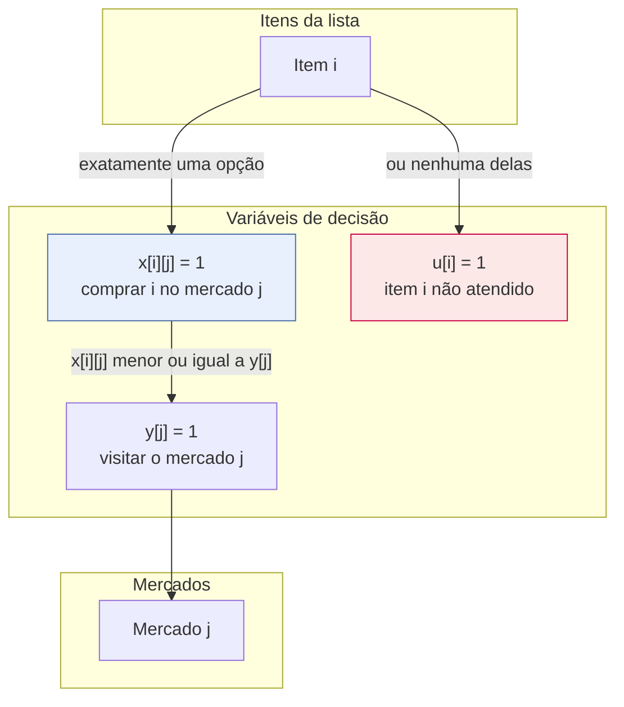
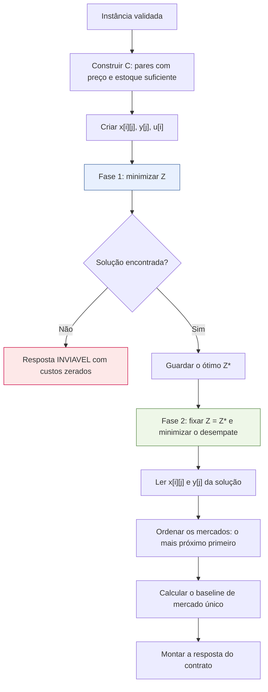
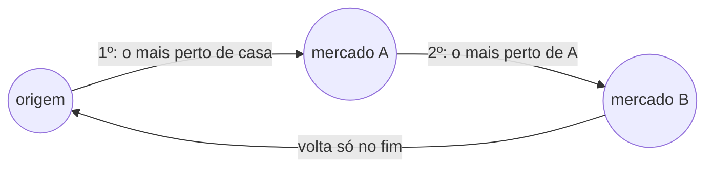
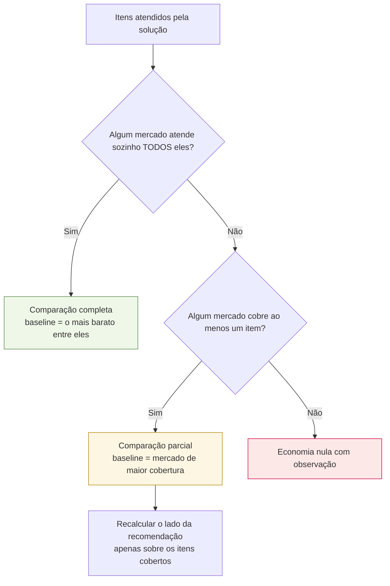

# Formulação matemática

Este é o documento central do trabalho. Ele descreve o modelo de Programação Inteira que
decide **onde comprar cada item**, é a fonte do capítulo de metodologia do TCC e espelha
exatamente o código de [`app/otimizacao/modelo_cpsat.py`](../app/otimizacao/modelo_cpsat.py).

## 1. O problema

Dada uma lista de compras da cesta básica e um conjunto de mercados, cada um com seus
preços e sua disponibilidade, decidir em qual mercado comprar cada item, minimizando ao
mesmo tempo:

- o **custo financeiro**, que é a soma do que se paga pelos itens;
- o **custo de conveniência**, que é o incômodo de parar em vários mercados, medido pelo
  **número de mercados visitados**.

Os dois objetivos são conflitantes: o menor preço quase sempre exige visitar mais
mercados. É esse conflito que o modelo resolve de forma explícita e auditável.

**O SAD decide por preço e disponibilidade.** A distância percorrida **não é
precificada** e não entra na função objetivo. Ela aparece em três lugares, sempre fora do
custo:

- no recorte por raio, que define quais mercados entram na instância;
- no desempate entre soluções de custo idêntico (seção 8);
- na ordem de visita, montada depois do solve (seção 9), e no total de quilômetros exibido
  ao usuário.

**O escopo e os dados.** O recorte é **Juazeiro do Norte/CE**. Os preços vêm da Pesquisa
Nacional da Cesta Básica de Alimentos do DIEESE, que publica um preço médio por cidade: cada
nome de cidade vira um **supermercado fictício em Juazeiro** que pratica os preços daquela
cidade. Os itens se restringem aos 13 da cesta, e cada um tem duas marcas fictícias. A conversão está
documentada em [`docs/dados-e-coleta.md`](../../docs/dados-e-coleta.md).

## 2. Conjuntos

| Símbolo | Significado |
|---|---|
| $I$ | itens da lista de compras, indexados por $i$ |
| $J$ | mercados considerados, indexados por $j$ |
| $C \subseteq I \times J$ | **pares candidatos**: existe preço cadastrado de $i$ em $j$ **e** o estoque cobre a quantidade pedida |

A restrição de disponibilidade não aparece como desigualdade no modelo: ela é aplicada na
**construção de $C$**. Um par sem preço, ou sem estoque suficiente, simplesmente não gera
variável. Isso reduz o modelo e torna a restrição impossível de violar por construção. Na
base do DIEESE, a indisponibilidade real é a célula `-`: a Batata, por exemplo, não é
pesquisada no Norte e no Nordeste.

## 3. Parâmetros

| Símbolo | Descrição | Unidade |
|---|---|---|
| $p_{ij}$ | preço unitário do item $i$ no mercado $j$ | centavos |
| $q_i$ | quantidade pedida do item $i$ | unidade do item |
| $c_{ij}$ | custo total do item $i$ comprado em $j$ | centavos |
| $f$ | custo fixo por mercado visitado (padrão R\$ 8,00) | centavos |
| $\lambda$ | peso de conveniência (escalarização) | adimensional |
| $M$ | penalidade de não atendimento | centavos |
| $\delta_j$ | distância em linha reta entre a origem e o mercado $j$ (**só** no desempate) | metros |

O custo de um item é:

$$c_{ij} = \left\lfloor p_{ij} \cdot q_i + 0{,}5 \right\rfloor$$

O arredondamento é sempre **meio para cima**, nunca o `round` embutido do Python, que usa
arredondamento bancário. Sob ele, o custo de um item dependeria da paridade do resultado, e
a reprodutibilidade exigida pela Fase 4 se perderia.

A distância é a **linha reta num plano local**. As diferenças de latitude e longitude viram
metros (a de longitude encolhida pelo cosseno da latitude média), e a distância é a
hipotenusa:

$$\delta = R\sqrt{(\Delta\varphi)^2 + (\Delta\lambda_{\text{lon}} \cos\bar\varphi)^2}$$

com $R$ = 6.371.008,8 m e os ângulos em radianos. É a forma mais simples de distância que
ainda fala em metros.

## 4. Variáveis de decisão

$$
x_{ij} \in \{0,1\} \quad \forall (i,j) \in C \qquad
y_j \in \{0,1\} \quad \forall j \in J \qquad
u_i \in \{0,1\} \quad \forall i \in I
$$

| Variável | No código | Significado |
|---|---|---|
| $x_{ij}$ | `comprar[i][j]` | o item $i$ é comprado no mercado $j$ |
| $y_j$ | `visitar[j]` | o mercado $j$ entra no roteiro |
| $u_i$ | `nao_atendido[i]` | o item $i$ fica sem alocação |

A variável $u_i$ é o que impede o modelo de ser inviável. Sem ela, uma lista com um item que
nenhum mercado tem tornaria o problema insatisfazível, e o usuário receberia um erro em vez
de uma recomendação para os demais itens.

## 5. Restrições

**Atribuição exata**: todo item tem um destino explícito, e a quantidade de um item nunca é
dividida entre mercados.

$$\sum_{j : (i,j) \in C} x_{ij} + u_i = 1 \qquad \forall i \in I$$

**Acoplamento compra–visita**: só se compra onde se visita.

$$x_{ij} \le y_j \qquad \forall (i,j) \in C$$

Essas duas famílias são a formulação inteira completa. Não há restrição de capacidade nem
de orçamento: a PoC assume que o usuário compra o que a lista pede.

## 6. Função objetivo

Escalarização por soma ponderada dos dois objetivos:

$$
\min \underbrace{\sum_{(i,j) \in C} c_{ij}\, x_{ij}}_{\text{custo financeiro}}
\; + \; \lambda \underbrace{f \sum_{j \in J} y_j}_{\text{custo de conveniência}}
\; + \; M \sum_{i \in I} u_i
$$

O custo de conveniência é só o custo fixo de cada mercado visitado. Um mercado a 5 km e
outro a 1.000 km custam o mesmo $f$: quilômetros não têm preço.

### 6.1 Aritmética inteira

O CP-SAT é um solver **estritamente inteiro**, e $\lambda$ é fracionário. A solução é
escalar tudo por $E = 100$ e usar $\Lambda = \lfloor \lambda E + 0{,}5 \rfloor$:

$$
Z = E \sum_{(i,j) \in C} c_{ij}\, x_{ij}
+ \Lambda f \sum_{j \in J} y_j
+ E\,M \sum_{i \in I} u_i
$$

O objetivo é minimizado em centésimos de centavo. Nada é convertido para ponto flutuante
durante a resolução; as conversões acontecem só na montagem da resposta.

### 6.2 A penalidade não é um "número grande mágico"

$$M = \sum_{(i,j) \in C} c_{ij} \; + \; \left\lceil \frac{\Lambda\, f\, |J|}{E} \right\rceil \; + \; 1$$

O raciocínio: abandonar um item pode, no melhor caso concebível, poupar o custo de todos os
pares candidatos da instância somado ao custo ponderado de visitar todos os mercados.
Somando 1 a esse teto, **qualquer** solução que deixe de atender um item atendível fica
estritamente pior que a alternativa que o atende. A penalidade nunca distorce a comparação
entre soluções viáveis, e isso é demonstrável em vez de empírico. Um `BIG_M = 999999`
arbitrário não teria essa garantia.

### 6.3 O peso e os três perfis

| Perfil | $\lambda$ | Efeito |
|---|---|---|
| `economico` | 0,0 | o termo de conveniência desaparece; o modelo caça o menor preço, aceitando visitar quantos mercados for preciso |
| `equilibrado` | 1,0 | cada mercado extra precisa se pagar: só entra se economizar mais que R\$ 8,00 |
| `conveniente` | 3,0 | cada parada vale o triplo (R\$ 24,00); a compra se concentra em poucos mercados |

A API aceita qualquer $\lambda \ge 0$, o que permite varrer a fronteira de Pareto nos
experimentos da Fase 4 sem alterar o código.

## 7. Evolução do tratamento da distância (histórico)

**Esta seção registra decisões de modelagem anteriores.** O tratamento do deslocamento
passou por três versões:

| Versão | Custo logístico no objetivo | Ordem de visita |
|---|---|---|
| 1. Ida e volta linearizada | $f\,y_j + k \cdot 2\delta_j\, y_j$ por mercado | TSP resolvido depois do solve |
| 2. Circuito no CP-SAT | $f\,y_j$ + custo por km dos arcos de um `AddCircuit` | decidida dentro do solve |
| 3. **Atual** | só $f\,y_j$; distância fora do objetivo | vizinho mais próximo, depois do solve |

**Da versão 1 para a 2.** A ida e volta independente cobrava como se o usuário voltasse
para casa entre um mercado e outro. Na base de semente então usada (6 mercados fictícios em
Juazeiro do Norte), isso superestimava o custo logístico do perfil econômico em 62%. O
modelo passou a decidir o circuito real com a restrição nativa `AddCircuit`.

**Da versão 2 para a 3.** O autor decidiu simplificar a PoC: o SAD passa a decidir **por
preço e disponibilidade**, e precificar a distância percorrida saiu do escopo. Três
consequências:

- as variáveis de arco, a restrição `AddCircuit` e o parâmetro de custo por km saíram do
  modelo;
- a conveniência passou a ser medida só pelo número de mercados;
- o modelo encolheu de $|C| + |J| + |I| + |J|(|J|+1)$ para $|C| + |J| + |I|$ variáveis.

A lição da versão 1 continua valendo na apresentação: a rota exibida é **um único
percurso**, e não uma ida e volta por mercado (seção 9).

## 8. Desempate determinístico em duas fases

Com $\lambda = 0$ o termo de conveniência some do objetivo, e passam a existir **várias
soluções de custo idêntico**, como comprar um item de preço igual no mercado A ou no B. Qual
delas o solver devolve seria arbitrário, e a validação por enumeração exaustiva da Fase 4
acusaria falsas divergências.

A resolução tem duas fases:

O critério de desempate é lexicográfico: primeiro **menos mercados**, depois **mercados
mais próximos da origem**. Ele é codificado em um único escalar inteiro:

$$D = \Big(\textstyle\sum_{j \in J} \delta_j + 1\Big) \sum_{j} y_j \; + \; \sum_{j} \delta_j\, y_j$$

A segunda parcela nunca alcança o fator multiplicativo, então o primeiro critério domina o
segundo sem ambiguidade. Isso evita duas chamadas sucessivas ao solver para os dois
critérios.

A distância entra aqui **só como desempate**. Ela nunca muda o valor ótimo: a fase 2 apenas
escolhe, **entre as soluções já ótimas**, a que fica mais perto de casa. O valor reportado
em `valor_objetivo_centavos` é sempre o $Z^*$ da primeira fase.

## 9. Ordem de visita: o mais próximo primeiro

O modelo decide **quais** mercados visitar. A ordem de visita é montada depois do solve, em
[`rota.py`](../app/otimizacao/rota.py), pela regra do **vizinho mais próximo**:

1. o usuário sai da origem **uma única vez**;
2. a próxima parada é sempre o mercado ainda não visitado mais próximo **do ponto onde o
   usuário está**, e não da origem;
3. depois do último mercado, ele volta para a origem.

É o critério que as pessoas usam na prática ao fazer a feira. Por isso é o que a
recomendação reproduz. Não é um Caixeiro-Viajante: como a distância não é precificada, não
há por que otimizar o percurso, só apresentá-lo numa ordem natural. Empates de distância são
resolvidos pelo menor `mercado_id`, para que a saída seja determinística.

`distancia_total_km` é o comprimento desse percurso fechado (origem → paradas → origem), e
`distancia_do_anterior_km` é o trecho de cada parada. Os dois são informativos.

| Etapa fora do modelo inteiro | Onde | Método |
|---|---|---|
| Ordem de visita | [`rota.py`](../app/otimizacao/rota.py) | vizinho mais próximo a partir da origem |
| Baseline de economia | [`economia.py`](../app/otimizacao/economia.py) | comparação com o melhor mercado único, em dois níveis |

Nenhuma das duas influencia a decisão de **onde comprar**: elas apresentam e contextualizam
uma decisão já tomada.

## 10. Baseline de economia

A economia responde a "quanto eu ganho em relação a comprar tudo num mercado só?". Para a
comparação ser honesta, o baseline tem dois níveis:

Na comparação parcial, o lado da recomendação é **recalculado sobre o mesmo subconjunto**
de itens que o mercado baseline cobre. Sem isso, compararíamos uma cesta cheia com uma
cesta menor e a economia seria superestimada, exatamente o tipo de número que não sobrevive
a uma banca.

A comparação é **só do que se paga no caixa**: a soma de $c_{ij}$ de cada lado. O custo
das paradas ($f$) serve ao modelo para pesar conveniência, mas ninguém o paga no mercado,
então fica de fora. Na comparação completa, a economia nunca é negativa. A recomendação
satisfaz $\sum c + \lambda f n \le \sum c^{\text{único}} + \lambda f$ com $n \ge 1$, logo
$\sum c \le \sum c^{\text{único}}$.

O esforço é mostrado à parte, em quilômetros: a resposta traz a ida e volta até o mercado
único ($2\delta_j$), para comparar com o percurso do roteiro. A distância continua sem
preço, e é o usuário quem julga se a economia compensa os quilômetros a mais.

## 11. Complexidade e escala

O modelo tem $|C| + |J| + |I|$ variáveis binárias e $|I| + |C|$ restrições lineares. No
teto da PoC (20 itens × 30 mercados) isso dá no máximo $600 + 30 + 20 = 650$ variáveis. O
catálogo real (13 itens × 28 supermercados) fica bem abaixo disso, e o CP-SAT resolve essa
instância na casa dos milissegundos, como registram os tempos em
[`validacao-e-testes.md`](validacao-e-testes.md).

O problema de alocação é NP-difícil no caso geral, porque generaliza o *Uncapacitated
Facility Location*. A PoC, porém, opera muito abaixo do ponto em que isso importa. **A
contribuição do TCC está na formulação e na escolha dos pesos, não no algoritmo de busca.**
Daí a exigência do `CLAUDE.md` de usar CP-SAT e nunca escrever um branch-and-bound manual.

## 12. Rastreamento entre a notação e o código

| Notação | Código | Arquivo |
|---|---|---|
| $x_{ij}$ | `comprar[(indice_item, mercado_id)]` | `modelo_cpsat.py` |
| $y_j$ | `visitar[mercado_id]` | `modelo_cpsat.py` |
| $u_i$ | `nao_atendido[indice_item]` | `modelo_cpsat.py` |
| $c_{ij}$ | `_ParCandidato.custo_centavos` | `modelo_cpsat.py` |
| $f$ | `custo_por_visita_centavos` | `esquemas.py` / `configuracao.py` |
| $\delta_j$ | `_Instancia.metros_da_origem` | `modelo_cpsat.py` (via `distancia_em_linha_reta_metros`, `logistica.py`) |
| $\Lambda$ | `_Instancia.peso_escalado` | `modelo_cpsat.py` |
| $M$ | `_calcular_penalidade` | `modelo_cpsat.py` |
| $D$ | `desempate_lexicografico` | `modelo_cpsat.py` |
| ordem de visita | `ordenar_pelo_mais_proximo` | `rota.py` |

> Ao alterar qualquer coisa deste documento, atualize também a **seção 5 do `CLAUDE.md`** e
> o capítulo de metodologia do TCC. É uma regra do próprio `CLAUDE.md` (seção 6).
