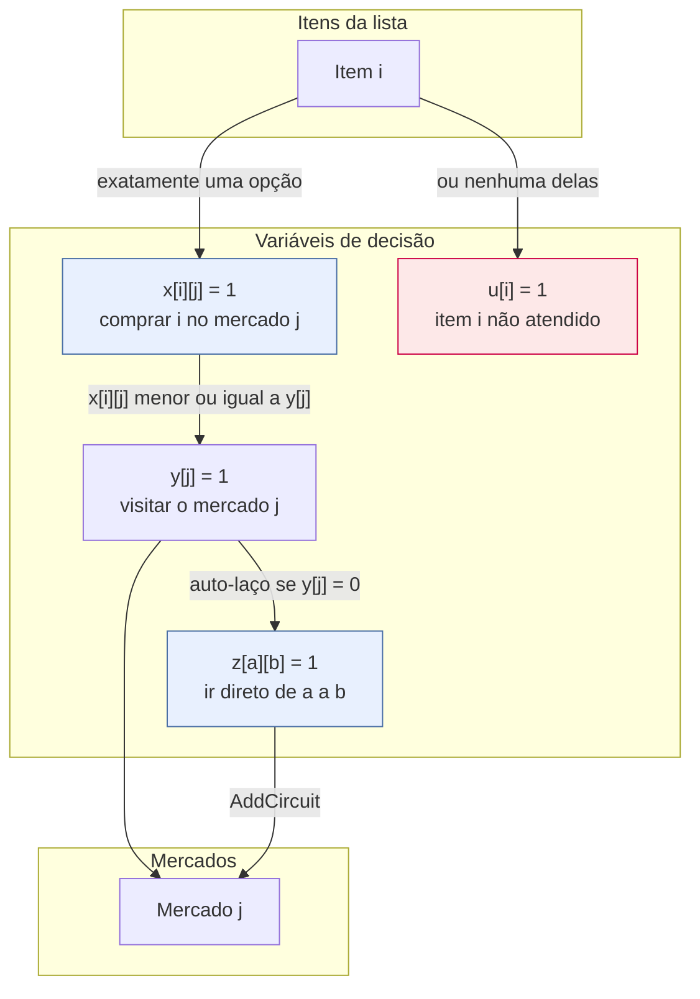
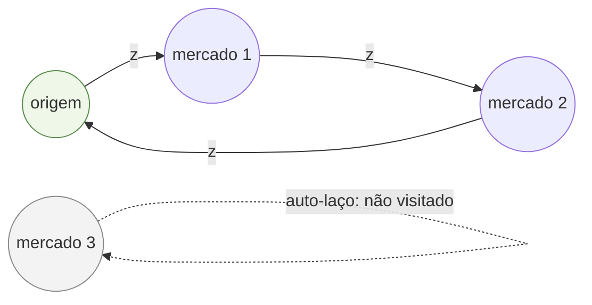
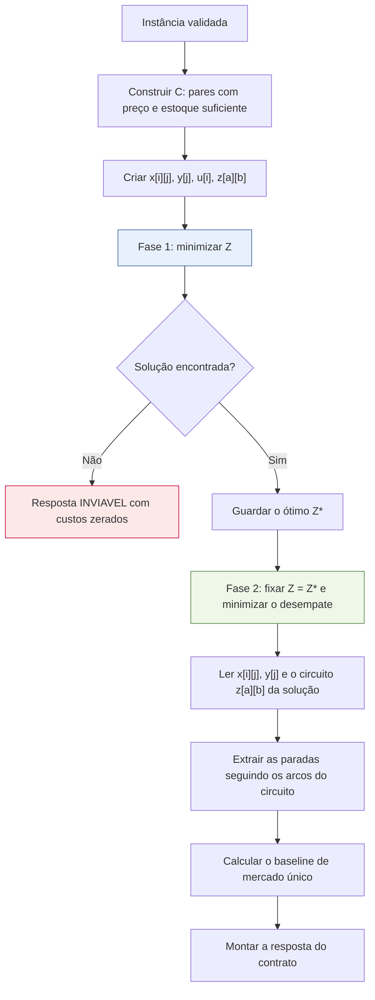
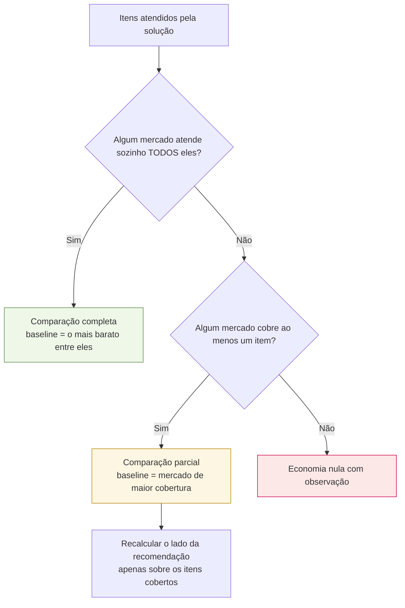

# Formulação matemática

Este é o documento central do trabalho: descreve o modelo de Programação Inteira que
decide **onde comprar cada item**. Ele é a fonte do capítulo de metodologia do TCC e
espelha exatamente o código de [`app/otimizacao/modelo_cpsat.py`](../app/otimizacao/modelo_cpsat.py).

## 1. O problema

Dada uma lista de compras e um conjunto de supermercados de Juazeiro do Norte/CE, cada um
com seus preços e estoques, decidir em qual mercado comprar cada item, minimizando
simultaneamente:

- o **custo financeiro** — a soma do que se paga pelos itens;
- o **custo logístico** — o incômodo de visitar vários mercados espalhados pela cidade.

Os dois objetivos são conflitantes: o menor preço quase sempre exige visitar mais lojas.
É esse conflito que o modelo resolve de forma explícita e auditável.

## 2. Conjuntos

| Símbolo | Significado |
|---|---|
| $I$ | itens da lista de compras, indexados por $i$ |
| $J$ | mercados considerados, indexados por $j$ |
| $N = \{0\} \cup J$ | nós do circuito de rota: $0$ é a origem, os demais são os mercados |
| $C \subseteq I \times J$ | **pares candidatos**: existe preço cadastrado de $i$ em $j$ **e** o estoque cobre a quantidade pedida |

A restrição de estoque não aparece como desigualdade no modelo: ela é aplicada na
**construção de $C$**. Um par que não atende ao estoque simplesmente não gera variável.
Isso reduz o modelo e torna a restrição impossível de violar por construção.

## 3. Parâmetros

| Símbolo | Descrição | Unidade |
|---|---|---|
| $p_{ij}$ | preço unitário do item $i$ no mercado $j$ | centavos |
| $q_i$ | quantidade pedida do item $i$ | unidade do item |
| $c_{ij}$ | custo total do item $i$ comprado em $j$ | centavos |
| $\delta_{ab}$ | distância haversine entre os nós $a, b \in N$ | metros |
| $d_j$ | $2 \cdot \delta_{0j}$, distância de ida e volta entre a origem e o mercado $j$ | metros |
| $f$ | custo fixo por mercado visitado (padrão R$ 8,00) | centavos |
| $k$ | custo por quilômetro percorrido (padrão R$ 1,20) | centavos |
| $g_{ab}$ | custo logístico do arco $(a,b)$, $\lfloor k \cdot \delta_{ab} / 1000 + 0{,}5 \rfloor$ | centavos |
| $\ell_j$ | custo logístico de visitar **só** o mercado $j$, isoladamente (visita + $d_j$) | centavos |
| $\lambda$ | peso de conveniência (escalarização) | adimensional |
| $M$ | penalidade de não atendimento | centavos |

$d_j$ e $\ell_j$ não entram mais na função objetivo (seção 7): são cotas superiores da rota
real, usadas só para dimensionar $M$ e o desempate, e o custo exato do baseline de mercado
único (seção 10), que é sempre uma visita isolada. Quem entra no objetivo é $g_{ab}$, o
custo de cada arco do circuito.

O custo de um item e o custo logístico de um mercado visitado isoladamente são:

$$c_{ij} = \left\lfloor p_{ij} \cdot q_i + 0{,}5 \right\rfloor \qquad
\ell_j = f + \left\lfloor \frac{k \cdot d_j}{1000} + 0{,}5 \right\rfloor$$

O arredondamento é sempre **meio para cima**, nunca o `round` embutido do Python, que usa
arredondamento bancário — sob ele o custo de um item dependeria da paridade do resultado,
e a reprodutibilidade exigida pela Fase 4 se perderia.

## 4. Variáveis de decisão

$$
x_{ij} \in \{0,1\} \quad \forall (i,j) \in C \qquad
y_j \in \{0,1\} \quad \forall j \in J \qquad
u_i \in \{0,1\} \quad \forall i \in I \qquad
z_{ab} \in \{0,1\} \quad \forall a, b \in N, a \ne b
$$

| Variável | No código | Significado |
|---|---|---|
| $x_{ij}$ | `comprar[i][j]` | o item $i$ é comprado no mercado $j$ |
| $y_j$ | `visitar[j]` | o mercado $j$ entra no roteiro |
| $u_i$ | `nao_atendido[i]` | o item $i$ fica sem alocação |
| $z_{ab}$ | `arco[a][b]` | a rota vai direto do nó $a$ ao nó $b$ |

A variável $u_i$ é o que impede o modelo de ser inviável. Sem ela, uma lista com um item
que nenhum mercado tem tornaria o problema insatisfazível, e o usuário receberia um erro
em vez de uma recomendação para os demais itens.

As variáveis $z_{ab}$ não têm auto-laço ($a = b$) na tabela acima porque o auto-laço de
cada nó não é uma variável livre: é o literal `visitar[j].Not()` (ou, para a origem,
"nenhum mercado visitado", ver seção 7) passado direto para `AddCircuit`. Amarrar o
auto-laço a $y_j$ é o que faz $z$ e $y$ concordarem por construção — não é preciso nenhuma
restrição extra ligando as duas.

## 5. Restrições

**Atribuição exata** — todo item tem um destino explícito, e a quantidade de um item nunca
é dividida entre mercados:

$$\sum_{j : (i,j) \in C} x_{ij} + u_i = 1 \qquad \forall i \in I$$

**Acoplamento compra–visita** — só se compra onde se visita:

$$x_{ij} \le y_j \qquad \forall (i,j) \in C$$

**Circuito de rota** — os nós de $N$ formam uma única rota fechada, com os mercados fora
dela ($y_j = 0$) e a origem (quando nenhum mercado é visitado) marcados por auto-laço:

$$\texttt{AddCircuit}\big(\{(a,b,z_{ab}) : a \ne b\} \,\cup\, \{(j,j,\lnot y_j) : j \in J\} \,\cup\, \{(0,0,\lnot w)\}\big)$$

onde $w \in \{0,1\}$ é uma variável auxiliar equivalente a $\sum_j y_j \ge 1$ (seção 7).
`AddCircuit` é uma restrição **nativa** do CP-SAT — não há busca escrita à mão aqui, só a
formulação de quais arcos e auto-laços entram nela.

Essas três famílias são a formulação inteira completa. Não há restrição de capacidade nem
de orçamento: a PoC assume que o usuário compra o que a lista pede.

## 6. Função objetivo

Escalarização por soma ponderada dos dois objetivos:

$$
\min \underbrace{\sum_{(i,j) \in C} c_{ij}\, x_{ij}}_{\text{custo financeiro}}
\; + \; \lambda \underbrace{\Big(f \sum_{j \in J} y_j + \sum_{a \ne b} g_{ab}\, z_{ab}\Big)}_{\text{custo logístico}}
\; + \; M \sum_{i \in I} u_i
$$

O custo logístico é o custo fixo de cada mercado visitado mais o custo dos arcos que o
circuito (seção 7) realmente percorre — não mais uma aproximação por mercado.

### 6.1 Aritmética inteira

O CP-SAT é um solver **estritamente inteiro**, e $\lambda$ é fracionário. A solução é
escalar tudo por $E = 100$ e usar $\Lambda = \lfloor \lambda E + 0{,}5 \rfloor$:

$$
Z = E \sum_{(i,j) \in C} c_{ij}\, x_{ij}
+ \Lambda \Big(f \sum_{j \in J} y_j + \sum_{a \ne b} g_{ab}\, z_{ab}\Big)
+ E\,M \sum_{i \in I} u_i
$$

O objetivo é minimizado em centésimos de centavo. Nada é convertido para ponto flutuante
em nenhum ponto da resolução — as conversões acontecem só na montagem da resposta.

### 6.2 A penalidade não é um "número grande mágico"

$M$ continua calculado a partir de $\ell_j$ — a ida e volta isolada, **não** o custo real do
arco — porque $\ell_j$ é uma cota superior válida do que qualquer mercado custa dentro de
um circuito (seção 7 explica por quê), e é isso que $M$ precisa: um teto, não o valor exato.

$$M = \sum_{(i,j) \in C} c_{ij} \; + \; \left\lceil \frac{\Lambda \sum_{j \in J} \ell_j}{E} \right\rceil \; + \; 1$$

O raciocínio: abandonar um item pode, no melhor caso concebível, poupar o custo de todos
os pares candidatos da instância somado a toda a parcela logística possível — mesmo
superestimando essa parcela com $\ell_j$ em vez do custo real do circuito, **ainda assim**
$M$ é grande o bastante. Somando 1 a esse teto, **qualquer** solução que deixe de atender
um item atendível fica estritamente pior que a alternativa que o atende. A penalidade nunca
distorce a comparação entre soluções viáveis, e isso é demonstrável em vez de empírico — um
`BIG_M = 999999` arbitrário não teria essa garantia.

### 6.3 O peso e os três perfis

| Perfil | $\lambda$ | Efeito |
|---|---|---|
| `economico` | 0,0 | o termo logístico desaparece; o modelo caça o menor preço, aceitando visitar todos os mercados |
| `equilibrado` | 1,0 | cada mercado extra precisa se pagar: uma visita custa R$ 8,00 mais R$ 1,20 por km percorrido do circuito |
| `conveniente` | 3,0 | o incômodo vale o triplo; a compra se concentra em poucas lojas |

A API aceita qualquer $\lambda \ge 0$, o que permite varrer a fronteira de Pareto nos
experimentos da Fase 4 sem alterar o código.

## 7. Seleção conjunta da rota: circuito no CP-SAT

**Esta seção documenta uma correção de modelagem, não a formulação original.** Até uma
versão anterior deste documento, o custo logístico usava a distância de **ida e volta
independente entre a origem e cada mercado**, $d_j = 2 \cdot \delta_{0j}$, somada sobre os
mercados visitados — como se o usuário voltasse à origem entre uma compra e outra. Na vida
real ele vai de um mercado direto ao seguinte. A seção 7.1 quantifica o que essa
aproximação custava; a 7.2 descreve a correção adotada.

### 7.1 O problema da aproximação por ida e volta (histórico)

| | Ida e volta independente | Rota real |
|---|---|---|
| Fórmula | $\sum_j 2\,\delta_{0j}\, y_j$ | origem → mercados na ordem → origem |
| Depende da ordem de visita? | não | sim |
| Onde era usada | **dentro** da função objetivo | apenas **exibida** ao usuário |

A justificativa original era que ida e volta independente é uma **cota superior** da rota
real (desigualdade triangular: um circuito por $n$ mercados nunca custa mais que $n$
viagens separadas de casa), o que tornava o modelo "conservador" — mas conservador demais,
de um jeito que distorcia a própria decisão. Medindo na base de semente de Juazeiro do
Norte, com 18 itens e 6 mercados:

| Perfil | Mercados | Distância linearizada | Rota real | Sobrepreço |
|---|---|---|---|---|
| Equilibrado | 2 | 8,14 km | 7,65 km | +6% |
| Econômico | 6 | 35,58 km | 21,90 km | **+62%** |

Com seis mercados o modelo cobrava por uma viagem que ninguém faria, e cobrava
**sistematicamente mais** as soluções com mais paradas — exatamente o perfil econômico, que
é o que mais se beneficiaria de rotear bem. O modelo escolhia menos mercados do que o ótimo
verdadeiro escolheria, não porque visitar mais lojas fosse de fato pior, mas porque a
aproximação exagerava o custo de fazê-lo.

### 7.2 A correção: `AddCircuit`

O CP-SAT tem uma restrição nativa para exatamente este problema — escolher um subconjunto
de nós e a ordem ótima de visitá-los em um único circuito: `CpModel.AddCircuit`. Cada nó
$a \in N$ recebe um **auto-laço**, um arco $(a,a)$ cujo literal booleano vale 1 quando esse
nó fica **fora** do circuito:

- mercado $j$: auto-laço amarrado a $\lnot y_j$ — a mesma variável que já decide se o
  mercado é visitado, sem nenhuma restrição extra de acoplamento;
- origem: auto-laço amarrado a $\lnot w$, onde $w \Leftrightarrow \sum_j y_j \ge 1$ — a
  origem só sai do circuito quando nenhum mercado é visitado (lista vazia ou totalmente
  inatendível).

Os nós sem auto-laço ativo formam, por construção do `AddCircuit`, **um único** circuito
fechado — não há necessidade de eliminação de subciclos escrita à mão (a restrição de
Miller–Tucker–Zemlin ou qualquer variante), porque é o próprio `AddCircuit` que garante
isso internamente. A distância percorrida é $\sum_{a \ne b} \delta_{ab}\, z_{ab}$, e o custo
logístico do objetivo usa exatamente essa soma, não mais $d_j$.

**Por que não é o branch-and-bound manual que o `CLAUDE.md` proíbe.** `AddCircuit` é
resolvida pelo motor de busca do próprio CP-SAT, junto com todas as outras restrições do
modelo, na mesma resolução que decide $x_{ij}$ e $y_j$ — nenhum código deste projeto
enumera rotas ou implementa uma heurística de busca. A contribuição do TCC continua sendo a
formulação, não o algoritmo.

**Por que $\ell_j$ e $d_j$ continuam no documento.** Eles não somem: viram cotas superiores
usadas para dimensionar $M$ (seção 6.2) e o desempate (seção 8), e são o custo **exato** do
baseline de mercado único (seção 10), que por definição visita um mercado só — caso em que
ida e volta e circuito são a mesma coisa.

**O que a correção mudou na prática.** `custo_logistico_centavos`, devolvido pela API, deixa
de ser a soma de idas e voltas independentes e passa a ser o custo do circuito real — o
mesmo valor usado para decidir a alocação e o mesmo exibido em `distancia_total_km`. Os dois
números que antes podiam divergir (o linearizado, usado na decisão, e o real, só exibido)
agora são o mesmo número, por construção. `docs/contrato-otimizacao.md` documenta o efeito
no contrato HTTP.

## 8. Desempate determinístico em duas fases

Com $\lambda = 0$ o termo logístico some do objetivo, e passam a existir **várias soluções
de custo idêntico** — por exemplo, comprar um item de preço igual no mercado A ou no B.
Qual delas o solver devolve seria arbitrário, e a validação por enumeração exaustiva da
Fase 4 acusaria falsas divergências.

A resolução tem duas fases:

O critério de desempate é lexicográfico — primeiro **menos mercados**, depois **menos
distância real do circuito** — e é codificado em um único escalar inteiro:

$$D = (\textstyle\sum_j d_j + 1) \sum_{j} y_j \; + \; \sum_{a \ne b} \delta_{ab}\, z_{ab}$$

O fator multiplicativo $\sum_j d_j + 1$ usa $d_j$ (a ida e volta independente, cota superior
da seção 7.1), não a distância real — mas o desempate continua correto: a distância real do
circuito nunca excede $\sum_j d_j$ (mesma desigualdade triangular), então a segunda parcela
é sempre menor que o fator multiplicativo, e o primeiro critério domina o segundo sem
ambiguidade. Isso evita duas chamadas sucessivas ao solver para os dois critérios.

O valor reportado em `valor_objetivo_centavos` é sempre o $Z^*$ da primeira fase: a
segunda apenas escolhe, **entre as soluções já ótimas**, a mais conveniente.

## 9. Etapas fora do modelo inteiro

Uma única coisa é calculada **depois** do solve — a ordenação da rota deixou de ser uma
delas, porque agora é o próprio `AddCircuit` (seção 7.2) que decide a ordem de visita
**dentro** do modelo:

| Etapa | Onde | Método |
|---|---|---|
| Baseline de economia | [`economia.py`](../app/otimizacao/economia.py) | comparação com o melhor mercado único, em dois níveis |

A extração das paradas em [`rota.py`](../app/otimizacao/rota.py) não é mais uma etapa fora
do modelo: é leitura direta da solução do circuito, sem nenhuma busca própria (ver seção
7.2). O baseline de economia continua fora do modelo inteiro e não influencia a decisão de
**onde comprar** — ele apresenta e contextualiza uma decisão já tomada.

## 10. Baseline de economia

A economia responde a "quanto eu ganho em relação a comprar tudo num mercado só?". Para a
comparação ser honesta, o baseline tem dois níveis:

Na comparação parcial, o lado da recomendação é **recalculado sobre o mesmo subconjunto**
de itens que o mercado baseline cobre. Sem isso, compararíamos uma cesta cheia com uma
cesta menor e a economia seria superestimada — exatamente o tipo de número que não
sobrevive a uma banca.

Os dois lados incluem a parcela logística: um mercado único também custa uma visita e um
deslocamento. A régua é a mesma nos dois lados. Do lado da recomendação, quando a
comparação cobre exatamente os mercados de toda a recomendação (o caso comum, completo), a
parcela logística é o custo real do circuito — o mesmo `custo_logistico_centavos` da
resposta. Na comparação **parcial**, restrita a um subconjunto de mercados, não há como
repartir o custo de um circuito compartilhado entre paradas; a parcela logística volta a
ser a soma de $\ell_j$ (ida e volta isolada) dos mercados desse subconjunto — uma
aproximação conservadora, que nunca superestima a economia relatada.

## 11. Complexidade e escala

O modelo tem $|C| + |J| + |I| + |N|(|N|-1)$ variáveis binárias — as últimas são os arcos
$z_{ab}$, com $|N| = |J| + 1$ — e $|I| + |C|$ restrições lineares mais uma restrição de
circuito. No teto da PoC (20 itens × 8 mercados, $|N| = 9$) isso são no máximo $188 + 72 =
260$ variáveis — ainda uma instância que o CP-SAT resolve na casa dos milissegundos, como
registram os tempos em [`validacao-e-testes.md`](validacao-e-testes.md).

O problema de alocação é NP-difícil no caso geral (generaliza o *Uncapacitated Facility
Location*) e a seleção de rota embutida generaliza o Caixeiro Viajante — também NP-difícil
—, mas a PoC opera muito abaixo do ponto em que isso importa: $|N| = 9$ é trivial para
`AddCircuit`. **A contribuição do TCC está na formulação e na escolha dos pesos, não no
algoritmo de busca** — daí a exigência do `CLAUDE.md` de usar CP-SAT e nunca escrever um
branch-and-bound manual, e daí também `AddCircuit` em vez de uma heurística de rota escrita
à mão.

## 12. Rastreamento entre a notação e o código

| Notação | Código | Arquivo |
|---|---|---|
| $x_{ij}$ | `comprar[(indice_item, mercado_id)]` | `modelo_cpsat.py` |
| $y_j$ | `visitar[mercado_id]` | `modelo_cpsat.py` |
| $u_i$ | `nao_atendido[indice_item]` | `modelo_cpsat.py` |
| $z_{ab}$ | `arco[(a, b)]` | `modelo_cpsat.py` |
| $w$ | `algum_mercado_visitado` | `modelo_cpsat.py` |
| $c_{ij}$ | `_ParCandidato.custo_centavos` | `modelo_cpsat.py` |
| $\delta_{ab}$ | `_Instancia.matriz_metros` | `modelo_cpsat.py` (via `matriz_de_distancias_metros`, `logistica.py`) |
| $g_{ab}$ | `_Instancia.custo_arco_centavos` | `modelo_cpsat.py` |
| $d_j$, $\ell_j$ | `_Instancia.metros_ida_volta`, `_Instancia.custo_logistico_centavos` | `modelo_cpsat.py` |
| $\Lambda$ | `_Instancia.peso_escalado` | `modelo_cpsat.py` |
| $M$ | `_calcular_penalidade` | `modelo_cpsat.py` |
| $D$ | `desempate_lexicografico` | `modelo_cpsat.py` |
| extração das paradas | `extrair_rota` | `rota.py` |

> Ao alterar qualquer coisa deste documento, atualize também a **seção 5 do `CLAUDE.md`** e
> o capítulo de metodologia do TCC. É uma regra do próprio `CLAUDE.md` (seção 6).
