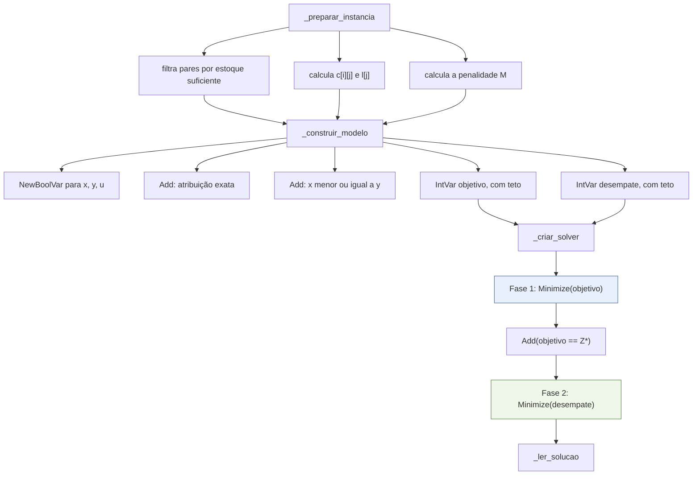

# Guia do CP-SAT

Como o solver é usado na prática, por que ele foi escolhido e como o código se relaciona
com a notação de [`formulacao-matematica.md`](formulacao-matematica.md).

## 1. Por que CP-SAT

O OR-Tools oferece mais de um caminho para resolver um problema inteiro. O `CLAUDE.md`
(seção 5) determina o CP-SAT, e as razões são:

| Alternativa | Por que não |
|---|---|
| `pywraplp` (MIP clássico, CBC/SCIP) | interface mais antiga do OR-Tools, em manutenção reduzida; para modelos puramente binários o CP-SAT costuma ser mais rápido e tem parâmetros de reprodutibilidade melhores |
| Branch-and-bound próprio | proibido pelo `CLAUDE.md`: a contribuição do TCC é a **formulação**, não o algoritmo de busca. Um solver caseiro seria mais lento, mais frágil e indefensável na banca |
| PuLP, Pyomo, python-mip | camadas de modelagem que exigiriam um solver por baixo assim mesmo, e trocar de biblioteca impactaria o texto do TCC (seção 7 do `CLAUDE.md`) |

O CP-SAT também traz de graça duas coisas que o modelo usa: variáveis inteiras com domínio
declarado (usado nos tetos de `objetivo` e `desempate`) e um controle de determinismo
explícito, essencial para os experimentos da Fase 4.

## 2. A limitação que molda tudo: só inteiros

O CP-SAT **não aceita coeficientes fracionários**. Duas consequências percorrem todo o
código:

| Grandeza | Como entra no solver | Conversão |
|---|---|---|
| Dinheiro | centavos inteiros | reais × 100, feito pela API Go |
| Distância | metros inteiros | haversine arredondado ao metro |
| Peso $\lambda$ | inteiro escalado por 100 | `peso_escalado = arredondar_meio_para_cima(λ * 100)` |

Todo o objetivo é multiplicado por $E = 100$ para acomodar o peso fracionário sem perder
exatidão. O resultado é minimizado em **centésimos de centavo**, e só a montagem da
resposta volta para centavos.

O arredondamento usa `arredondar_meio_para_cima`, e não o `round` embutido: o `round` do
Python faz arredondamento bancário (`round(0.5) == 0`, `round(1.5) == 2`), o que tornaria o
custo de um item dependente da paridade — inaceitável quando a Fase 4 exige que a mesma
entrada produza sempre a mesma saída.

## 3. Construção do modelo, passo a passo



### Variáveis criadas sob demanda

```python
comprar[(indice_item, mercado_id)] = modelo.NewBoolVar(...)
```

A variável $x_{ij}$ **só existe** se o par for candidato — há preço cadastrado e o estoque
cobre a quantidade pedida. A restrição de estoque, portanto, não é uma desigualdade no
modelo: ela é aplicada na construção do conjunto $C$. Isso reduz o número de variáveis e
torna a restrição impossível de violar.

### Objetivo como variável, não como expressão

```python
objetivo = modelo.NewIntVar(0, teto_objetivo, "objetivo_escalado")
modelo.Add(objetivo == E * termo_itens + peso_escalado * termo_logistico + E * M * termo_penalidade)
```

Declarar o objetivo como uma `IntVar` amarrada por igualdade — em vez de passar a expressão
direto para `Minimize` — é o que permite a segunda fase fixar `objetivo == Z*` com uma
única restrição adicional, sem reconstruir o modelo.

O teto do domínio é calculado a partir da instância (soma de todos os custos possíveis mais
um). Domínios apertados ajudam a propagação do CP-SAT.

## 4. Parâmetros do solver e reprodutibilidade

```python
solver.parameters.max_time_in_seconds = limite_tempo_segundos
solver.parameters.random_seed = 42
solver.parameters.num_search_workers = 1
```

| Parâmetro | Valor | Motivo |
|---|---|---|
| `max_time_in_seconds` | `MODELO_LIMITE_TEMPO_SEGUNDOS` (10) | teto por fase; se estourar, o status vira `VIAVEL` em vez de `OTIMO` |
| `random_seed` | `MODELO_SEMENTE_SOLVER` (42) | mesma busca a cada execução |
| `num_search_workers` | `1` | **o ponto crítico**: o CP-SAT paralelo é não determinístico por construção — a ordem de chegada das subsoluções varia entre execuções, e com empates isso muda a solução devolvida. Uma thread só custa desempenho irrelevante nesta escala e compra determinismo |

Numa PoC de 20 × 8, o solve fica na casa dos milissegundos; o determinismo vale muito mais
do que o paralelismo aqui.

## 5. Tradução do status do solver

| Status do CP-SAT | `status` do contrato | Significado |
|---|---|---|
| `OPTIMAL` | `OTIMO` | ótimo provado |
| `FEASIBLE` | `VIAVEL` | solução encontrada, mas o limite de tempo interrompeu a prova de otimalidade |
| `INFEASIBLE`, `MODEL_INVALID`, `UNKNOWN` | `INVIAVEL` | sem solução; a resposta vem com custos zerados e todos os itens como não atendidos |

`INVIAVEL` não deveria acontecer na prática: a variável $u_i$ garante que sempre exista uma
solução viável (deixar tudo sem atendimento). O caminho existe por robustez, não por
expectativa.

## 6. Leitura da solução

```python
solver.Value(variavel)  # devolve 0 ou 1 para as BoolVar
```

O código lê $x_{ij}$ para montar `compras_por_mercado`, $y_j$ para saber quais mercados
entram na rota e $u_i$ para preencher `itens_nao_atendidos`. O motivo do não atendimento é
reconstruído a partir da instância: se o item não tinha **nenhum** candidato, é
`SEM_CANDIDATO`; se tinha candidatos mas nenhum com estoque suficiente, é
`SEM_CANDIDATO_COM_ESTOQUE`.

## 7. Armadilhas conhecidas

| Armadilha | Consequência | Como o código evita |
|---|---|---|
| Coeficiente fracionário | erro ou truncamento silencioso | tudo escalado para inteiro nas bordas |
| `round` embutido | custo dependente da paridade | `arredondar_meio_para_cima` explícito |
| Busca paralela | resultado diferente a cada execução | `num_search_workers = 1` |
| `BIG_M` arbitrário | penalidade pequena demais distorce a solução; grande demais degrada a propagação | $M$ derivado da instância, com garantia demonstrável |
| Empates com $\lambda = 0$ | solução arbitrária entre ótimos | segunda fase lexicográfica |
| Domínio de `IntVar` frouxo | propagação fraca | tetos calculados da instância |

## 8. Para reproduzir um resultado

O `payload_resultado` gravado na tabela `recomendacoes` guarda a resposta bruta do
otimizador. Com o payload de entrada e a semente fixa, qualquer execução futura do mesmo
código produz exatamente o mesmo resultado — é isso que torna a trilha de auditoria da
Fase 4 verificável, e não apenas registrada.
