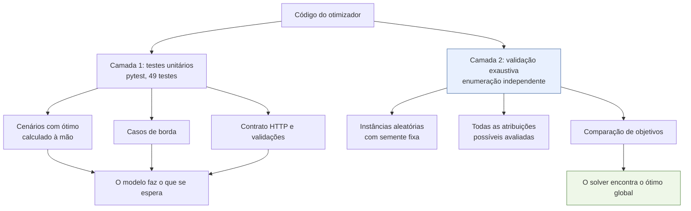
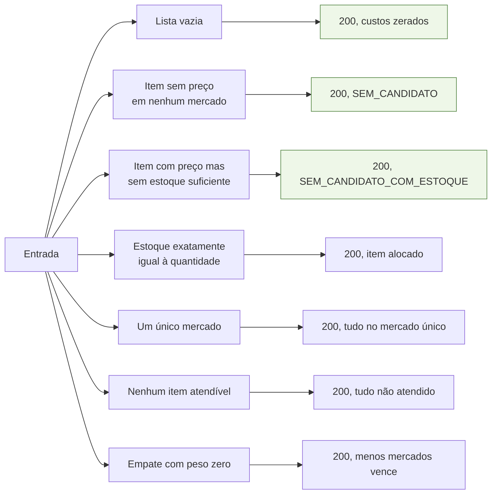
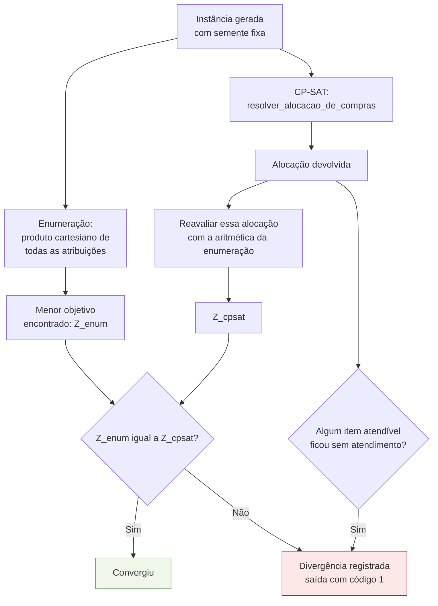

# Validação e testes

Como se demonstra que a recomendação está **certa** — não apenas que o código roda. Este
documento é a base do capítulo de resultados do TCC (Fase 4 do `plano_desenvolvimento.md`).

## 1. Duas camadas de garantia



As duas camadas respondem a perguntas diferentes. Os testes unitários verificam se o
**modelo está formulado como se pretendia**; a validação exaustiva verifica se o **solver
realmente encontra o ótimo** desse modelo. Uma não substitui a outra.

## 2. Camada 1 — testes unitários

```bash
cd modelo
.venv/Scripts/python -m pytest testes -q
```

| Arquivo | O que cobre |
|---|---|
| `test_logistica.py` | haversine contra distâncias geodésicas conhecidas, simetria, ida e volta, e a verificação de que os 6 mercados do recorte estão dentro do raio declarado de Juazeiro do Norte |
| `test_modelo_cpsat.py` | o núcleo: trade-offs com ótimo calculado à mão, efeito do peso, estoque, casos de borda, determinismo, consistência dos custos e o custo logístico real do circuito (não mais ida e volta independente) |
| `test_rota.py` | extração das paradas a partir de um circuito já resolvido |
| `test_economia.py` | os dois níveis do baseline de mercado único |
| `test_api.py` | o contrato na fronteira HTTP: forma da resposta, as 5 regras de validação (422) e o teto da PoC |

### Cenários com ótimo calculado à mão

Os testes centrais não afirmam "o resultado é X". Eles montam um trade-off cujo desfecho é
**calculável antes de rodar o solver**, e o próprio teste refaz a conta:

```python
economia_no_item = 400
assert economia_no_item < custo_logistico_do_mercado(5)   # a premissa do cenário
# ... o modelo deve, portanto, concentrar tudo em um mercado só
```

Se algum dia o custo por visita ou as coordenadas mudarem, a premissa falha explicitamente
em vez de o teste passar por acidente.

### Casos de borda cobertos



**Nenhum caso de borda gera erro.** Essa é a decisão de projeto que a variável
$u_i$ (`nao_atendido`) viabiliza: uma lista com um item impossível ainda produz uma
recomendação útil para os demais itens, com o problema reportado em vez de escondido.

## 3. Camada 2 — validação por enumeração exaustiva

```bash
.venv/Scripts/python scripts/validacao_exaustiva.py --repeticoes 60
.venv/Scripts/python scripts/validacao_exaustiva.py --repeticoes 200 --semente 2026 --saida ../docs/relatorio-validacao.md
```

Exigido pela seção 5 do `CLAUDE.md`. O script gera instâncias pequenas, resolve cada uma
por força bruta e compara com o CP-SAT.

### Por que a implementação é independente

O script **reescreve do zero** o haversine, o custo por par item-mercado, o custo logístico
e a função objetivo. Ele importa de `app/` apenas a função que está sob teste
(`resolver_alocacao_de_compras`) e o esquema de entrada.

Isso não é preciosismo: se os dois lados compartilhassem a aritmética, um erro na fórmula
apareceria idêntico nos dois e a comparação passaria sem detectar nada. A independência é
o que dá validade ao experimento.

### Método de comparação



Note que a comparação **não é** entre dois números que cada lado calculou à sua maneira: a
alocação do CP-SAT é reavaliada pela régua da enumeração. Isso detecta tanto um ótimo não
encontrado quanto uma diferença de arredondamento entre as duas implementações.

A verificação extra — nenhum item com candidato elegível pode ficar sem atendimento — é o
que valida empiricamente a **penalidade $M$**: se ela fosse pequena demais, alguma instância
acabaria abandonando um item atendível para economizar uma visita.

### As instâncias geradas

| Parâmetro | Faixa |
|---|---|
| Itens | 2 a 5 |
| Mercados | 2 a 4, sorteados entre os 6 do recorte de Juazeiro do Norte |
| Peso de conveniência | 0,0 / 0,5 / 1,0 / 3,0 |
| Preço unitário | R$ 3,00 a R$ 40,00, com variação de −20% a +30% entre mercados |
| Cobertura | 15% de chance de o mercado não vender o item |
| Estoque | 8% de chance de estoque zerado; caso contrário, 1 a 12 unidades |

As faixas de cobertura e estoque garantem que os caminhos de não atendimento apareçam com
frequência nas amostras, em vez de ficarem restritos aos testes unitários.

O tamanho é pequeno de propósito: a enumeração é exponencial. Uma instância de 5 itens × 4
mercados já avalia até $5^4 = 625$ combinações — e é justamente por caber na força bruta
que ela serve de referência confiável.

### Resultado atual

| Métrica | Valor |
|---|---|
| Instâncias avaliadas | 200 (semente 2026) |
| Alocações avaliadas ao todo | 5.843 |
| Taxa de convergência | 100% |
| Tempo total da enumeração | 0,0303 s |
| Tempo total do CP-SAT | 1,7957 s |

O CP-SAT ficou mais lento que antes da correção (era 0,6967 s) porque `AddCircuit`
acrescenta variáveis de arco e uma restrição de circuito a cada uma das duas fases do
solve. Ainda assim, a casa de milissegundos por instância continua desprezível frente ao
tempo de resposta esperado da API.

O relatório completo, com uma linha por instância, está em
[`../../docs/relatorio-validacao.md`](../../docs/relatorio-validacao.md) e é regerado por
comando — ele não é escrito à mão.

O CP-SAT ser **mais lento** que a força bruta nessas instâncias é esperado e vale
comentário na defesa: montar o modelo tem custo fixo, que só se paga quando o espaço de
busca cresce. Em 20 itens × 8 mercados a enumeração avaliaria até $8^{20} \approx 10^{18}$
combinações — inviável — enquanto o CP-SAT continua na casa dos milissegundos.

## 4. Portões de qualidade

```bash
.venv/Scripts/python -m pytest testes -q                       # 49 testes
.venv/Scripts/python -m black --line-length 100 --check .      # formatação
.venv/Scripts/python -m ruff check .                           # lint
.venv/Scripts/python scripts/validacao_exaustiva.py --repeticoes 60   # sai 1 se divergir
```

Os quatro fazem parte da Definition of Done do projeto (ver
[`../../docs/plano-de-sprints.md`](../../docs/plano-de-sprints.md)).

## 5. O que ainda falta para fechar a Fase 4

Estes itens dependem de dados reais e ficam a cargo do autor:

- [ ] Repetir a validação exaustiva com a **coleta real** de Juazeiro do Norte no lugar da
      semente fictícia.
- [ ] Montar 2 ou 3 cenários de compra representativos (cesta básica completa) com cálculo
      manual documentado, e comparar com a recomendação do sistema.
- [ ] Medir o tempo de resposta com a instância típica (18 × 6) e confrontar com o RNF de
      tempo do otimizador.
- [ ] Rodar a mesma lista sob os três perfis e tabelar custo × nº de mercados × distância —
      é a evidência empírica do trade-off que o trabalho propõe resolver.
