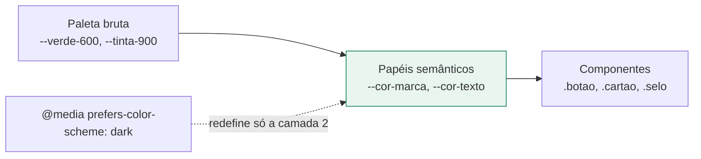

# Convenções de CSS e sistema visual

Como o `src/estilos/base.css` está organizado, por que cada convenção existe e qual
heurística de Nielsen ela atende. A avaliação que originou boa parte destas decisões está
em [`avaliacao-heuristica.md`](../../docs/avaliacao-heuristica.md).

## Referência visual: o que foi tomado emprestado e o que não foi

A interface se apoia deliberadamente nas convenções dos aplicativos de delivery já
consolidados no Brasil, porque o público-alvo — quem faz compra de supermercado pelo
celular — já aprendeu esses gestos. Aproveitar esse aprendizado é a heurística **H4
(consistência com padrões do mundo externo)** aplicada fora do próprio sistema.

| Convenção da categoria | Como aparece aqui | Heurística |
|---|---|---|
| Menu inferior fixo | `.barra-navegacao` com dois destinos | H6, H7 |
| Barra de ação fixa com o total | `.barra-acao`: "18 itens · Gerar recomendação" | H1 |
| Busca em pílula no topo | `.busca` com ícone embutido | H6 |
| Cartões arredondados com sombra suave | `.cartao`, raio de 14px | H8 |
| Contador de quantidade com − e + | `.passo` | H5, H7 |
| Selos curtos de qualificação | `.selo--destaque`: "Mais barato" | H1, H6 |
| Avatar circular do estabelecimento | `.avatar` com iniciais | H6 |
| Esqueleto no lugar de girador | `.esqueleto` | H1 |

O que **não** foi copiado, por decisão explícita:

- **Nenhuma paleta de aplicativo existente.** A marca é verde, não o vermelho, o laranja ou
  o rosa dos concorrentes conhecidos. O verde tem razão de ser: o propósito do sistema é
  economizar, e economia se lê em verde.
- **Nenhum logotipo, nome ou tipografia de terceiros.** Os mercados aparecem com iniciais
  geradas do próprio nome (`iniciaisDe`), nunca com marca de estabelecimento real — o que
  também é coerente com a base de dados fictícia do trabalho.
- **Nenhum padrão de urgência artificial**: sem contagem regressiva, sem "restam 2",
  sem banner promocional. São recursos de conversão, e este é um sistema de apoio à
  decisão — induzir pressa contraria o propósito.

## Duas camadas de token



Nenhum componente usa a paleta bruta diretamente. É essa separação que torna o modo escuro
uma redefinição de papéis, e não uma segunda folha de estilo — e que permite ao verificador
de contraste conferir os pares de forma automática.

### Papéis disponíveis

| Papel | Uso |
|---|---|
| `--cor-fundo` | fundo da página |
| `--cor-superficie` | fundo de cartão, campo e barra |
| `--cor-superficie-alt` | fundo rebaixado: busca, contador, selo neutro |
| `--cor-borda` | separador decorativo |
| `--cor-borda-forte` | contorno de controle interativo |
| `--cor-texto` / `--cor-texto-suave` | texto principal e secundário |
| `--cor-texto-inverso` | texto sobre o sólido da marca |
| `--cor-marca` / `--cor-marca-forte` | sólido e estado ativo, link, ênfase |
| `--cor-marca-tenue` / `--cor-marca-borda` | fundo e borda de tinte |
| `--cor-destaque*` | atenção e qualificação |
| `--cor-erro*` | erro e ação destrutiva |
| `--cor-foco` | anel de foco |

## Escalas

Nenhum valor solto no CSS: espaçamento, raio, tipografia e alvo de toque vêm de escala.
É o que impede que cada tela invente sua própria margem — a causa raiz da falta de
hierarquia apontada no achado A13.

| Escala | Valores |
|---|---|
| Espaçamento | `--esp-1` a `--esp-10`, base de 4px |
| Tipografia | `--fonte-mini` (12px) a `--fonte-valor` (32px) |
| Peso | 400 normal, 600 médio, 700 forte, 800 extra |
| Raio | 8px, 14px, 20px, pílula |
| Alvo de toque | `--alvo-toque` 44px (mínimo), `--alvo-confortavel` 52px (ação principal) |

## Nomenclatura

Português brasileiro, como o resto do projeto, no padrão bloco / elemento / modificador:

```
.cartao              bloco
.cartao--destaque    modificador do bloco
.barra-acao__valor   elemento do bloco
```

- Classe de bloco descreve **o que a coisa é** (`.cartao`, `.selo`, `.chip`), nunca a
  aparência (`.verde`, `.grande`).
- Modificador com `--`, elemento com `__`.
- Estilo específico de uma tela mora no `<style scoped>` dela; o que se repete em duas
  telas sobe para o `base.css`.

## Componentes e a heurística que cada um atende

### H1 — Visibilidade do estado

- **`.esqueleto`** desenha a forma do conteúdo que vem. O layout não salta quando os dados
  chegam, e a espera parece menor do que o girador fazia parecer.
- **`.barra-acao`** mantém à vista o estado corrente — quantos itens, quanto se paga —
  enquanto o usuário rola.
- **`.aviso--sucesso`** com `role="status"` confirma a inclusão de um item, que em tela de
  celular costuma acontecer fora do campo de visão.

### H4 — Consistência

- **`.botao`** tem quatro variantes com papel fixo: `--primario` (a ação da tela, uma só),
  `--secundario` (alternativa), `--fantasma` (terciária), `--perigo` (destrutiva). Uma tela
  com dois botões primários é erro de uso do sistema.
- Todo retorno usa **`.voltar`** com a mesma seta e o mesmo destino textual.

### H5 — Prevenção de erros

- **`.passo`** troca a digitação de número por dois toques, o que elimina o "0,001" digitado
  sem querer no celular.
- O contador `.selo` do editor mostra "14 de 20 itens" e vira `.selo--destaque` ao se
  aproximar do teto, em vez de deixar o limite aparecer como erro 400 no 21º item.

### H6 — Reconhecer em vez de lembrar

- **`.barra-navegacao`** deixa os destinos permanentemente visíveis.
- **`.busca` + lista de sugestões tocáveis** substituiu o par campo-de-busca mais
  `<select>`, que obrigava a procurar duas vezes o mesmo produto.
- **`.selo--destaque`** com "Mais barato" e "Menos percurso" qualifica as opções de perfil
  sem exigir que o usuário compare números de cabeça.

### H7 — Flexibilidade e eficiência

- Alvos de 44px no mínimo e ações principais na faixa inferior da tela, ao alcance do
  polegar. O `env(safe-area-inset-bottom)` mantém a barra acima da área de gestos do
  aparelho.

### H8 — Estética e minimalismo

- Uma cor sólida de marca, usada só na ação principal e no estado ativo. Onde tudo se
  destaca, nada se destaca.
- **`.cartao--marca`** e **`.cartao--destaque`** dão ênfase por tinte de fundo, não por
  borda colorida grossa.
- Detalhe técnico vive em `<details>`, fora do caminho de quem só quer comprar.

## Acessibilidade

`npm run verificar-contraste` lê os tokens direto do `base.css` e confere cada par que a
interface usa contra a WCAG 2.1 — 4,5:1 para texto (1.4.3) e 3:1 para contorno de controle
(1.4.11), nos dois modos de cor. O portão falha com código 1, então serve em CI.

**22 pares, 0 reprovados.** Duas decisões saíram dessa verificação:

| Token | Antes | Depois | Motivo |
|---|---|---|---|
| `--cor-marca` | `--verde-500` | `--verde-600` | rótulo do botão ficava em 4,11:1 |
| `--tinta-300` | `#b2bcb6` | `#78857e` | contorno de campo em 1,95:1, invisível para baixa visão |

Além do contraste:

- Foco visível e uniforme por `:focus-visible`, com anel de 3px que passa em 3:1.
- `prefers-reduced-motion` desliga a animação do esqueleto e as transições.
- Nenhuma informação depende só de cor: a aba ativa ganha marcador, e o perfil escolhido
  ganha borda e tinte além do rádio marcado.
- Tabela larga rola dentro de `.rolagem-horizontal`; a página nunca rola na horizontal.

## Modo escuro

Acompanha o sistema operacional por `prefers-color-scheme`, sem alternador na interface —
um controle a menos para manter, e o comportamento que o usuário já espera do aparelho.

O único ponto que exige atenção ao editar: no modo escuro o sólido da marca é **claro**,
então `--cor-texto-inverso` passa a ser quase preto. Trocar o verde sem trocar esse par
derruba o contraste do botão primário — e o verificador acusa.
