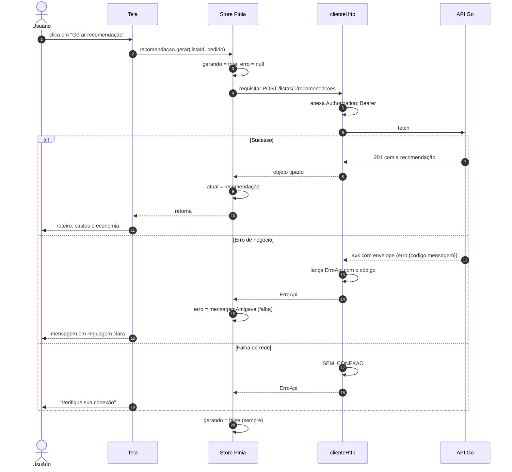
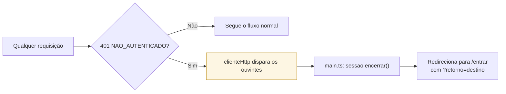
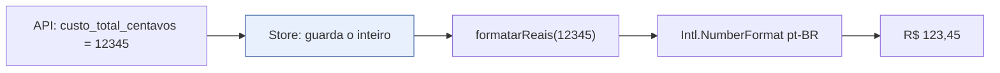

# Estado e comunicação com a API

## As quatro stores

| Store | Guarda | Persiste? |
|---|---|---|
| `sessao` | token e usuário logado | sim, em `localStorage` |
| `catalogo` | produtos, mercados e marcas por produto | não, memória da aba |
| `listas` | listas do usuário e a lista aberta, com os itens | não |
| `recomendacao` | recomendação atual, histórico, estado de geração | não |

Só a sessão persiste. Catálogo, listas e recomendações são dados do servidor: mantê-los em
`localStorage` criaria a chance de mostrar preço velho como se fosse atual — o oposto do
que um sistema de decisão de compra deve fazer.

## Caminho de uma requisição

O `finally` que devolve `gerando`/`carregando` a `false` é o que impede a tela de ficar
travada em "Carregando…" depois de um erro.

## O cliente HTTP

`src/api/clienteHttp.ts` concentra tudo que é transversal:

| Responsabilidade | Como |
|---|---|
| URL base | `VITE_API_URL`, com padrão `http://localhost:8080/api/v1` |
| Token | lido do `localStorage` e anexado como `Bearer` em toda requisição |
| Envelope de erro | qualquer 4xx/5xx vira `ErroApi` com o `codigo` do contrato |
| Falha de rede | vira o código sintético `SEM_CONEXAO` |
| Resposta ilegível | vira `RESPOSTA_INVALIDA` |
| Sessão expirada | dispara os ouvintes de `aoExpirarSessao` |

`SEM_CONEXAO` e `RESPOSTA_INVALIDA` não existem no contrato da API: são códigos do cliente,
criados para que as telas tratem **um único tipo de erro**, sem precisar distinguir entre
"o servidor recusou" e "o servidor não respondeu".

### Sessão expirada é tratada num lugar só

O registro do ouvinte fica em `main.ts`, depois de `use(createPinia())` — antes disso não
é possível instanciar uma store fora de um componente. Sem esse registro, um token expirado
mostraria mensagem de erro em toda tela e nunca levaria o usuário de volta ao login.

## Mensagens de erro em linguagem de gente

`mensagemAmigavel` traduz cada código do contrato:

| Código | Mensagem exibida |
|---|---|
| `VALIDACAO` | a mensagem do servidor, que já é específica (ex.: o teto de 20 itens) |
| `NAO_AUTENTICADO` | "Sua sessão expirou. Entre novamente." |
| `OTIMIZADOR_INDISPONIVEL` | "O serviço de otimização está indisponível no momento. Tente novamente em instantes." |
| `SEM_CONEXAO` | "Não foi possível falar com o servidor. Verifique sua conexão e tente de novo." |
| `ERRO_INTERNO` | "O servidor encontrou um problema inesperado. Tente novamente." |

`VALIDACAO` é o único caso em que a mensagem do servidor passa direto: ela é escrita para
o usuário e costuma ser mais útil que qualquer texto genérico do cliente.

## Dinheiro no frontend

O frontend **nunca soma, subtrai ou compara valores monetários**. Todos os totais,
subtotais e a economia já vêm calculados pela API, que por sua vez os recebe do otimizador
em aritmética inteira. A única operação aqui é dividir por 100 na hora de exibir.

## Normalização defensiva

`src/api/listas.ts` normaliza a resposta de `GET /listas` aceitando alguns apelidos para o
campo de contagem de itens, e `extrairLista` aceita tanto um arranjo direto quanto um
objeto com a lista dentro. É uma tolerância deliberada na fronteira: o contrato define a
forma esperada, mas uma divergência pontual do servidor degrada a exibição de uma contagem
em vez de quebrar a tela inteira.
