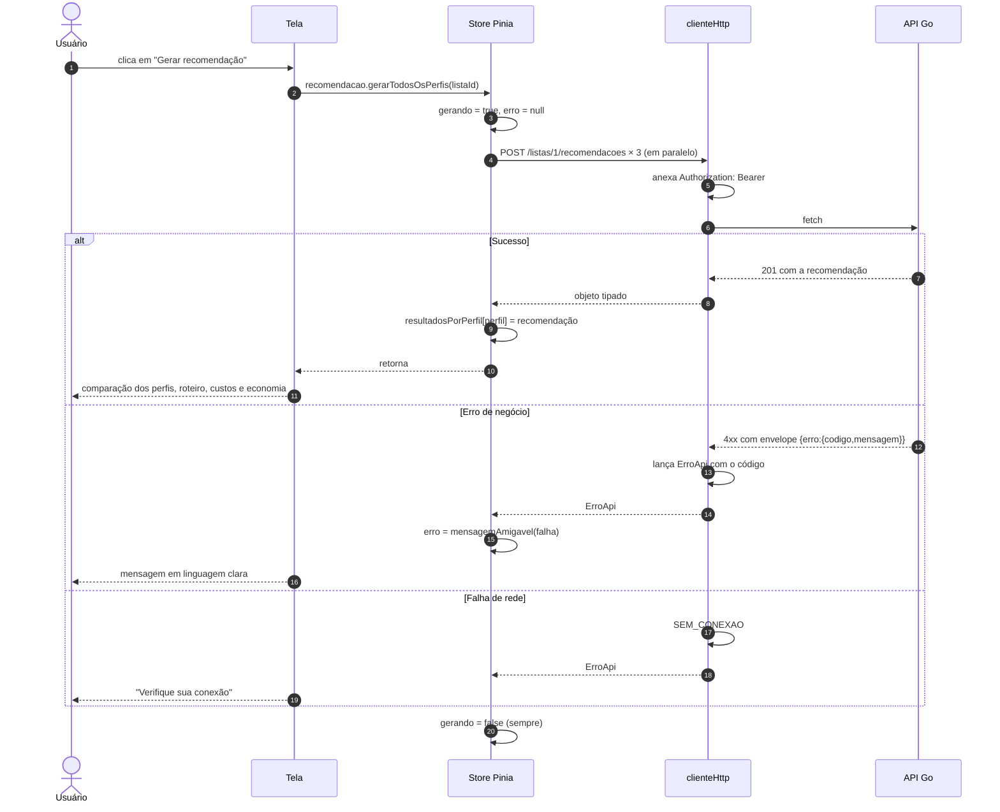
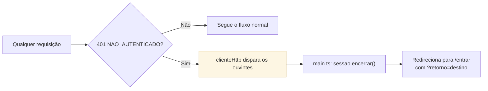
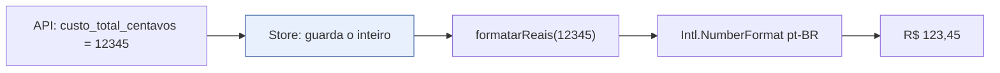

# Estado e comunicação com a API

## As quatro stores

| Store | Guarda | Persiste? |
|---|---|---|
| `sessao` | token e usuário logado | sim, em `localStorage` |
| `catalogo` | produtos, mercados e marcas por produto | não, memória da aba |
| `listas` | listas do usuário e a lista aberta, com os itens | não |
| `recomendacao` | os três perfis resolvidos, histórico, estado de geração | não |
| `origem` | de onde o usuário parte e o raio de busca | só a **preferência**, nunca a coordenada |

### Por que a origem persiste o modo, e não a posição

Coordenada de pessoa física é dado pessoal pela LGPD. O `localStorage` guarda apenas o modo
escolhido (centro, dispositivo ou mercado de referência) e o raio; a posição fica em
memória. Não há perda: quando a permissão já está concedida, obtê-la de novo é instantâneo
e **não dispara aviso nenhum do navegador** — por isso a restauração no início da sessão
não é um pedido às escondidas.

A permissão negada é definitiva: a aplicação não consegue pedir de novo. Daí a regra que a
store impõe — `obterPosicao` só é chamada a partir de um toque, nunca na montagem de tela.

Só a sessão persiste. Catálogo, listas e recomendações são dados do servidor: mantê-los em
`localStorage` criaria a chance de mostrar preço velho como se fosse atual — o oposto do
que um sistema de decisão de compra deve fazer.

### Por que a store de recomendação sabe a qual lista pertence

A store é global e as telas são reaproveitadas entre listas. Sem um dono declarado, o
roteiro da lista A permaneceria na tela ao abrir a lista B — o achado A01 da
[avaliação heurística](../../docs/avaliacao-heuristica.md). Três mecanismos evitam isso:

| Mecanismo | Papel |
|---|---|
| `focarLista(id)` | descarta tudo quando a lista exibida muda |
| `invalidarResultados()` | chamado pela store `listas` a cada item incluído, alterado ou removido — outra cesta, outro roteiro |
| `recomendacaoAberta` separado de `resultadosPorPerfil` | consultar o histórico não altera o que a tela de recomendação mostra |

## Caminho de uma requisição

O `finally` que devolve `gerando`/`carregando` a `false` é o que impede a tela de ficar
travada em "Carregando…" depois de um erro.

As três chamadas saem juntas por `Promise.allSettled`, e não em sequência: cada resolução
custa dezenas de milissegundos, e ter os três perfis na mão é o que permite mostrar o
trade-off entre preço e deslocamento lado a lado. O `allSettled` isola as falhas — se um
perfil não resolver, os outros dois continuam sendo apresentados, e a mensagem de erro só
aparece quando nenhum dos três volta.

Medição na pilha real (semente de 18 itens, 6 mercados): **76 ms** para as três em
paralelo, contra cerca de 40 ms de uma única execução isolada.

## O cliente HTTP

`src/api/clienteHttp.ts` concentra tudo que é transversal:

| Responsabilidade | Como |
|---|---|
| URL base | `VITE_API_URL`, com padrão `http://localhost:8080/api/v1` |
| Token | lido do `localStorage` e anexado como `Bearer` em toda requisição |
| Envelope de erro | qualquer 4xx/5xx vira `ErroApi` com o `codigo` do contrato |
| Falha de rede | vira o código sintético `SEM_CONEXAO` |
| Resposta ilegível | vira `RESPOSTA_INVALIDA` |
| Sessão expirada | dispara os ouvintes de `aoExpirarSessao` |

`SEM_CONEXAO` e `RESPOSTA_INVALIDA` não existem no contrato da API: são códigos do cliente,
criados para que as telas tratem **um único tipo de erro**, sem precisar distinguir entre
"o servidor recusou" e "o servidor não respondeu".

### Sessão expirada é tratada num lugar só

O registro do ouvinte fica em `main.ts`, depois de `use(createPinia())` — antes disso não
é possível instanciar uma store fora de um componente. Sem esse registro, um token expirado
mostraria mensagem de erro em toda tela e nunca levaria o usuário de volta ao login.

## Mensagens de erro em linguagem de gente

`mensagemAmigavel` traduz cada código do contrato:

| Código | Mensagem exibida |
|---|---|
| `VALIDACAO` | a mensagem do servidor, que já é específica (ex.: o teto de 20 itens) |
| `NAO_AUTENTICADO` | "Sua sessão expirou. Entre novamente." |
| `OTIMIZADOR_INDISPONIVEL` | "O serviço de otimização está indisponível no momento. Tente novamente em instantes." |
| `SEM_CONEXAO` | "Não foi possível falar com o servidor. Verifique sua conexão e tente de novo." |
| `ERRO_INTERNO` | "O servidor encontrou um problema inesperado. Tente novamente." |

`VALIDACAO` é o único caso em que a mensagem do servidor passa direto: ela é escrita para
o usuário e costuma ser mais útil que qualquer texto genérico do cliente.

## Dinheiro no frontend

O frontend **nunca soma, subtrai ou compara valores monetários**. Todos os totais,
subtotais e a economia já vêm calculados pela API, que por sua vez os recebe do otimizador
em aritmética inteira. A única operação aqui é dividir por 100 na hora de exibir.

## Normalização defensiva

`src/api/listas.ts` normaliza a resposta de `GET /listas` aceitando alguns apelidos para o
campo de contagem de itens, e `extrairLista` aceita tanto um arranjo direto quanto um
objeto com a lista dentro. É uma tolerância deliberada na fronteira: o contrato define a
forma esperada, mas uma divergência pontual do servidor degrada a exibição de uma contagem
em vez de quebrar a tela inteira.
