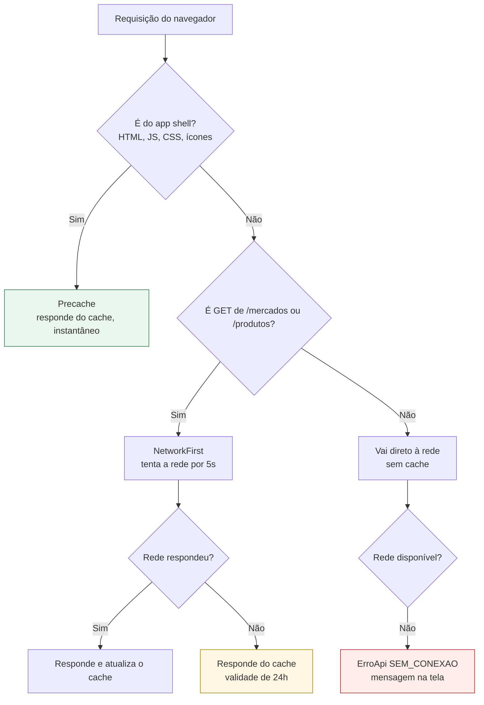

# PWA, instalação e comportamento offline

O que o aplicativo faz sem rede, o que não faz, e por quê. Configurado em
[`vite.config.ts`](../vite.config.ts) com `vite-plugin-pwa` (Workbox por baixo).

## Estratégia de cache



## O que funciona sem rede

| Recurso | Offline? | Motivo |
|---|---|---|
| Abrir o app já instalado | **sim** | app shell no precache |
| Navegar entre telas | **sim** | rotas em JS já precacheado |
| Ver a lista de mercados já visitada | **sim, com ressalva** | `NetworkFirst` com validade de 24h |
| Ver produtos já buscados | **sim, com ressalva** | mesma estratégia |
| Ver suas listas de compra | não | dados por usuário, sempre da rede |
| **Gerar recomendação** | **não** | exige o solver CP-SAT no servidor |
| Login e cadastro | não | exige o servidor |

A regra que separa os dois grupos: **catálogo tolera dado levemente velho; decisão de
compra não.** Um mercado que mudou de endereço ontem ainda é útil hoje; um preço de ontem
levaria a uma recomendação errada, e é justamente isso que o sistema existe para evitar.

Por isso `/precos`, `/listas` e `/recomendacoes` **não têm cache de runtime**. Falha de
rede nessas rotas vira mensagem clara, nunca um resultado desatualizado apresentado como
atual.

## Aviso de offline

`App.vue` observa `navigator.onLine` e mostra uma faixa fixa quando a conexão cai:

> Você está offline. As telas já visitadas continuam abrindo, mas gerar recomendação
> precisa de conexão.

A mensagem diz o que ainda funciona e o que não funciona, em vez de apenas anunciar a
falha.

## Manifest

| Campo | Valor |
|---|---|
| `name` | Compra Certa — Apoio à Decisão de Compras |
| `short_name` | Compra Certa |
| `display` | `standalone` (abre sem barra de navegador) |
| `orientation` | `portrait` |
| `start_url` / `scope` | `/` |
| `lang` | `pt-BR` |
| `theme_color` | `#1f7a4d` |
| Ícones | 192×192 e 512×512, mais uma variante `maskable` |

A variante `maskable` existe porque o Android recorta o ícone no formato do sistema; sem
ela o ícone aparece dentro de um quadrado branco na tela inicial.

## Atualização do service worker

`registerType: 'autoUpdate'` com `skipWaiting` e `clientsClaim`: uma versão nova assume
assim que fica pronta, sem pedir confirmação. Numa PoC acadêmica isso evita o problema
clássico de usuário preso a uma versão antiga durante uma demonstração.

`cleanupOutdatedCaches` remove precaches de builds anteriores, para o armazenamento não
crescer indefinidamente a cada deploy.

## Como testar de verdade

O service worker **não roda em `npm run dev`** (`devOptions.enabled: false`). Testar
offline exige o build:

```bash
cd pwa
npm run build
npm run preview        # http://localhost:4173
```

Depois, no navegador:

1. Abra as DevTools → *Application* → *Service Workers* e confirme que há um SW ativo.
2. Em *Application* → *Manifest*, confira nome, ícones e `display`.
3. Navegue por algumas telas para popular o cache.
4. Marque *Offline* na aba *Network* e recarregue: o app deve abrir e navegar.
5. Tente gerar uma recomendação offline: deve aparecer a mensagem de erro de conexão, e
   **não** uma tela branca ou um resultado inventado.

Para instalar no celular, acesse o endereço pela rede local e use "Adicionar à tela
inicial". Navegadores exigem HTTPS para instalação fora de `localhost` — numa demonstração
em rede local, `localhost` no próprio aparelho ou um túnel HTTPS resolvem.

## Limites assumidos

- Sem sincronização em segundo plano: uma lista editada offline não é enviada depois.
- Sem notificações push.
- Sem armazenamento offline das listas do usuário.

Os três estão fora do escopo da PoC (seção 7 do `CLAUDE.md`). O requisito da Fase 3 é que
o app seja **instalável e que as telas estáticas funcionem offline**, e é isso que está
implementado.
