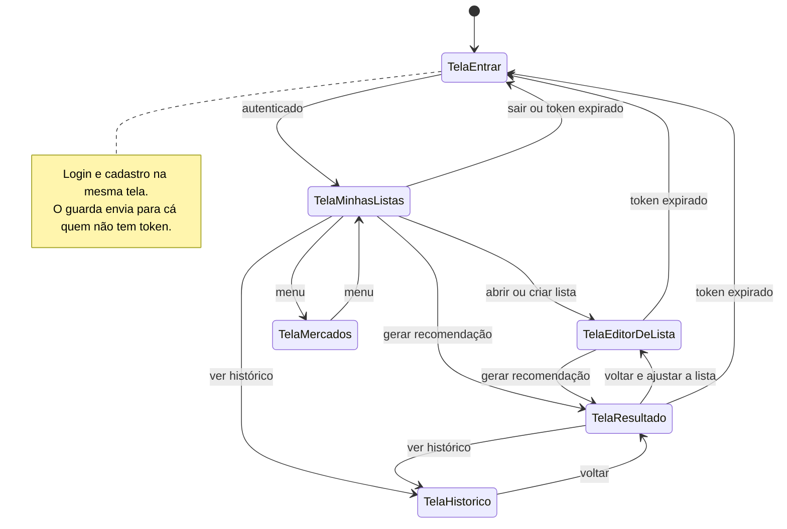
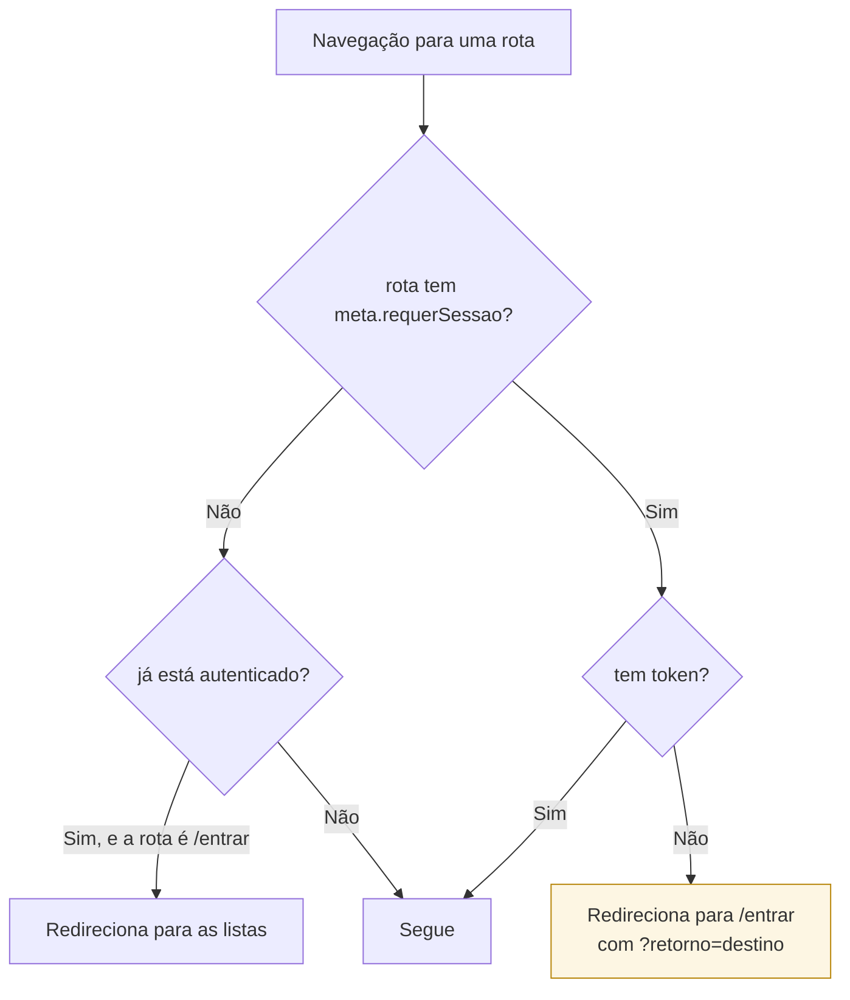
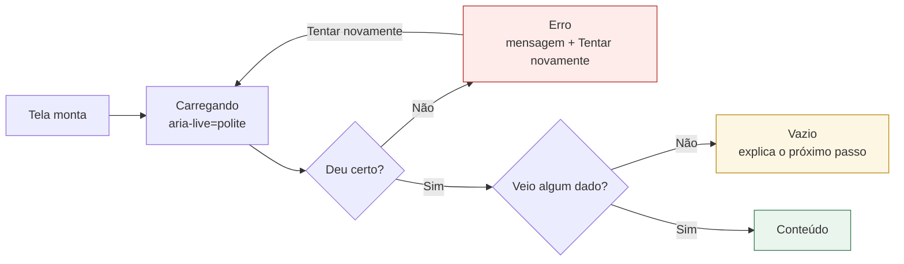

# Telas e navegação

## Fluxo entre as telas

Qualquer resposta `NAO_AUTENTICADO` limpa a sessão e devolve o usuário à tela de entrada,
preservando o destino em `?retorno=` para retomar de onde parou.

## Guarda de autenticação

A proteção é declarada em `meta.requerSessao` de cada rota, e não numa lista de exceções.
A diferença importa: uma tela nova nasce protegida se o autor marcar a meta, e o erro de
esquecer aparece como redirecionamento indevido — não como vazamento de dados.

## As telas

| Tela | Rota | Papel |
|---|---|---|
| `TelaEntrar` | `/entrar` | login e cadastro alternáveis no mesmo formulário |
| `TelaMinhasListas` | `/` | listas do usuário, criação e exclusão |
| `TelaEditorDeLista` | `/listas/:id` | montagem rápida da lista no celular |
| `TelaResultado` | `/listas/:id/resultado` | comparação dos três perfis e o roteiro do escolhido |
| `TelaHistorico` | `/listas/:id/historico` | recomendações anteriores, imutáveis |
| `TelaMercados` | `/mercados` | supermercados considerados |

## Os quatro estados de cada tela

Toda tela que carrega dados passa por `EstadoDaTela`, que centraliza os estados. Sem esse
componente, cada tela precisaria repetir a mesma lógica — e a que esquecesse mostraria uma
tela branca.

O estado vazio nunca diz apenas "nada aqui": ele diz o que fazer em seguida — "crie a
primeira lista", "adicione itens antes de gerar a recomendação".

## Decisões de interface

### O seletor de perfil não fala de matemática — e mostra a consequência

O usuário não sabe o que é peso multiobjetivo. Cada perfil se apresenta pelo efeito
prático:

| Perfil | Texto exibido |
|---|---|
| Econômico | "Menor preço possível, mesmo que precise visitar mais mercados." |
| Equilibrado | "Pondera o quanto se economiza contra o quanto se anda." |
| Conveniente | "Concentra a compra em poucos mercados, mesmo pagando um pouco mais." |

Escolher o perfil e ver o que a escolha custa são a mesma decisão, então são o mesmo
controle: ao chegar na tela os três perfis já foram resolvidos, e cada opção exibe o que se
paga, quantos mercados e quanto se anda. As não selecionadas trazem a diferença em relação
à atual — *"paga R$ 8,26 a menos e anda 14,25 km a mais"*.

Isso é o trade-off entre custo e conveniência posto na tela. Antes, percebê-lo exigia gerar
um perfil, memorizar os números, gerar outro e comparar de cabeça (achado A05 da
[avaliação heurística](../../docs/avaliacao-heuristica.md)).

### Só "você paga" fica no destaque

O custo logístico é o parâmetro que torna comparáveis preço e deslocamento — não é dinheiro
gasto no caixa. Somar os dois sob o rótulo "custo total", como a primeira versão fazia,
levava o usuário a esperar uma conta R$ 25,77 maior do que a que vai pagar.

| Onde | O que aparece |
|---|---|
| Destaque | "Você paga nos mercados R$ 308,65" · "2 mercados · 7,65 km" |
| Detalhes técnicos | deslocamento R$ 25,77, custo da decisão R$ 334,42 e **os parâmetros que os produziram** |

Os parâmetros vêm da própria resposta (`custo_por_visita_centavos` e
`custo_por_km_centavos`), e não de constantes repetidas no cliente — é o que torna o valor
auditável em vez de misterioso. Recomendações gravadas antes dessa mudança chegam sem os
campos, e aí a linha simplesmente não aparece.

### O ponto de equilíbrio explica a escolha

O sistema não sabe quanto vale um quilômetro para quem vai comprar: R$ 1,20/km é um
parâmetro de servidor calibrado para carro. Em vez de impor esse valor, a tela mostra o
limiar em que a decisão se inverte:

> **Econômico** — Economiza R$ 8,26, mas exige 4 paradas e 14,25 km a mais.
> *Compensa se, para você, rodar 1 km custar menos de R$ 0,58.*

O limiar é `Δpreço / Δdistância` entre as duas soluções, calculado em
`utilitarios/comparacao.ts` — não depende de nenhum parâmetro novo. Quem anda de moto
conclui que o econômico vale; quem anda de carro conclui que não, que é o que o modelo
decidiu. **O número explica a recomendação em vez de apenas anunciá-la**, que é o que se
espera de um sistema de apoio à decisão.

### O vocabulário do solver fica recolhido

Status do CP-SAT, peso de conveniência, data de geração e ponto de partida vão para um
`
` de "Detalhes técnicos". A informação importa para a avaliação do modelo e para
a banca, mas competia por atenção com a resposta que o comprador veio buscar.

### Marca opcional, com "qualquer marca" como padrão

No editor de lista, o seletor de marca já vem em "Qualquer marca (costuma economizar
mais)". Fixar marca restringe os candidatos do otimizador e quase sempre encarece a
compra; deixar o padrão aberto orienta o usuário para a escolha que rende mais, sem tirar
dele a possibilidade de exigir uma marca específica.

### O carregamento não promete mais tempo do que gasta

A primeira versão anunciava que o cálculo "leva alguns segundos". A medição na pilha real
mostra **71 ms para os três perfis em paralelo** — anunciar segundos fazia o sistema
parecer mais lento do que é. Hoje a espera é um esqueleto com "Comparando os três perfis de
compra", sem promessa de duração.

### O resultado é um roteiro, não uma tabela de preços

A tela de resultado é organizada pela **ordem da rota**: primeira parada, o que comprar
ali, subtotal; segunda parada, e assim por diante. É a forma como a informação vai ser
usada de fato — com o celular na mão, dentro do mercado.

### Itens não atendidos aparecem, e em português

Um item que nenhum mercado pôde atender ganha seção própria, com o motivo traduzido:
`SEM_CANDIDATO` vira "nenhum mercado cadastrado vende este item" e
`SEM_CANDIDATO_COM_ESTOQUE` vira "os mercados têm o item, mas não na quantidade pedida".
Esconder essa informação faria o usuário chegar em casa sem perceber a falta.

### Busca de produto com atraso curto

Buscar a cada tecla geraria uma requisição por caractere. Um atraso de 300 ms agrupa a
digitação numa consulta só.

## Acessibilidade

- Todo campo tem `<label>` associado.
- Foco visível com `outline` de 3px, nunca removido.
- O resultado da recomendação está em região `aria-live="polite"`: quem usa leitor de tela
  é avisado quando ele chega.
- Tabelas com `<caption>`, `<th scope>` e `<tfoot>` para o subtotal.
- Botões de ação com `aria-label` quando o texto sozinho é ambíguo ("Excluir" repetido em
  várias linhas).
- A animação de carregamento respeita `prefers-reduced-motion`.
